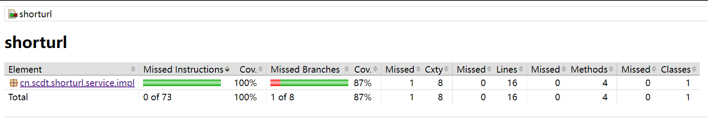
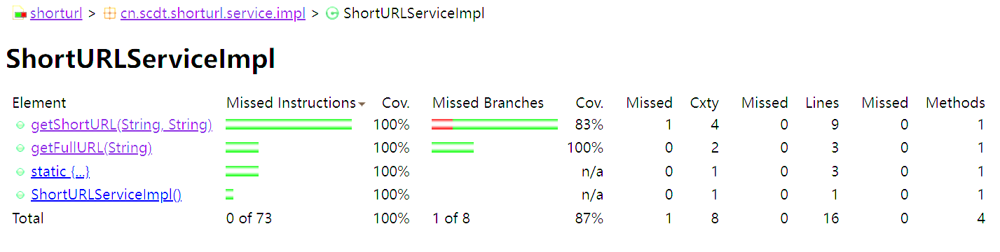
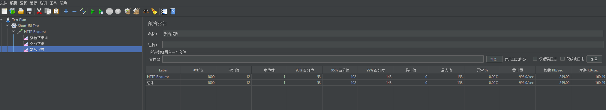
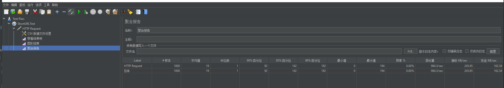

# 短链接服务

## 需求说明

撰写两个 API 接口:

- 短域名存储接口：接受长域名信息，返回短域名信息
- 短域名读取接口：接受短域名信息，返回长域名信息。

限制：

- 短域名长度最大为 8 个字符
- 采用SpringBoot，集成Swagger API文档；
- JUnit编写单元测试, 使用Jacoco生成测试报告(测试报告提交截图)；
- 映射数据存储在JVM内存即可，防止内存溢出；

**递交作业内容**

- 源代码(按照生产级的要求编写整洁的代码，使用gitignore过滤掉非必要的提交文件，如class文件)
- Jacoco单元测试覆盖率截图(行覆盖率和分支覆盖率85%+)
- 文档：完整的设计思路、架构设计图以及所做的假设(Markdown格式)

**加分项**

- 系统性能测试方案以及测试结果

  

## 需求设计

生成短链接，根据已有资料采取MurmurHash+62进制转换，62进制转换后只含数字+小写+大写字母。而64进制转换会含有/,+这样的符号（不符合正常URL的字符）。

| 依赖        | 说明                                                 |
| ----------- | ---------------------------------------------------- |
| Spring Boot | MVC 框架                                             |
| Swagger3    | http://localhost:8086/shortURL/swagger-ui/index.html |
| hutool      | Hash 算法                                            |

## 需求实现

使用 MurmurHash 算法将原始长链接 hash 为 32 位散列值，将散列值转为 62 进制字符串，即为短链接，将长短链接分别添加入ConcurrentHashMap，短链接添加过程增加重复校验避免HASH碰撞。用户查询短链接，在 ConcurrentHashMap 中查找是否存在缓存。

## 技术选型

MurmurHash：长链转短链自然需要一个哈希算法，应用的类型决定了我们并不需要解密，而是关心运算速度和冲突概率，MurmurHash 就是一种非加密型哈希算法，与 MD5、SHA 等常见哈希函数相比，性能与随机分布特征都要更佳。MurmurHash 有 32 bit、64 bit、128 bit 的实现，32 bit 已经足够表示近 43 亿个短链接。使用 Java 的话，在 Google 的 [guava](https://github.com/google/guava) 或 [hutool](https://github.com/dromara/hutool) 中有相应实现，这里使用 hutool。

base62：MurmurHash 生成的哈希值最长有 10 位十进制数，为了进一步缩短短链接长度，可以将哈希值转为 62 进制，最长为 6 个字符。


## Jacoco测试报告





## JMETER性能测试

测试机：

​	LENOVO R9000P R5800H 16G

JVM参数配置：	

```json
-Xms1024m
-Xmx2048m
-XX:ReservedCodeCacheSize=512m
-XX:+UseG1GC
-XX:SoftRefLRUPolicyMSPerMB=50
-XX:CICompilerCount=2
-XX:+HeapDumpOnOutOfMemoryError
-XX:-OmitStackTraceInFastThrow
```

测试步骤：

​	1.1000个相同长地址1秒内完成请求，jmeter测试结果平均值为12ms,最长相应为153ms，95%的响应落在100ms以内



2.1000个不相同长地址1秒内完成请求，jmeter测试结果平均值为19ms,最长相应为182ms，90%的响应落在100ms以内




## 性能提升

1.后续可引入redis,采用redis集群实现存储长短链接对应关系，同时根据LRU算法去除不常用的地址。

2.可定义访问控制，同一地址一段时间内只允许生成一次短链接。


