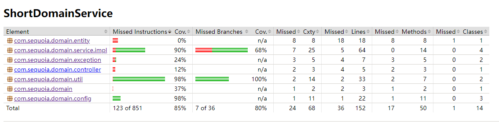
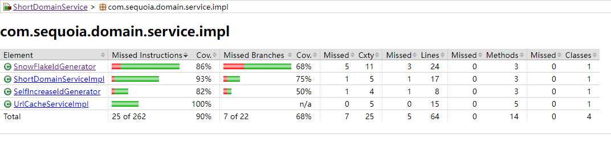
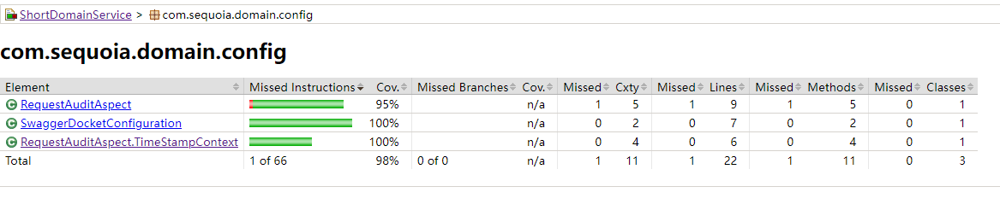

[toc]

### 设计方案
短域名生成算法使用id生成并进行62进制转换为短域名

主要包含ID生成算法和62进制转换算法

#### ID生成算法
题目要求短域名长度不超过8位，对long值进行62进制编码（0-9a-zA-Z）,按照62进制最大可表示的十进制数为`218340105584895L`
即最大可生成218340105584895个短域名。

因此ID生成范围为`0~218340105584895L`

代码中实现了两种ID生成方式：
- 自增ID生成算法
- 雪花分布式ID生成算法

##### 自增ID生成算法
实际项目中可以使用关系型数据库自增id来实现分布式id生成，本项目简化处理，在内存中生成（使用AtomicLong）

- 优点：使用连续数字，不存在id浪费
- 缺点：在内存中连续生成，有状态，无法分布式部署。如果使用数据库自增id性能（相对雪花算法）相对不足

开启自增ID算法配置方式：
```yaml
app:
  id:
    generator:
      algorithm: ${ID_GENERATOR_ALGO:self_increase}
      init_value: ${ID_INIT_VALUE:0}
```

##### 雪花分布式ID生成算法
- 优点：无状态，使用内存生成，性能很高
- 缺点：针对id生成不高的场景，由于跟时间相关id不连续，会使得id使用率降低

前面已经说过ID生成范围为`0~218340105584895L`, 介于2的47次幂到48次幂之间。所以为了防止超过8位字符，
使用雪花算法生成的ID必须小于2的47次幂-1.

正常雪花算法生成64bit的long值
- 1bit  符号位
- 41bit 时间戳（精确到毫秒，可使用约69年）
- 10bit 数据中心id+机器id(共1024节点)
- 12bit 同一毫秒序列号

此项目中限制短域名长度不大于8位，因此最多可以使用低47位来生成id, 以防止长度超限
因此对雪花算法进行定制：
- 1bit  符号位
- 30bit 时间戳（精确到秒，可使用约34年）
- 2bit 数据中心id+机器id(共4个节点)
- 14bit 同一秒序列号（可分配16384）

缺点：由于bit长度限制，单节点单位秒内只能生成16384个id,不适合并发量非常高的场景。这里仅作为方案展示

开启雪花算法配置方式：
```yaml
app:
  id:
    generator:
      algorithm: ${ID_GENERATOR_ALGO:snow_flake}
      data_center_id: ${DATA_CENTER_ID:1}
      machine_Id: ${MACHINE_ID:1}
```

#### 62进制转换
使用数字加字母大小写`[0-9a-zA-Z]`共62个字符来进行转换。

### 单元测试覆盖率报告





### 性能测试
【TODO】


