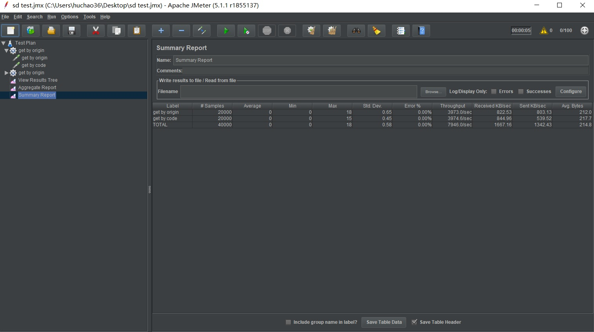
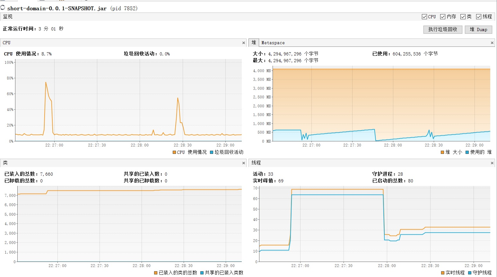
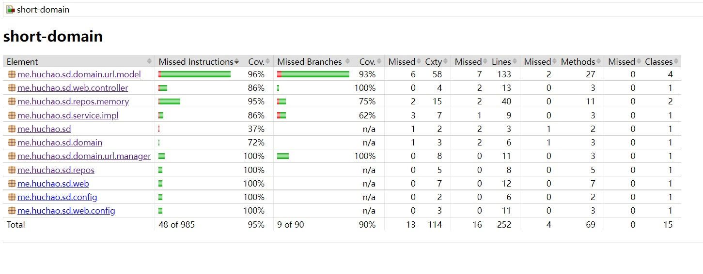

#  设计说明

## 设计原则

本系统通过设计为运行时无状态保证可以在单机/分布式集群的模式下运行。

## 业务模型

为了达到无状态的效果，系统内设计了以下三个核心概念：

### 数据节点-Node

数据节点是实际记录原始域名与短域名的映射关系的数据结构。含有以下属性：

1. 原始域名
2. 所属数据槽名称（数据槽后续介绍）
3. 数据槽内节点偏移量：用来记录数据节点在数据槽中的位置，避免出现重复的映射关系
4. 数据槽内短域名代号：由数据槽内节点偏移量生成

### 数据槽-Slot

数据槽是实际为原始域名生成短域名并记录映射关系的对象。每一个slot都有名称属性slot会为每一个接受到的原始域名进行以下操作：

1. 分配一个没有被使用过的偏移量offset对应节点
2. 通过offset映射生成代号code。code生成的方式为使用大小写字母、0到9数字、加减号共64个字符组成64位映射关系，然后将数字与code按照64进制进行映射
3. 将原始域名、slot名称、节点偏移量、偏移量映射代号生成node实例，并将数据写入数据持久化介质
4. 实际生成的短域名=节点node的slot名称+节点的偏移量code
5. 同名slot的读写请求需要落到相同的持久化介质中

为了达到分布式运行无状态的要求，同名的slot需要可以同时分布在多个系统节点中。对于读 /写请求分别使用了以下方法：

#### 读请求，按照短域名查找原始域名

对于落到slot中的短域名查询请求：

1. 首先去掉slot的名称，获取实际的偏移量code
2. 按照映射关系将code映射回偏移量offset
3. 从持久化介质中查找对应offset的node
4. 返回node中的原始域名信息

对于落到不同节点中同名slot中的读请求，由于持久化介质是相同的，因此查询的结构都一样，可以保证无状态。

#### 读请求，按照原始域名查找短域名

对于落到slot中的原始域名查询请求：

	1. 直接按照原始域名在持久化介质中查找对应的node
 2. 返回node中的短域名信息

对于落到不同节点中同名slot中的读请求，由于持久化介质是相同的，因此查询的结构都一样，可以保证无状态。

#### 写请求，按照原始域名生成短域名并持久化

对于落到slot中的原始域名写入请求：

- 为了保证多个同名slot对offset的竞争问题，使用预取的方法。

  1. 持久化介质需要记录当前所有slot名称在使用的最大偏移量offset值。
  2. 在新slot实例初始化的时候，首先去持久化介质中将最大偏移量增大（例如每次增大10000），然后获取更新后的值。此操作需要持久化介质提供独占的事务支持（例如redis的incr操作、mysql的select for update事务等）
  3. slot实例获取到被自身更新的当前偏移量offset最大值后，减去更新量即得到一批可用的连续offset值
  4. 当步骤3获取到的offset使用完后，再次进行步骤2的预取操作，即可获取下一批可用的offset
  5. slot实例在分配offset时，是自增的使用获取到的offset范围。仅在获取下一个可用offset时加锁，保证不会将一个offset分配两次，同时保证offset使用完后的预取过程不会执行两次。
  6. slot进行node数据持久化时，每次写入的offset值都不会相同，因此写入的操作完全可以并发进行，不必引入锁的开销

  此方法通过持久化介质来保证多个同名slot实例不会获取的相同的offset，解决offset值的竞争问题。同时由于每次预取都只是做一次写入，且频率不高，对于持久化介质的性能压力也可控。

  此方法在slot实例销毁时，会导致此slot获取的offset中没有使用的一部分无效永远不会再使用的情况。不过由于slot的offset取值范围够大（64的6次方），对于这种offset的浪费可以接受。

  在同一个原始域名进行写入未完成时，另一个运行线程接受到了相同参数的写入请求，会导致同一个原始域名被分配到两个offset（因为写入没有做同步）。但是即使同一个同一个原始域名拥有多个offset和code值，对于查询的读请求还是可以获得符合预期的结果，因此可以通过牺牲一部分空间来避免同步锁，以加快写入的效率。同一个原始域名可能占用的最多offset个数为当前运行的节点数*节点上运行的业务线程数，这个数字对于offset的取值范围来说，是可以接受的范围。

### 数据桶Bucket

  数据桶是数据槽的容器，一个数据桶会加载多个数据槽。数据桶是外界读、写请求的统一入口，负责为读写请求分配到合适的数据槽，并将数据槽返回的数据节点中的数据组装成为短域名。

  数据桶负责按照请求加载数据槽，并向对应的数据槽转发请求。

#### 按照原始域名获取短域名

  数据桶获得请求后，对原始域名进行md5运算，获得对应md值。使用md5值的前两位作为对应数据槽的名称，加载（初始化）数据槽并将请求转发给数据槽。获得数据槽返回的数据节点后，数据桶组装数据槽名+数据节点code作为短域名返回。

#### 按照短域名获取原始域名

  数据桶获得短域名请求后，截取短域名的前两位作为数据槽的名称，加载（初始化）对应的数据槽并将请求转发给数据槽。获得数据槽返回的数据节点后，数据桶返回数据节点中记录的原始域名。

  

  数据桶使用懒汉式加载数据槽，通过对初始化方法加锁的方式，避免同名的数据槽在进程内被初始化多次。

  

  一个运行进程中只有一个数据桶。在分布式的情况下，可以通过前置负载均衡的方式将请求进行负载均衡，保证一个桶中不用加载所有的数据槽，而是加载部分具有特定名称的数据槽。

同时数据桶中还有定时任务线程，对于长时间没有请求路由过去的数据槽，会卸载掉，以节约内存空间。这样设计的原因是在前置的负载均衡做出改变后，数据桶能够自动的卸载掉无用的数据，节约内存空间。

  

## 系统结构

上述业务模型在系统中单独抽象为一层，通过定义接口与持久化介质解耦。持久化介质的使用只需要实现接口并依赖注入即可。

同时对于数据请求的获取方式（http、dubbo或其他通信协议），运行容器（spring、纯java程序或其他），业务模型层都与之解耦。例如像题目要求的springboot方式来运行程序，就是自行实例化数据桶、数据槽等对象实例，然后注入spring容器中。业务模型层的代码完全不依赖与spring或任务其他的第三方运行时容器框架。

# 性能测试

系统可以使用如下指令运行，指定使用4G的堆内存：  java -Xmx4096m -Xms4096m -XX:+UseConcMarkSweepGC -server -jar short-domain-0.0.1 -SNAPSHOT.jar 。使用jmeter进行并发性能测试，同时使用jdk自带的visualvm工具监控虚拟机的运行时状态（如果是线上运行，可以使用grafana+Prometheus）。

运行时监控见下图：

以内存作为持久化存储介质模拟时，单节点进行1万次随机原始链接获取短链接的请求，再进行1万次短链接获取原始链接的请求，吞吐量均在800+，堆内存的使用不超过1G。

# 测试报告

使用jacoco进行单元测试覆盖率测试，代码覆盖和分支覆盖都超过90%，见下图：

