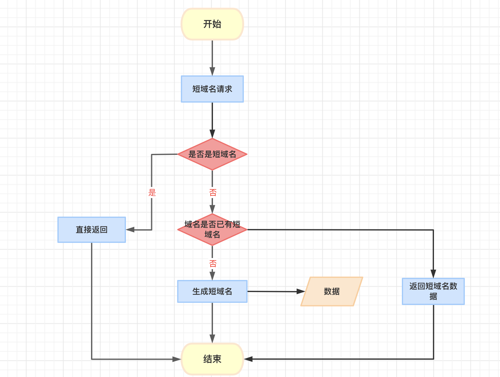

# TypeScript Backend Engineer Assignment

### Typescript 实现短域名服务（细节可以百度/谷歌）

撰写两个 API 接口

- 短域名存储接口：接受长域名信息，返回短域名信息
- 短域名读取接口：接受短域名信息，返回长域名信息。

限制

- 短域名长度最大为 8 个字符（不含域名）

递交作业内容

1. 源代码
2. 单元测试代码以及单元测试覆盖率
=============================== Coverage summary ===============================
Statements   : 81.19% ( 82/101 )
Branches     : 26.09% ( 6/23 )
Functions    : 88% ( 22/25 )
Lines        : 81.19% ( 82/101 )
================================================================================
3. API 集成测试案例以及测试结果 
4. 简单的框架设计图，以及所有做的假设

5. 涉及的 SQL 或者 NoSQL 的 Schema，注意标注出 Primary key 和 Index 如果有
```sql
CREATE TABLE `url` (
  `id` int(10) unsigned NOT NULL AUTO_INCREMENT,
  `short_id` varchar(32) NOT NULL DEFAULT '',
  `url` varchar(2000) NOT NULL DEFAULT '',
  `ip` varchar(15) NOT NULL DEFAULT '',
  `na` varchar(128) NOT NULL DEFAULT '',
  `created_at` datetime DEFAULT NULL,
  `updated_at` datetime DEFAULT NULL,
  `deleted_at` datetime DEFAULT NULL,
  PRIMARY KEY (`id`),
  KEY `idx_short_id` (`short_id`),
  KEY `idx_url` (`idx_url`)
) ENGINE=InnoDB AUTO_INCREMENT=18 DEFAULT CHARSET=utf8mb4
```
其他

- 我们期望不要过度设计，每一个依赖以及每一行代码都有足够充分的理由。

## 岗位职责

- 根据产品交互稿构建高质量企业级 Web 应用
- 技术栈：Express + React
- 在产品迭代中逐步积累技术框架与组件库
- 根据业务需求适时地重构
- 为 Pull Request 提供有效的代码审查建议
- 设计并撰写固实的单元测试与集成测试

## 要求

- 三年以上技术相关工作经验
- 能高效并高质量交付产品
- 对业务逻辑有较为深刻的理解
- 加分项
  - 持续更新的技术博客
  - 长期维护的开源项目
  - 流畅阅读英文技术文档
  - 对审美有一定追求
  - 能力突出者可适当放宽年限
