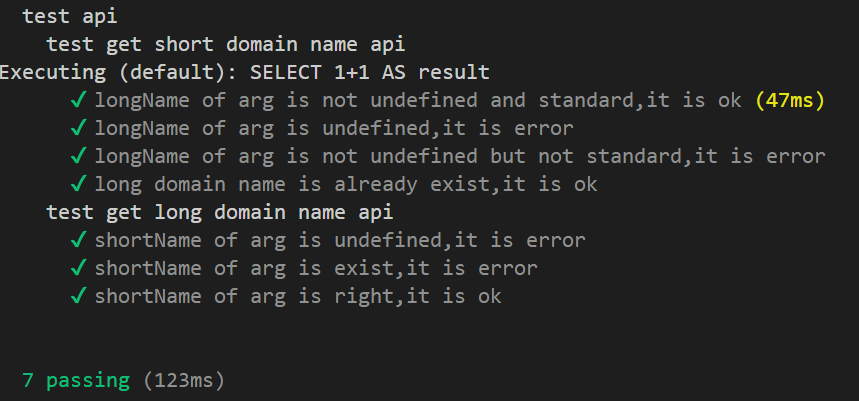
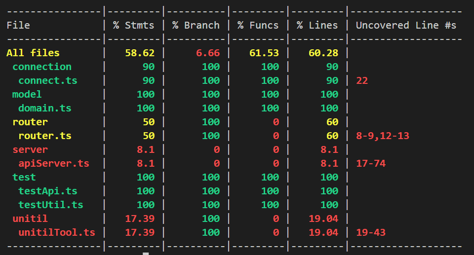

## 简历
简历文件在doc文件夹中
## 架构
使用koa框架搭建http服务，监听3000端口。向外暴露短域名存储接口和短域名读取接口。框架中orm采用sequelize操作mysql数据库。测试框架为mocha，测试覆盖率使用nyc。
## 接口服务使用说明
### 下载依赖包
    npm i
### 启动服务准备
* 服务连接数据库为mysql，可以运行**doc/challenge.sql**来创建数据库和表
* 修改项目中连接数据库配置，分别在**src/connection/connect.ts**和**test/testUtil.ts**中。
### 启动服务
    npm start
### 测试api功能
    npm test
### 展示测试覆盖率
    npm run cover
### 调用api
* 使用postman，按照**doc/api.md**中的说明进行调用
## 测试结果和覆盖率图面

**测试采用模拟调用http请求方式调用接口，因此导致有些文件的覆盖率不高**