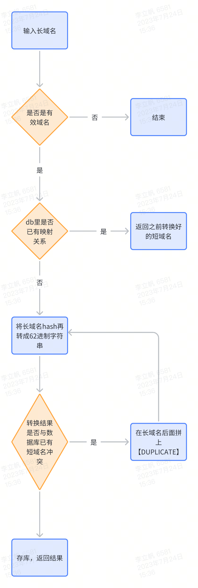
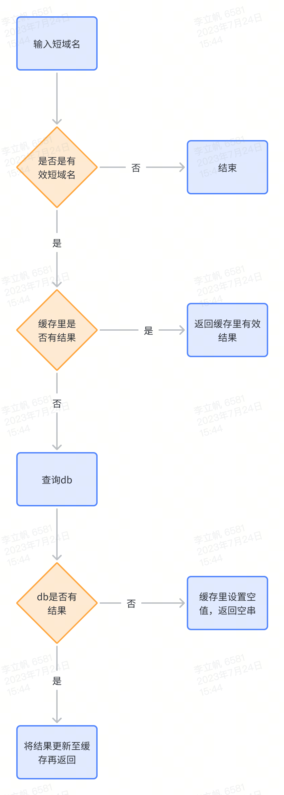
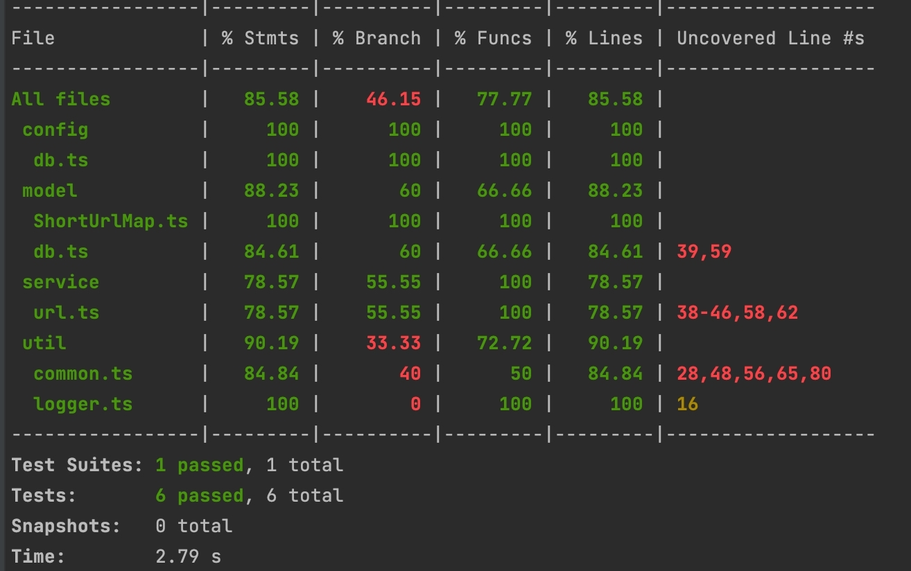

### Typescript 实现短域名服务
撰写两个 API 接口
- 短域名存储接口：接受长域名信息，返回短域名信息
- 短域名读取接口：接受短域名信息，返回长域名信息。

限制
- 短域名长度最大为 8 个字符（不含域名）

递交作业内容
1. 源代码
2. 单元测试代码以及单元测试覆盖率(覆盖率请勿提交整个目录，一张图片或一个 text table 即可)
3. API 集成测试案例以及测试结果
4. 简单的框架设计图，以及所有做的假设
5. 涉及的 SQL 或者 NoSQL 的 Schema，注意标注出 Primary key 和 Index 如果有。

#总体设计
1. 采用非加密型的 murmurhash 算法来快速hash原始长域名，能较好地兼顾性能与输出结果随机性
2. 通过短域名查询长域名是一个高频场景，为了提供接口响应性能，降低数据库查询压力，需要添加缓存层，本项目出于演示目的采用 LRU 本地缓存，实际多实例部署时，需要用 Redis
3. 在短域名存储接口里，为了保证同一个长域名转换结果相同，每次先查库，当并发较高时，此处是性能瓶颈，需要考虑通过 Redis+布隆过滤器 来过滤请求

##长域名转换流程图


##短域名查询流程图


#单测结果


#集成测试
## 正常转换长域名
```shell
curl -d '{"longUrl":"http://www.baidu.com/abc"}' -H "Content-Type: application/json" -X POST http://localhost:3000/shortenUrl
```
返回值
```json
{
  "msg":"success",
  "status":0,
  "data":"http://www.test.com/39y6VP"
}
```

## 转换非法长域名
```shell
curl -d '{"longUrl":"baidu.com/abc"}' -H "Content-Type: application/json" -X POST http://localhost:3000/shortenUrl
```
返回值
```json
{
  "msg":"invalid url: baidu.com/abc",
  "status":-1}
```

## 查询对应的短域名
```shell
curl --location 'localhost:3000/queryLongUrl?shortUrl=http://www.test.com/39y6VP'
```
返回值
```json
{
  "msg":"success",
  "status":0,
  "data":"http://www.baidu.com/abc"}
```

## 查询无效的短域名
```shell
curl --location 'localhost:3000/queryLongUrl?shortUrl=http://www.test.com/aaaaa'
```
返回值
```json
{
  "msg":"invalid short url: http://www.test.com/aaaaa",
  "status":-1}
```

#数据库设计
id: 主键   
short_url：唯一索引    
long_url：前缀索引   
```sql
create table short_url_map
(
id          bigint unsigned auto_increment comment '主键'
primary key,
short_url   varchar(32)                         not null comment '短网址',
long_url    varchar(1024)                       not null comment '原始长网址',
create_time timestamp default CURRENT_TIMESTAMP not null comment '创建时间',
constraint uniq_short_url
unique (short_url)
) ENGINE = InnoDB
AUTO_INCREMENT = 1
DEFAULT CHARSET = utf8
comment '短网址映射表';

create index idx_long_url
on short_url_map (long_url(12));
```


