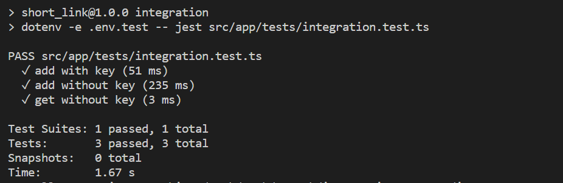

# 短链接

## 架构设计
<p align="center"></p>

考虑到短链服务的 qps 可能比较大，所以使用缓存对 key 以及 原有链接进行缓存。在设计该服务的时候，主要实现了两个接口，1. 短链生成；2. 短链跳转。
### 短链生成
生成短链，用户可以指定短链的 key，也可以让系统随机生成8位key的短链。
#### 指定短链的 Key
<p align="center"></p>

其主要逻辑如下：
1.因为 key 是全局唯一的，如果 key 在 db 中已经存在，就会写入失败，直接返回错误。
2.如果写入成功，将 key 和 origin_link 的映射关系，缓存到 redis。缓存过程是异步的，可降级，不用关心缓存 redis 是否成功。
#### 随机短链的 Key
<p align="center"></p>

其主要逻辑如下：
1.随机生成的key，会写入到 db，如果 key 在 db 中已经存在，就重新随机生成 key，直到不会出现重复为止。
2.如果写入成功，将 key 和 origin_link 的映射关系，缓存到 redis。缓存过程是异步的，可将及，不用关心缓存 redis 是否成功。
### 短链跳转
<p align="center"></p>
其主要逻辑如下：
1.优先从 redis 中获取短链的源地址。如果获取失败，则从 db 中获取。
2.对于 redis 中没有缓存或者缓存失效的情况，从 mysql 中将数据同步到 redis，这步是可降级的。
3.获取源地址成功之后，走301跳转。
## 数据库设计
|  字段   | 类型  | 描述|
|  ----  | ----  | ---- |
| id  | bigint | 记录ID，primary key |
| key | varchar(8) | 短链的key, unique key |
| originLink | text | 源链接 |
| createdAt | datetime | 创建时间 |

## 单测
执行单元测试
```bash
npm run unittest
```

## 集成测试
集成测试，采用 docker-compose 去编排整个测试环境，只需要执行如下命令就可以执行集成测试。
```bash
docker-compose up -d
```
查看集成测试结果：
```bash
docker logs app_test_client
```
