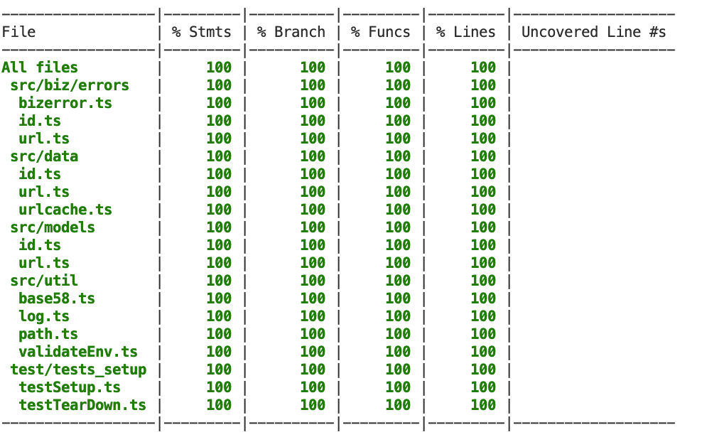
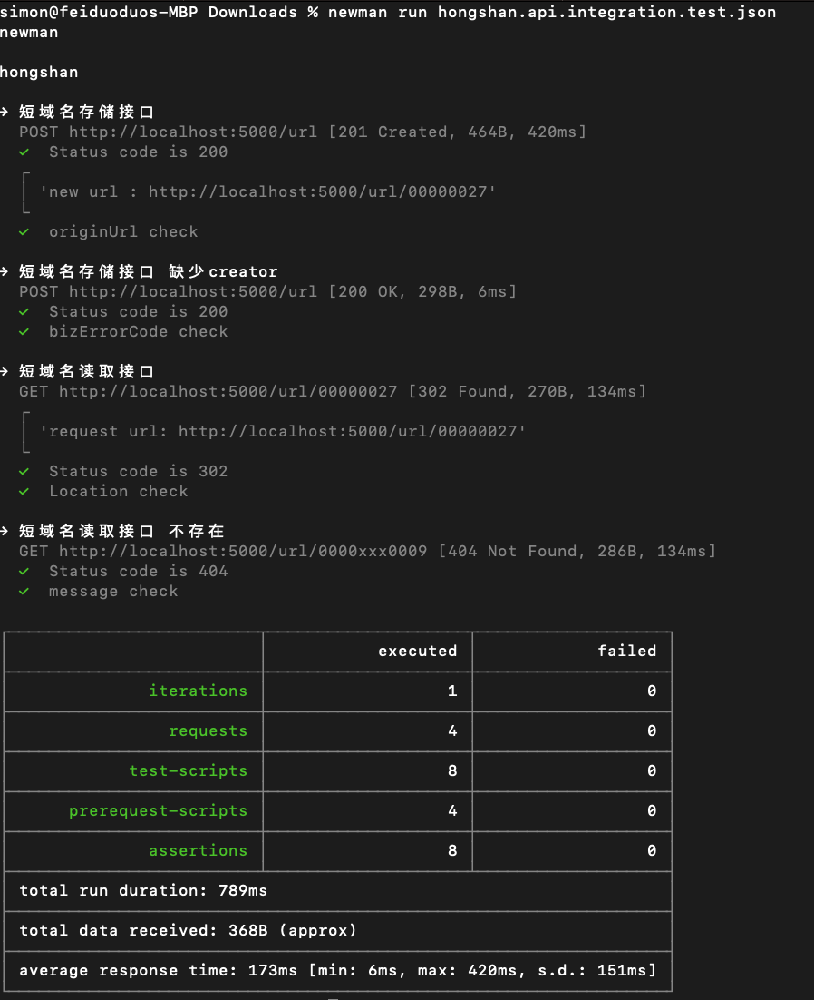

[toc]

# TypeScript Backend Engineer Assignment
## 设计
### 假设与估算
#### 假设
用户量： 100,000  
单用户每天创建链接数：3  
单用户每天获取链接数：30

长链接平均长度：30
#### 估算
QPS峰值：`100,000 * 33 / 24 / 3600 * 4 = 152 query/sec`
> 4为峰值估算的系数，平均值为38  

存储量：`100,000 * 3 * (30 + 8 + 32) * 365 = 7665MB/year`   
服务器数量：2，分布在不同可用区

### Database Schema
#### urls
链接记录表
| Field | Type | Index |  Description | Validate |
| --- | --- | --- | --- | --- |
| shortenUrl | string | unique | 短链 | 最长8位字符 |
| originUrl | string | - | 原始链 | 最长512位字符 |
| description | string | - | 描述信息 | 最长256位字符 |
| creator | string | - | 原始链 | 最长32位字符 |
| expires | Date | - | 过期时间 | - |
| status | string | - | "o": open，可用 "c": close，不可用 | - |
| createdAt | Date | - | 创建时间 | - |
| updatedAt | Date | - | 更新时间 | - |
#### systems
系统数据项表，name="id"的记录，为短链id生成器
| Field | Type | Index |  Description | Validate |
| --- | --- | --- | --- | --- |
| id | BigInt | unique | 短链生成器 | - |
| name | string | unique | 系统数据项name | 取值只有"id" |
### 架构图
#### 生成短链：  
Request --> Load Balancer --> RateLimiter --> Sequencer --> Database(Mongodb)  
> RateLimiter: [ratelimiter.ts](./src/middleware/ratelimiter.ts)为避免大量无效流量影响系统性能，对流量采用了基于IP的时间窗口限流策略

> Sequencer: 短链生成算法原理[url.ts/newUrl](src/data/url.ts)是，基于mongodb的findOneAndUpdate的$inc原子操作[id.ts](./src/data/id.ts)，采用base58编码[base58.ts](./src/util/base58.ts)，生成链接
##### 
#### 获取原始链接：   
Request --> Load Balancer --> RateLimiter --> Cache(Memory) --missed,read through--> Database(Mongodb)    
> 选择的缓存策略是read through模式[url.ts/getOriginUrlFromCache](src/data/url.ts)，辅助策略是miss保护位（分别对应db miss和数据失效的情况，避免缓存穿透）
### API
#### 生成链接
`POST /url`  
##### Request
Request Json Body
```
interface NewUrlRequest {
    originUrl: string,
    description: string,
    creator: string,
    expires?: Date,
}
```
##### Response
```
{
    "bizErrorCode": "0",
    "message": "",
    "data": {
        "url": "http://localhost:5000/url/0000000p",
        "originUrl": "https://bing.com",
        "description": "bing search engine",
        "creator": "Simon",
        "expires": null,
        "createdAt": "2023-09-12T02:59:05.309Z"
    }
}
```
| bizErrorCode | message |
| --- | --- |
| 0 | ok |
| 20000 | id system config is not created yet |
| 20001 | max id exceed |
| 30000 | short url should be provided |
| 30001 | origin url not found |
| 30012 | creator should be provided |
| 30013 | originUrl should be provided |
| 30014 | description should be provided |
| 30015 | creator too long |
| 30016 | originUrl too long |
| 30017 | description too long |

#### 获取原始链接
`GET /url/:shortUrl`  
##### Response
1. HTTP STATUS CODE 302, HTTP HEADER Location: originUrl
2. HTTP STATUS CODE 404, Response Json Body
```
{
    "bizErrorCode": "0",
    "message": "no such url"
}
```

### 后续扩展完善
1. 添加监控报警功能
2. 观察数据量以及缓存命中率，可扩展缓存为redis，可扩展服务器数量
3. 添加数据埋点，挖掘用户行为的数据价值

## 单元测试代码以及单元测试覆盖率
#### 单元测试代码
使用jest框架进行单元测试，100%覆盖率  
对于复杂逻辑的测试，利用jest的mock功能实现每个代码分支的测试，  

例如：  
[./src/data/url.test.ts](./src/data/url.test.ts)  中，url数据的读取采用了read-through的缓存策略，测试代码分别用mock功能模拟相应接口，实现了以下分支覆盖:  
1. 缓存miss;数据库exists
2. 缓存miss;数据库miss
3. 缓存exists
#### 单元测试覆盖率

## 集成测试
#### 集成测试代码
> [postman数据](./test/api_integration/hongshan.api.integration.test.json)    

采用postman编写集成测试代码:
1. 调用api POST /url 创建短链
2. 调用api GET /url/:shortUrl 访问上一步创建的短链

异常情况：
1. 输入值不合法
2. 读取不存在的短链
#### 集成测试结果



---
---


### Typescript 实现短域名服务（细节可以百度/谷歌）

撰写两个 API 接口

- 短域名存储接口：接受长域名信息，返回短域名信息
- 短域名读取接口：接受短域名信息，返回长域名信息。

限制

- 短域名长度最大为 8 个字符（不含域名）

递交作业内容

1. 源代码
2. 单元测试代码以及单元测试覆盖率(覆盖率请勿提交整个目录，一张图片或一个 text table 即可)
3. API 集成测试案例以及测试结果
4. 简单的框架设计图，以及所有做的假设
5. 涉及的 SQL 或者 NoSQL 的 Schema，注意标注出 Primary key 和 Index 如果有。

其他

- 我们期望不要过度设计，每一个依赖以及每一行代码都有足够充分的理由。

## 岗位职责

- 根据产品交互稿构建高质量企业级 Web 应用
- 技术栈：Express + React
- 在产品迭代中逐步积累技术框架与组件库
- 根据业务需求适时地重构
- 为 Pull Request 提供有效的代码审查建议
- 设计并撰写固实的单元测试与集成测试

## 要求

- 三年以上技术相关工作经验
- 能高效并高质量交付产品
- 对业务逻辑有较为深刻的理解
- 加分项
  - 持续更新的技术博客
  - 长期维护的开源项目
  - 流畅阅读英文技术文档
  - 对审美有一定追求
  - 能力突出者可适当放宽年限
