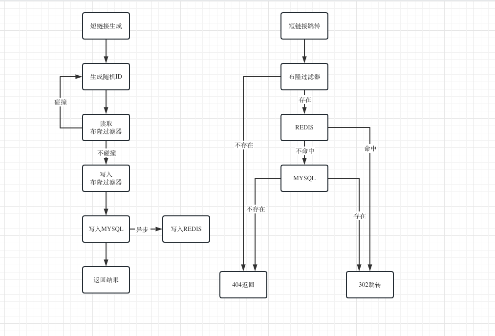

## 技术选型

对可能存在的长链接转短链接算法进行比较，也为了贴合文档中的要求，选择了以nanoid(类似uuid)随机字符串的形式生成短链接，每种方式都有一定的优缺点吧  

### hash算法

优点  
1.能保证同一个长链接在不同时刻生成的短链接保持一致  

缺点  
1.hash算法生成的短链接无序，对mysql等B+树或b树的插入操作不友好  
2.需要处理碰撞的问题  
3.如果为了保证唯一的优点，还需要维护短链接-->长链接一对多的关系  

### redis中央发号器

优点   
1.算法简单，只需要维护redis一个key的incrby  
2.生成的id严格有序，对mysql很友好  

缺点  
1.需要维护redis的持久化，宕机恢复（redis中心key不能丢失）  
2.依赖于redis单点性能，不好动态扩展  

### mysql自增id

优点  
1.算法非常简单，容易实现  
2.生成的id严格有序，可以作为mysql主键  

缺点  
1.无论mysql是单机或者分布式集群，扩展性都不能算良好  

### nanoid(或类uuid)

优点  
1.生成短链接id的算法不依赖中心节点，无性能瓶颈  
2.扩展性十分良好  

缺点  
1.算法生成的短链接无序，对mysql等B+树或b树的插入操作不友好  
2.需要处理碰撞的问题  

### 雪花算法（或类雪花算法）

优点  
1.生成短链接id的算法不依赖中心节点，无性能瓶颈  
2.扩展性十分良好  
3.生成的id基本有序，对mysql友好  

缺点  
1.生成id方式强依赖于本机时钟，有时钟回拨问题  
2.生成的id最大64bit,最大理论生成id数4000000/ms，但转换成62进制达到了10-11位，如果按照最大8位短链的方式，最大理论生成id数骤减到128/ms, 有严格的理论上限，无法扩展  
3.需要一个中心服务器管理workerId的分发和回收，提升了系统复杂度  

基于上述各种方案的优缺点，主要考虑了稳定性、扩展性、复杂性选择了nanoid的方式  

## TODO事宜及扩展性考量

1.bloom过滤器的实现，项目中只是实现redis set的方式实现了过滤器，但当数据量庞大到亿级别，从时间复杂度和空间复杂度都需要bloom过滤器的实现  
2.mysql的扩展，当数据量足够庞大（total 500万+）时，可以根据短链接id首字母进行一级分表（62张表），总数量超过3亿+时，可以考虑二级分表  

## 单元测试覆盖率

  

## 架构流程图

  