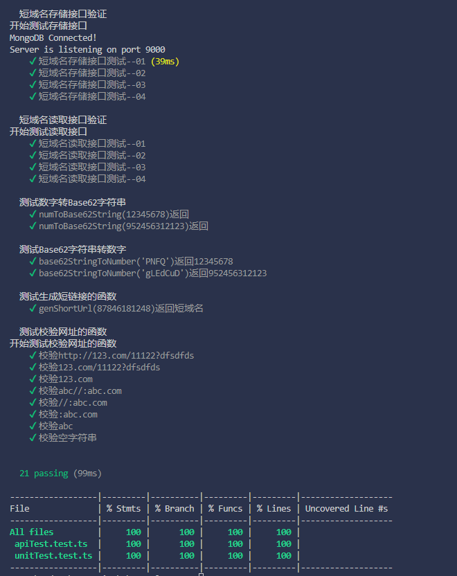
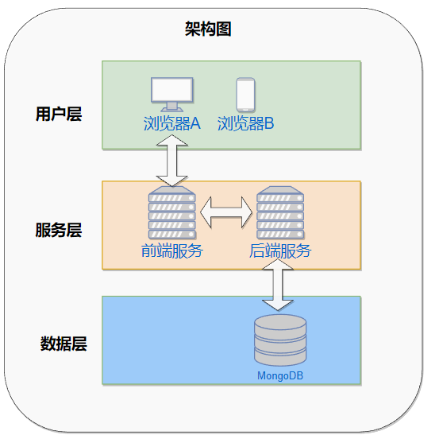

## TypeScript后端作业

### 启动服务

Pre-requirement: 安装Node.js、MongoDB

启动服务命令：

```
npm run start
```

<br/>

## 单元测试及覆盖率

测试命令:

```
npm run test:coverage
```

测试结果
<br/>
 

见./coverage/index.html
<br/>
<br/>

### API 集成测试案例以及测试结果

```
1.请求"/saveLongUrl"接口，输入长网址，返回短网址
curl -X POST http://127.0.0.1:9000/saveLongUrl -H 'Content-Type: application/json' -d '{"longUrl": "http://123.xyz/234sdrf5fg/?a=12"}'
结果：{"success":true,"result":{"shortUrl":"http://xxx.com/12345678"}}
通过测试！

2.请求"/saveLongUrl"接口，输入非网址字符串，返回错误
curl -X POST http://127.0.0.1:9000/saveLongUrl -H 'Content-Type: application/json' -d '{"longUrl": "aaafecc"}'
结果：{"success":false,"msg":"Invalid Url!"}
通过测试！

3.请求"/saveLongUrl"接口，不输入网址，返回错误
curl -X POST http://127.0.0.1:9000/saveLongUrl -H 'Content-Type: application/json' -d '{}'
结果：{"success":false,"msg":"Invalid Url!"}
通过测试！

4.请求"/fetchLongUrl"接口，输入有效短网址，返回长网址
curl -X GET 'http://127.0.0.1:9000/fetchLongUrl?shortUrl=http://xxx.com/12345678'
结果：{"success":true,"result":{"longUrl":"http://123.xyz/234sdrf5fg/?a=12"}}
通过测试！

5.请求"/fetchLongUrl"接口，输入不存在的短网址，返回错误
curl -X GET 'http://127.0.0.1:9000/fetchLongUrl?shortUrl=http://xxx.com/ttt'
结果：{"success":false,"msg":"Your short url not exists！"}
通过测试！
```

<br/>

### 框架设计图
<br/>

  
简化架构，暂不考虑高可用高并发等情况，省略网关、缓存、集群等

<br/>

### 数据库Schema

```javascript
ShortUrl = Schema({
  _id: {type: mongoose.SchemaTypes.ObjectId},
  shortUrl: {type: string},
  longUrl: {type: string}
})
```