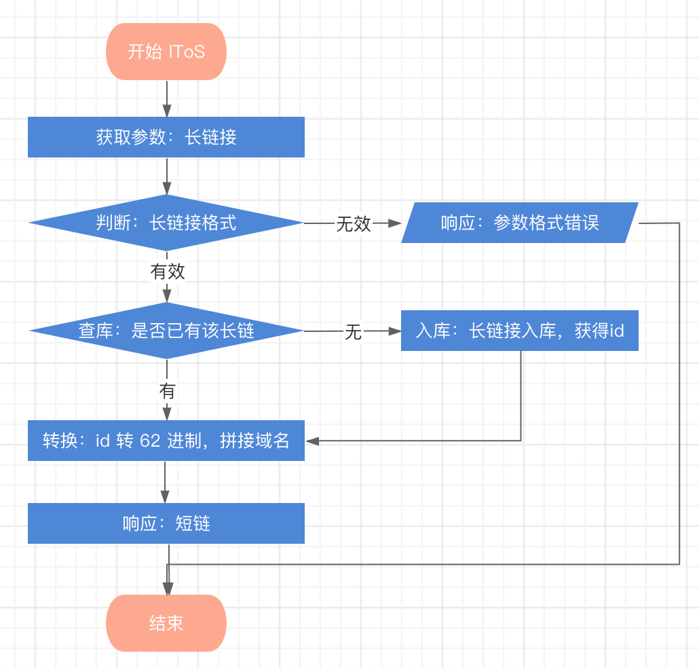
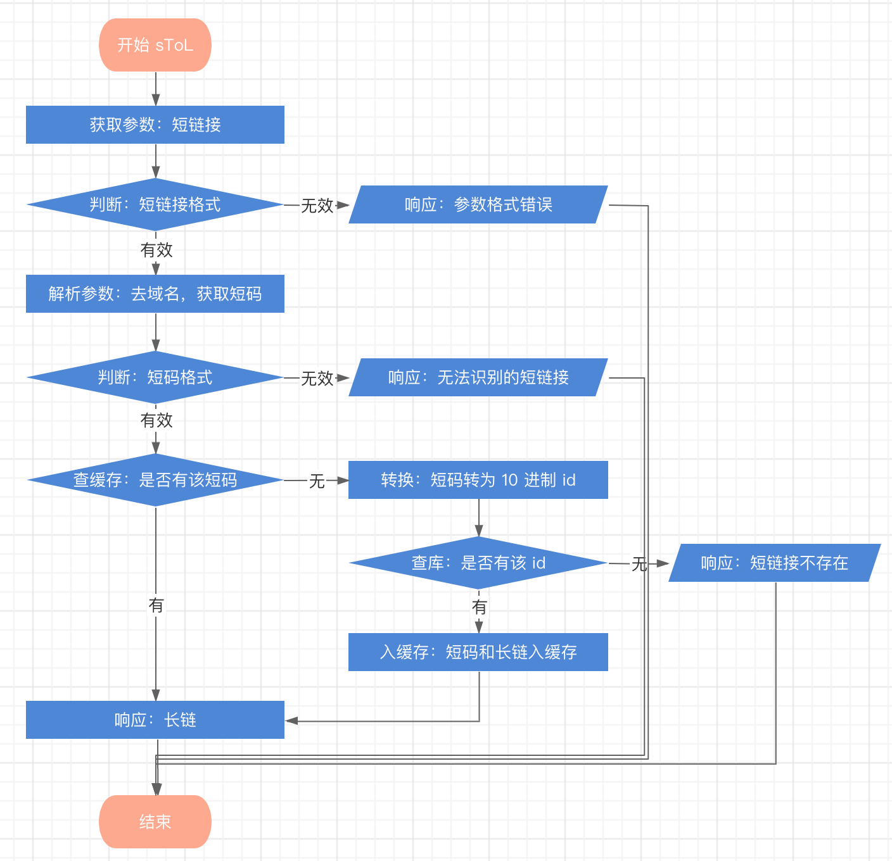
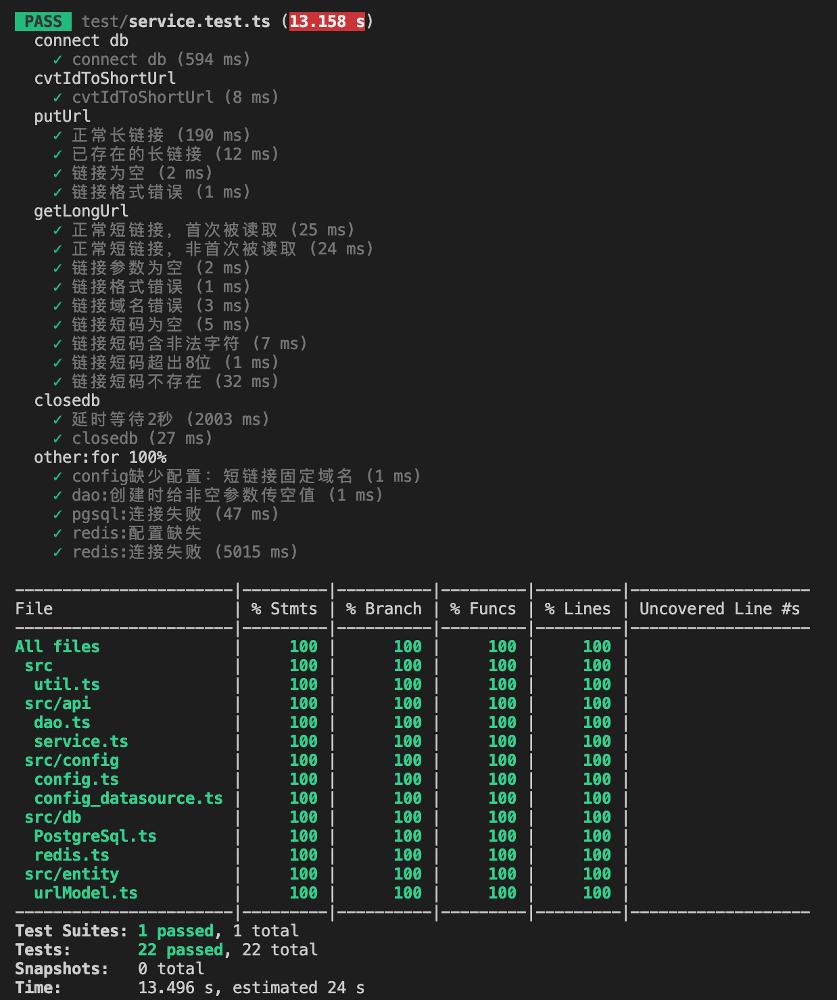

# Short-url
## 需求
```
短域名存储接口：接受长域名信息，返回短域名信息。
短域名读取接口：接受短域名信息，返回长域名信息。
短域名长度最大为 8 个字符（不含域名）。
不要过度设计、过度使用依赖。
```
注：此处推测“短域名”是指“短链接”
## 实现方案
- `链接缩短方案`：发号器 + 62 进制，使用数据库自增 id 转为 62 进制作为短链接（转换进制时码表用乱序的）。
- `缓存`：`Redis`，键值对格式为 `{短链接: 长链接}` 。
短链接存在读频繁的问题，所以在首次读取时入缓存。
- `持久化存储`： `PostgreSQL`
- `其他设计`：
  - graceful shutdown
  - “长链接”字段有注入风险，使用 `Sequelize` 作为 ORM 框架。
- `技术栈`：`Typescript + Express`

## 项目运行
1. 在 `./src/config/config_datasource.ts` 中补充数据库用户名、密码、库名等信息。
2. 安装依赖： `npm i`
3. 构建: `npm run build`
4. 运行: `npm run start` (此时数据库表会自动创建)

## 提交内容：
### 1. 源码
请见 [`./src`](./src)
### 2. 流程图
- 流程图-短链接存储

- 流程图-短链接读取


### 3. API
- 短链接存储
```javascript
PUT '/url/lToS'
request body: {
    // 长链接
    "longUrl": "https://www.long.com/longlonglong1756789892"
}
response: {
    // 业务状态码
    "code": "200",
    // 业务信息
    "message": "ok",
    // 短链接
    "data": "https://st.com/o"
}
```
- 短链接读取
```javascript
GET '/url/sToL'
request param: 
    // 短链接
    shortUrl=https://st.com/o
response: {
    // 业务状态码
    "code": "200",
    // 业务信息
    "message": "ok",
    // 长链接
    "data": "https://www.long.com/longlonglong1756789892"
}
```
#### 错误码表
请见 [`./doc/错误码.txt`](./doc/错误码.txt)

### 4. 单元测试代码、单元测试覆盖率（图片或table)
- 单元测试代码
请见 [`./test`](./test)
- 覆盖率
100%


### 5. API 集成测试案例以及测试结果
案例：（由于单测已完成，此处案例不再关注过多试错细节）
| 编号 | 描述             | 预期结果      | 测试结果 |
| --- | ---------------- | ------------ | ------ |
| a | 传入长链接，获取短链接 | 正常返回短链接 | 符合预期 |
| b | 传入短链接，获取长链接 | 正确返回长链接 | 符合预期 |
| c | 传入错误短链接，获取长链接 | 无法获得长链接 | 符合预期 |

测试结果截图请见 `./doc/API测试结果1～3.png`

### 6. SQL schema，Primary key，Index
请见 [`./doc/db_schema.ddl`](doc/db_schema.ddl)
