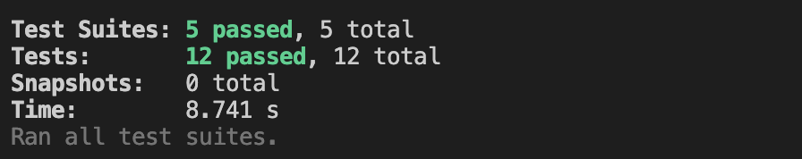
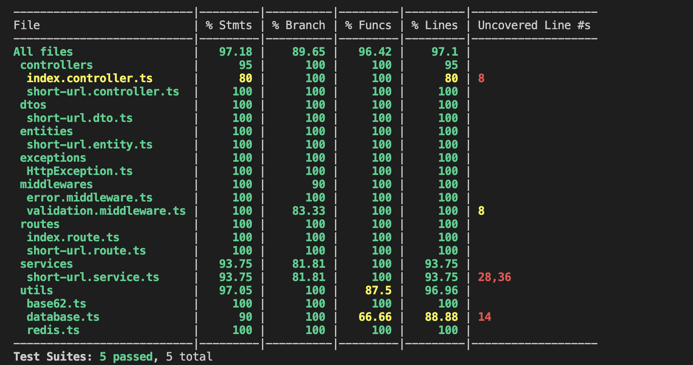

# 快速开始

## 设计思路

#### 1. 短域名生成规则

> 通过 redis incr 获取不重复 ID，添加随机数 （ID _ 62 \*\*2 + Math.random() _ 62 \*\* 2）使 ID 不连续不被预测，然后转化为 8 位(6 位自增 ID + 2 位随机字符串) base62 字符串
> 备注： 再转化为 base62 之前，还可以通过 CR4 算法对 ID 进行加密。后续再进行扩展。

#### 2. 接口请求

> 数据通过`Mysql`储存。通过`Redis`对域名映射做缓存。可对短链接配置过期时间，过期后不可访问（不配置默认缓存 24 小时，失效后再次缓存 24 小时，避免冷数据占据缓存空间）。

## 数据库设计

```sql
CREATE TABLE `short_url` (
  `id` int(11) NOT NULL AUTO_INCREMENT,
  `short_url` varchar(50) COLLATE utf8mb4_bin NOT NULL COMMENT '短链接',
  `long_url` varchar(200) COLLATE utf8mb4_bin NOT NULL COMMENT '原始长链接',
  `expired_at` timestamp NULL DEFAULT NULL COMMENT '过期时间',
  `created_at` timestamp(6) NOT NULL DEFAULT CURRENT_TIMESTAMP(6) COMMENT '创建时间',
  `updated_at` timestamp(6) NOT NULL DEFAULT CURRENT_TIMESTAMP(6) ON UPDATE CURRENT_TIMESTAMP(6) COMMENT '更新时间',
  PRIMARY KEY (`id`),
  UNIQUE KEY `udx_short_url` (`short_url`)
) ENGINE=InnoDB AUTO_INCREMENT=1 DEFAULT CHARSET=utf8mb4 COLLATE=utf8mb4_bin;
```

## 接口文档

### POST 新建短链接

POST /shorts

> Body 请求参数

```json
{
    "longUrl": "https://www.baidu.com"
}
```

#### 请求参数

| 名称        | 位置 | 类型   | 必选 | 中文名       | 说明 |
| ----------- | ---- | ------ | ---- | ------------ | ---- |
| body        | body | object | 否   |              | none |
| » longUrl   | body | string | 是   | 长链接       | none |
| » expiredAt | body | string | 否   | 链接过期时间 | none |

> 返回示例

#### 返回结果

| 状态码 | 状态码含义                                              | 说明 | 数据模型 |
| ------ | ------------------------------------------------------- | ---- | -------- |
| 201    | [OK](https://tools.ietf.org/html/rfc7231#section-6.3.1) | 成功 | Inline   |

#### 返回数据结构

#### 状态码 **201**

| 名称       | 类型   | 必选 | 约束 | 中文名     | 说明 |
| ---------- | ------ | ---- | ---- | ---------- | ---- |
| » shortUrl | string | true | none | 对应短链接 | none |
| » longUrl  | string | true | none | 长链接     | none |

### GET 查询短链接

GET /shorts/:short

#### 请求参数

| 名称  | 位置 | 类型   | 必选 | 说明 |
| ----- | ---- | ------ | ---- | ---- |
| short | path | string | 是   | none |

> 返回示例

#### 返回结果

| 状态码 | 状态码含义                                              | 说明 | 数据模型 |
| ------ | ------------------------------------------------------- | ---- | -------- |
| 200    | [OK](https://tools.ietf.org/html/rfc7231#section-6.3.1) | 成功 | Inline   |

#### 返回数据结构

#### 状态码 **201**

| 名称       | 类型   | 必选 | 约束 | 中文名     | 说明 |
| ---------- | ------ | ---- | ---- | ---------- | ---- |
| » shortUrl | string | true | none | 对应短链接 | none |
| » longUrl  | string | true | none | 长链接     | none |

## 安装

您首先需要连接 mongoose 数据库并创建“short-url-api”数据库。我们推荐使用 yarn 来管理依赖项和运行我们的命令。

```bash
$ yarn
```

## 运行 API 服务

```bash
# development
$ yarn dev

# production mode
$ yarn build
$ yarn start
```

## 运行测试用例

查看测试用例请访问文件夹命名为**test**下的文件, 比如：src/routes/shortUrlRouter/**test** 该目录包含所有关于短链接的测试用例。

```bash
$ yarn test

```



## 代码覆盖率

```
$ yarn test:coverage
```

用浏览器打开项目目录：./coverage/lcov-report/index.html 以查看代码测试结果. 一般工程不会将代码测试率提交到 git 进行管理，所以我们做了以下截图：


