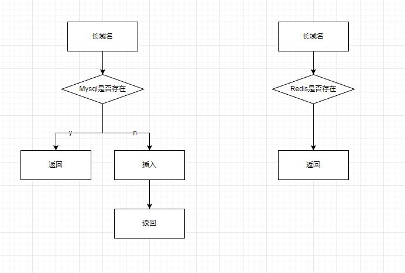

# TypeScript Backend Engineer Assignment

### Typescript 实现短域名服务（细节可以百度/谷歌）

短域名服务，并非短链接服务，最初理解有些偏差,理解为了长url转短url。

根据网上信息域名长度最大限制是63个字符，域名总长度则不能超过253个字符，在域名中大小写是没有区分的。
题目要求短域名长度最大为 8 个字符（不含域名）

考虑用mysql和redis结合来支持系统

~~~~sql
create table domain_exchange
(
    id           int auto_increment
        primary key,
    //short_domain varchar(8) null comment '短域名',
    //url_hash varchar(64) not null comment 'url哈希',
    domain       varchar(300) not null comment '原域名',
    create_time  timestamp null,
    update_time  timestamp null,
    constraint domain
        unique (domain)
);
~~~~

最初考虑是很长的text型url所以不能直接加唯一索引，需要另外hash后加唯一索引。现在由于域名长度有限，所以直接加唯一索引简化设计。
题目要求短域名最大8个字符，不含域名，所以按要求并不需要加密或者处理，可以直接使用表中的主键id做62进制处理，并限制长度即可。这里不做处理会有漏洞，可以被顺序拉去。
如果做处理的话用时间加id生成随机数，再62进制处理可以使短域名不连续。
8个字符的短域名a-zA-Z0-9，意味着一个62进制数，62的8次方约两百万亿，所以暂时没有考虑用完的情景。
redis的使用比较简单，直接key-value,short-domain---domain.

两个 API 接口

- 短域名存储接口：接受长域名信息，返回短域名信息
  POST /createShortDomain 参数为 domain:bulabulabula.com

~~~~json
{
  "shortDomain": "bula"
}
~~~~

反复调用返回同样信息，不会重新插入

- 短域名读取接口：接受短域名信息，返回长域名信息。

  GET /getDomain/:shortDomain 路由参数 shortDomain为短域名，返回为对应完整域名。

~~~~json
{
  "domain": "bulabulabula.com"
}
~~~~

考虑到穿透问题，所以这个接口十分简单，直接从redis里面取。没有的情况下也不再请求mysql。

犹豫是域名系统，考虑到高可用，所以基于redis，不考虑redis奔溃直接打mysql的情况，因为mysql难以承受这个量级的请求。
系统需要保持redis的稳定，需要脚本在redis重启时把mysql的数据重新加载到redis。
同时系统没有考虑短域名过期的问题。

关于测试，webstorm没调通，postman做了接口测试，同时系统缺乏细分单元，故没有做单元测试。

