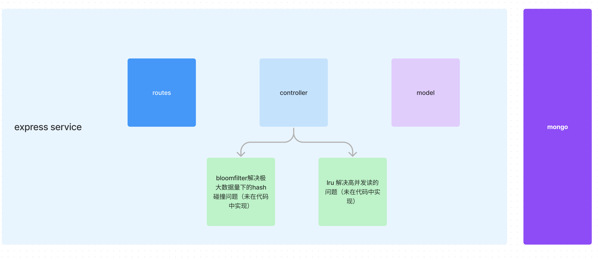
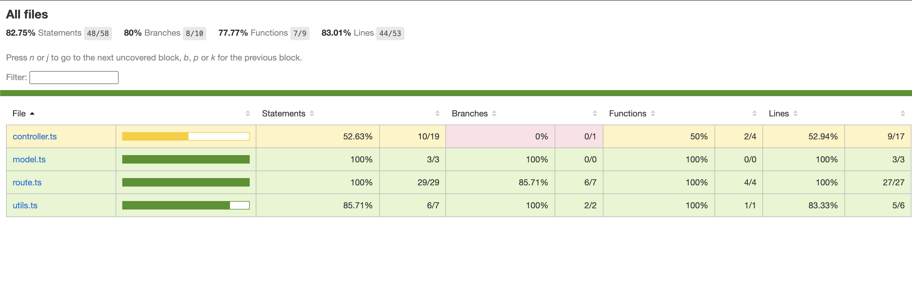

### 基础假设与设计考虑

  * 根据需求描述，该服务不是直接面向外部（短域名接口是返回短域名信息而不是直接提供跳转服务）
  * 基于上述假设，这里不考虑获取短域名接口的缓存（由前置的面向用户的服务提供，而且分使用场景而言，缓存设计上也有不同考虑， 原计划使用lrucache）
  * 对于同一URL，得的值应该一致，为了实现这个目标考虑考虑过程：
    
    1. 直接使用类似于uuid等方法生成唯一id，使用长url反查唯一id，这一方法主要问题是长url可能会很长(无RFC规定，但是实践中浏览器目前支持的很长)，导致索引效率低甚至无法索引的情况，另外，发生数据遗失之后，对同一url无法生成同样的短串（无法恢复数据）。
    2. url是开放集合，没做严谨考证的情况下，[粗略以收录的网页数量](https://siteefy.com/how-many-websites-are-there/)当做url的话，将是40亿级别, 本服务假设的值也不应太低:
      ```
      Indexed Web contains at least 4.98 billion pages (September 2021, Tilburg University Research).
      ```
    3. 所以考虑使用murmurhash对相关url进行hash, (murmurhash 32bit下产生的值也是40亿级别，在不严谨的情况下符合需求)

    4. 直接使用murmurhash + base62转换之后的id作为mongo的主键，查询有则直接返回已存在，没有则直接写入新的id和长url

    5. 关于缓存，除了前述短查长API的lru缓存，还可以考虑在长生短的API中设置布隆过滤器来处理hash冲突，考虑到实际服务的URL数量可能会很大（社交网络场景下的），但是仅做讨论，实现中作为demo，暂时不去实现
    
### 结构简述





### 单元测试覆盖率截图


### 集成测试
抱歉，暂缺

### 总结
1. typescript 尚在熟悉过程中，对于一些地方是不是该用明显ts风格的写法，以及相关想法的显著益处体会不深，需要进一步揣摩
2. 之前确实缺乏单元测试相关经验，项目主要时间在了解单元测试领域相关工具，写法等基础知识，对于如何构思单元测试，以及代码写法对单元测试的影响尚缺心得体会，技术选型也不成熟，导致后续mongo一个方法测试无法往下写