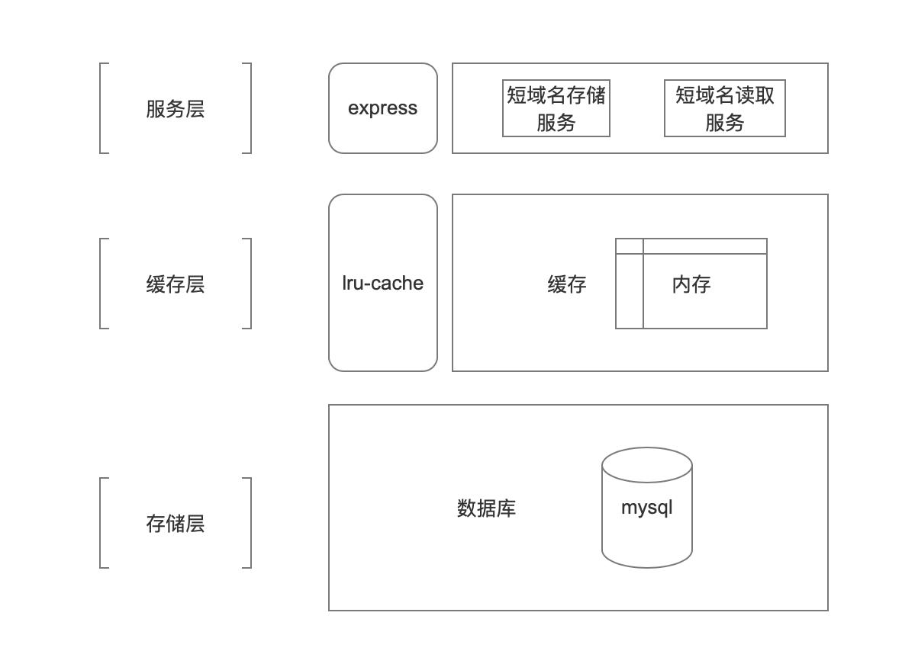

# url-shortener

## 假设及框架设计

### 假设

设定： 短域名对应的唯一值简称短码

* 短码唯一，且永久有效
* 用户规范使用本服务。（不考虑ip、用户访问频率限制、用户权限限制、禁用域名/主机等以防止短域名服务被滥用的情况）
* 不需要统计等功能。（只单纯做短域名转换，不做域名访问数据记录及统计等功能）

### 框架设计
注：数据库部分由 `knex` 进行实现，所以 `knex` 支持的数据库均支持，直接在配置文件中配置要使用的数据库即可。



## 数据库表字段信息

* 表名： `shortUrl`
* 字段： `shortCode` 20 位字符串 主键
* 字段： `longUrl` 3000 位字符串 唯一约束

```ts
       // 主键目前8位即可，预留空间
        table.string('shortCode', 20).primary();
        table.string('longUrl', 3000).unique();
```

## 支持配置

配置文件见 `config/` 目录

```yaml
#  兜底配置-假如未指定 环境变量：NODE_ENV=development/test/production 默认development的生效
port: 3000
# knex 加载数据库配置-参考： https://knexjs.org/guide/#configuration-options
dbConfig: { client: 'sqlite3', connection: { filename: './data.db' } }
# LRUCache 缓存配置 参考：https://github.com/isaacs/node-lru-cache#readme
cacheOptions: {
        #  最大数量
        max: 100,
        # ms
        ttl: 3600000,
        #  获取时更新存活时间
        updateAgeOnGet: true,
    }
# 短域名长度最大字符数（不含域名） 
shortCodeMaxLength: 8
# 短域名部分
shortUrlPrefix: https://scdt.com/

```