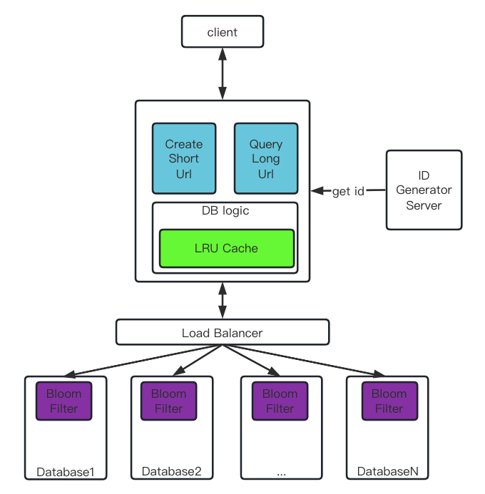

# ShortenDomainService

## 说在前面的话
老实说，我并没有使用typescript做过后端业务，正如岗位介绍中说的这的确是一种很激进的技术选型，但是短暂的犹豫之后我还是选择完成这份小作业，也正好看看自己是否具备短时间去学习一门新技术的能力。正因为我不是一个typescript专家，所以我会尽量让我的代码保持简单，最好不要有任何外部依赖，更注重把整个方案讲清楚。

上一次使用javascript是在本科毕设项目中使用React构建前端界面，那就凭借着模糊的记忆开始吧。

## 方案设计
tinyurl在业界其实已经有非常成熟的方案，我的作业也是在阅读了一些内容之后完成：
- https://medium.com/@sandeep4.verma/system-design-scalable-url-shortener-service-like-tinyurl-106f30f23a82
- https://www.enjoyalgorithms.com/blog/design-a-url-shortening-service-like-tiny-url
- https://www.youtube.com/watch?v=JQDHz72OA3c

google了短域名服务的概念，总结一下就是要把一个long url转为一个short url，并且后续可以通过short url访问long url。此概念在不同业务场景下也会有不同的要求，所以这里我先为系统划分一个边界：
- 所有short url和long url的映射都会一直保存；
- 生成的short url长度不能超过8；

**1.构建short url和long url的映射**

这里选择[上文](!https://medium.com/@sandeep4.verma/system-design-scalable-url-shortener-service-like-tinyurl-106f30f23a82)中提到全局序号转为base62进制字符的方法，选择全局需要而不是随机数字的原因是为了减少复杂度和耗时，生成id之后无需检查是否存在，选择base62字符的原因是base62只包含数字和字母，符合url编码规则且能进一步缩短数字。这里限制了生成的url长度不超过8，因此最多可以创建62^8个映射，这个数量级已经很大了。通过全局id转换得到一个base62 string作为key，利用key来生成short url，并且存储key和long url的映射。


**2.存储short url和long url的映射**

存储引擎的选择也很重要，如果数据量不大则SQL和NoSQL都可以，但是数据量比较大的时候个人倾向于NoSQL，读写性能更好，本人当前所在团队的存储大部分已经切换到Level DB。

**3.考虑系统的scalability**
任何系统在演进过程中都会遇到两个瓶颈：
- 高并发：web场景可以通过横向扩容来解决，设计的时候要规避阻碍横向扩容的方案，例如本地cookie等，也可通过cace来加快数据处理；
- 数据膨胀：一般通过分库分表来解决，这里可以通过1中生成的key的第一个字符来分表，这是最简单有效的做法，另外也可使用一台master server维护分表信息，查询的时候通过key去master server中确认使用哪张表，TiDB就是利用这种方案构建分布式存储；

## ShortUrlServer架构图
上文给出了一点设计思路，这里给出整个方案的架构图：



这里一共会实现两个web api，分别用于创建short url和查询long url，相关定义如下：
```typescript
CreateShortUrl
Method: POST
URL: /api/create_short_url
Request Body(json): {"long_url": "xxxxx"}
Response Body(json): {"short_url": "xxxxx"}

QueryLongUrl
Method: Get
URL: /api/query_long_url/:short_url
Response Body(json): {"long url": "xxx"}
```

当然图中的组件并没有全部实现，其中ID Generator Server我会用一个function代替，类似一个放号服务，可以使用类似snowflake的算法，Database的Load Balancer这里也会用一个function代替，这里会使用key的第一个字符来进行Load Balance。

## Let's Coding

浏览了Express官方文档，根据初始教程来完成代码，为了保持简洁这里没有使用脚手架来创建项目，仅仅只有几个ts文件，项目骨架如下：
```
.
|-- index.ts // express server
|-- generator.ts // 模拟一个id生成的server
|-- database.ts // 模拟db操作，所有的数据均在内存中
|-- util.js // 工具代码
|-- imgs // 图片资源目录
|-- package.json // npm 项目配置文件
|-- package-lock.json // lock文件
|-- tsconfig.json // typescript 配置文件
|-- start.sh // 启动bash脚本
|-- test.sh // 测试bash脚本
```
很遗憾，因为手头有工作要处理，所有没有时间去看jest文档来编写单元测试，这里我编写了一个简单的shell脚本，利用curl来模拟一下测试。

clone代码到本机之后可以按照以下步骤体验：
- 运行**bash start.sh**就可以自动编译ts，并且在8080端口启动一个web服务；
- 手动执行curl命令来体验；
- 或者运行**bash test.sh**来通过脚本测试；
```bash
// migrate database
npm install -g typeorm
npm install -g ts-node
npx typeorm-ts-node-commonjs -d datasource.ts migration:run

// start a server
bash start.sh

// 手动执行curl
curl -X POST -H "Content-Type: application/json" -d '{"long_url": "${test_url}"}' http://localhost:8080/api/create_short_url
curl -X Gethttp://localhost:8080/api/query_long_url/"${long_url}"

// 脚本批量测试，会进行100次测试，相关结果会输出到create.tmp和query.tmp，格式均是long_url short_url
bash test.sh
```

## 总结

工作了一年多都在使用c++进行开发，切换到typescript确实很舒服，团队也有一个模块使用node做后台，但是只是作为一个http转发模块，还是挺有意思的。

当然由于时间关系，这其中还有很多不完善的地方，也暂时记录下来：
- cache层和db中的bloom filter并没有实现，对于这种读多写少的应用，这两个东西往往能起到很大的作用；
- 由于全局id只是简单的递增，所以生成的short url是连续的，数据在分库分表之后也不是均匀的，应该调整策略均匀放号；
- 没有考虑淘汰策略，很多场景生成的short url会有时效性；


## 个人介绍
本人21年本科毕业于武汉理工大学，目前就职于腾讯，在wxg的企业邮箱团队担任后台开发，目前有1年半的后台开发经验，本人十分热衷于各种新技术的学习和探索，闲暇时间也会主动学习提升自我。虽然暂时没有typescript后台开发的经验，不过如果有机会也愿意主动去学习。

本人技术blog和github链接如下：
- https://mr-xingjian.github.io/ 
- https://github.com/Mr-xingJian
