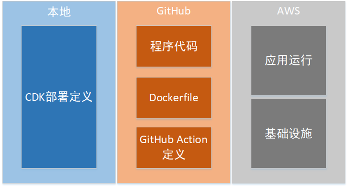
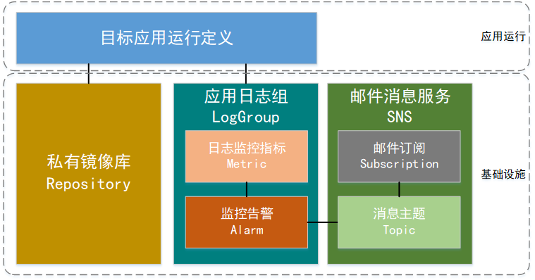
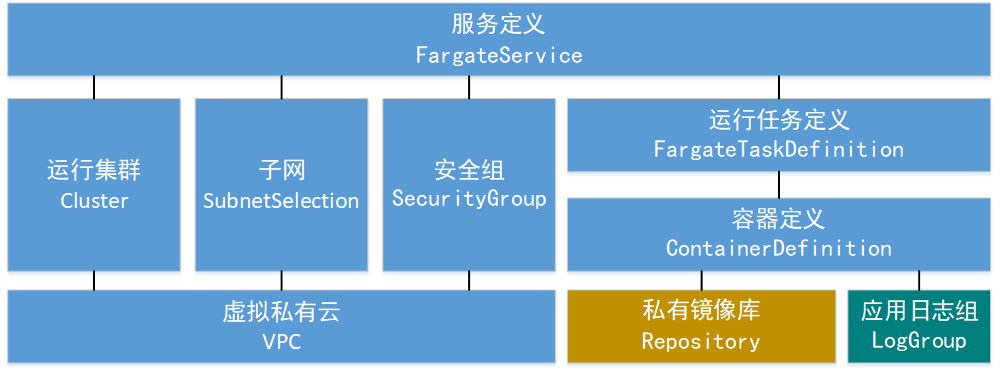
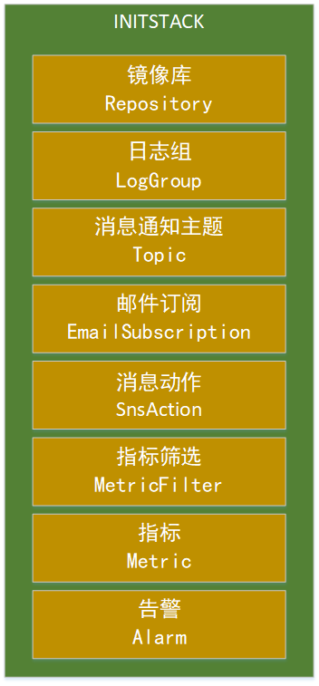
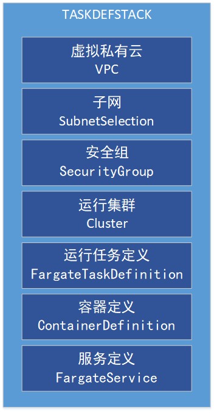
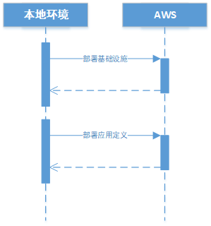
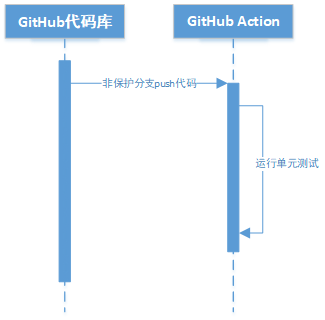
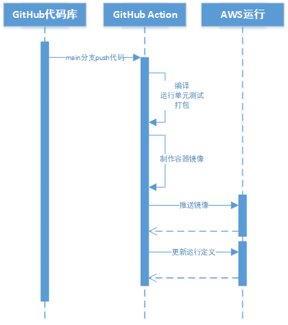

## 项目设计
### 基本技术选型：

使用CDK定义本项目所涉及的所有AWS基础设施。

开发语言定为java，使用JDK 17。

使用一个已经编写完成的springboot应用程序simplestspringboot作为目标应用程序（https://github.com/MaxMeng/simplespringboot） 该应用可直接使用maven进行编译、单元测试、打包等，启动后监听80端口。
### 架构及流程设计

#### 功能及部署架构

全系统按功能分为本地运行环境、代码库、CICD、程序运行基础设施和程序运行环境几部分，分别部署在本地环境、GitHub、AWS。各部分和部署位置如图。

##### 本地环境

在本地存放以java编写的CDK部署栈，并且本地具备完整的CDK定义运行条件，仅在本项目初始部署的时候使用本地环境。

##### GitHub

在GitHub中存放目标应用程序simplestsprintboot的代码、镜像制作文件Dockerfile、Github Action定义。

按一般java应用惯例，将Dockerfile放入程序代码根目录中。

按照GitHub规范，Github Action的定义需使用yaml语法写成yml文件，并放置在代码项目中的.github/workflows目录中。因此在GitHub中可以只存放一个代码项目。

按需求分析结论，需要为feature分支和main分支的push操作分别定义一个GitHub Action。

##### AWS

AWS的部署无需在AWS控制台中进行干预，所有部署指令和定义均由本地CDK或者GitHub发起。

#### AWS环境架构

##### AWS运行环境总架构

根据需求分析结论，把程序运行环境分为基础设施和应用运行两部分。

基础设施指和应用本身相干性较弱，从功能上能够脱离应用独立存在的AWS组件，实际上该类组件一经建立，一般不会再做改动。

本项目中，建立镜像库、日志组、消息服务三大类基础设施组件。

其中，基于日志组，建立日志筛选类监控指标和监控告警两个组件；基于消息服务建立消息主题和邮件订阅两个组件，并且建立监控告警和消息主题之间的联动，一旦触发监控告警，通过消息主题向订阅该主题的邮箱发送邮件。

##### 目标应用运行架构

为运行一个Fargate类应用，需要建立图中所示的一系列组件。

除镜像库和日志组之外，其余组件之间关系较紧密，宜放在一起建立。

此外，GitHub Action执行AWS发布的时候需要一个单独的用json表达的运行任务定义。

##### CDK定义栈

为基础设施和应用运行建立两个CDK定义栈，由于基础设施的定义仅在初始化部署的时候执行一次，而应用运行定义可能且可以被执行多次部署，故二者不适合使用Constructs进行整合。

###### 基础设施定义栈INITSTACK

对指标筛选定义（MetricFilter），配置“ERROR”为关键词，指标值为1，意即在日志中发现ERROR，指标值就为1。

对指标（Metric），设置采样间隔为10秒，收集MetricFilter的返回值并加和，意即10秒内日志中出现“ERROR”的次数。

对告警（Alarm），设置在1个采样周期内，若指标Metric的值大于等于1，触发告警并采取动作，动作为通过消息通知主题（Topic）发送提醒邮件。

###### 应用运行定义栈TASKDEFSTACK

对安全组（SecurityGroup），配置开放80端口，接受一切来源的请求。

对容器定义（ContainerDefinition），配置使用私有镜像库、日志组、映射80端口

对服务定义（FargateService），配置开放获取公网IP。

#### 交互流程

##### 初始部署

初始部署按照先部署基础设施，再部署应用运行环境的顺序进行。

##### 非保护分支push代码事件

因非保护分支push触发GitHub Action后，由GitHub Action执行mvn test，一体化执行编译和测试。

##### 保护分支push代码事件

因保护分支push触发GitHub Action后，执行mvn package，一体化执行编译、测试、打包，此后进行容器镜像制作，推送镜像，更新容器运行定义并部署等动作。

