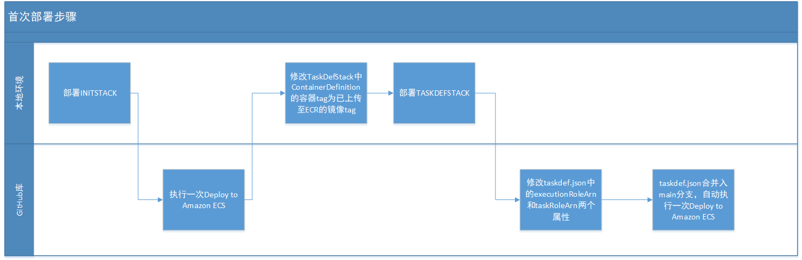

## 部署说明
### 总述

由于GitHub Action中部署ecs fargate的功能要求使用json格式的task定义文件，尤其是需要使用executionRoleArn和taskRoleArn两个属性，这两个属性只有CDK中的task定义成功部署到AWS上之后才会生成。
因此需要先部署INITSTACK，部署好镜像库、日志组等基础设施，并完成镜像推送，再根据推送的镜像tag修改TASKDEFSTACK的CDK定义程序并部署，获取到部署后的两个ARN值，再更新至task定义文件中，方可完整部署本项目。

### 环境要求

#### 本地环境

本地环境需安装CDK2.13.0或以上版本，具备CDK运行条件，并在环境变量中需配置如下四个变量：

1、AWS_DEFAULT_ACCOUNT：AWS用户ID，12位数字

2、AWS_DEFAULT_REGION：默认AWS区域

3、AWS_ACCESS_KEY_ID：AWS access key

4、AWS_SECRET_ACCESS_KEY：AWS账户访问密钥

此外，因涉及文件上传至GitHub及文件内容修改，本地环境也应具备文本编辑和正常访问GitHub的条件。

将awsfargatedef项目代码放置在本地环境。

#### GitHub

将simplestspringboot作为一个单独的repository整个上传到GitHub。并在该repository中，设定main为受保护分支，在Actions secrets中设置和本地环境相同的AWS_ACCESS_KEY_ID和AWS_SECRET_ACCESS_KEY。

### 执行步骤

1、本地执行cdk deploy MXINITSTACK

2、执行完成后手动执行GitHub Action中的Deploy to Amazon ECS，本次执行的目标是在镜像库中推送初始的应用程序镜像，故不关心最终执行结果。

3、执行完成后访问AWS上已经建立的镜像库ECR，获取刚上传的镜像tag，修改本地环境中的TaskDefStack.java文件，将ContainerDefinition中的镜像tag改为上传至镜像库的镜像tag。

4、本地执行cdk deploy MXTASKDEFSTACK --require-approval never，本次执行旨在将应用运行组件部署完成。

5、执行完成后访问AWS，在ECS Service中获取已部署Taskdefinition的executionRoleArn和taskRoleArn，并修改simplestspringboot项目中taskdef.json里的两个对应属性。

6、修改完成后将新的taskdef.json上传或合并至main分支（具体手段略），当能够自动触发Deploy to Amazon ECS的GitHub Action并执行成功，即部署成功。