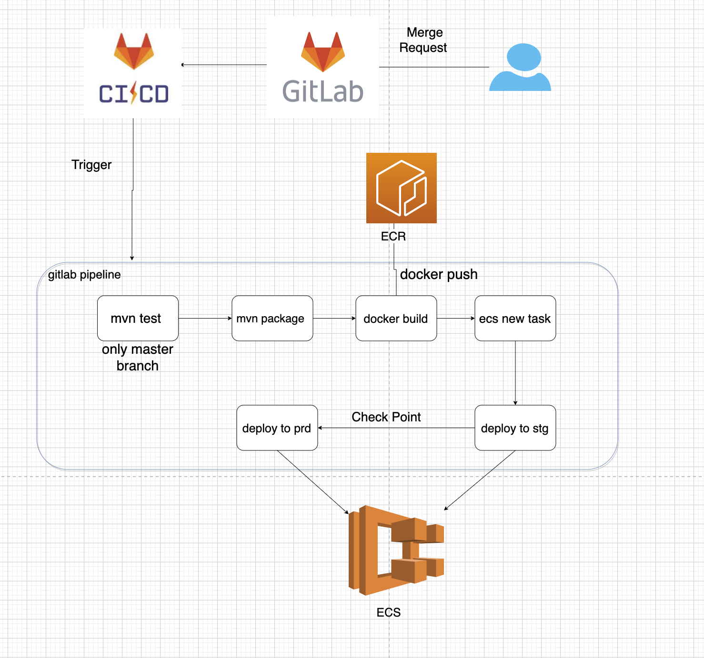

### Q2

作为团队的DevOps专家，您正在设计团队某应用的DevOps方案，代码使用Github存放[此仓库](https://github.com/goxr3plus/Simplest-Spring-Boot-Hello-World)(也可以使用您自己的应用代码)，应用运行在AWS的ECS Fargate中：

- 开发人员的源代码更改合并到master分支之前，自动运行单元测试(如果使用本仓库的Java工程，则使用maven执行测试命令)；
- 通过AWS CDK或AWS SDK创建应用所需的基础架构和所需的服务，包括VPC、ECS、Task Define、Service，使用AWS CloudWatch管理日志；
- 应用程序部署是自动化的，可以使用Jenkins、AWS Code Deploy、Github Action；
- 监控CloudWatch中的应用日志，当出现ERROR关键字时通过AWS SNS发送邮件告警；


递交作业内容

1. 设计文档，包含框架设计图、执行与部署步骤以及说明；
2. Dockerfile；
3. CI/CD的代码或配置；
4. 创建Infrastructure的代码；
5. 其他用到的代码和配置文件；

### Answer 2
#### 流程图

1. 当开发人团创建MR会自动触发 gitlb pipeline。
2. 第一个job定义为 java build,这个过程会完成java构建过程，生成构建物，即java war包
3. 第二个job定义为 docker build,这个过程根据Dockerfile文件生成docker镜像。
4. 第三个job定义为 ecs new task definition,生成新版本的task
5. 第四个job定义为 deploy stg,即更新在对应测试集群中，更新ECS service,此时新版本的应用已经测试环境完成部署,自动部署
5. 第五个job定义为 deploy prd,即更新在对应线上集群中，更新ECS service,此时新版本的应用已经线上环境完成部署，这个
   阶段有人工卡点，确保上线安全
6. CD部分，这里也使用了gitlab pipeline,题目中的Jenkins、AWS Code Deploy、Github Action，或是terraform也都是可以的。
   最终目的是要更新 AWS ECS resource
----   
#### Dockerfile
```dockerfile
FROM openjdk:16-alpine3.13

WORKDIR /app

COPY target/example.smallest-0.0.1-SNAPSHOT.war ./app.war

CMD ["java ", "-jar app.war"]
```
----
#### CI/CD 配置
```yaml
stages:
  - mvn_test
  - mvn_package
  - docker_build
  - new_ecs_task_define
  - deploy_stg
  - deploy_prd

build_docker_image:
  stage: docker_build
  image: docker
  services:
    - docker:dind
  script:
    - >
      set -x;
      git fetch origin $CI_MERGE_REQUEST_TARGET_BRANCH_NAME;
      cd  $CI_PROJECT_DIR
      export VERSION=${CI_JOB_ID}_$(echo $CI_COMMIT_SHA | head -c 6)
      aws ecr get-login-password --region ap-southeast-1 | docker login --username AWS --password-stdin 465027161316.dkr.ecr.ap-southeast-1.amazonaws.com
      docker build -t $REPOSITORY_URL:$SVC-$VERSION -t $REPOSITORY_URL:$SVC-latest
      docker push $REPOSITORY_URL:$SVC-$VERSION
      docker push $REPOSITORY_URL:$SVC-latest
      echo "#########################################################################"
      echo "# Pushed Docker Image: $REPOSITORY_URL:$SVC-$VERSION"
      echo "#########################################################################"


build_jar:
  stage: mvn_package
  image: maven
  script:
    - >
      set -x;
      git fetch origin $CI_MERGE_REQUEST_TARGET_BRANCH_NAME;
      cd  $CI_PROJECT_DIR
      mvn package
  artifacts:
    paths:
      - target/*.war

unit_test:
  stage: mvn_test
  image: maven
  script:
    - >
      set -x;
      git fetch origin $CI_MERGE_REQUEST_TARGET_BRANCH_NAME;
      cd  $CI_PROJECT_DIR
      mvn test
  only:
    - master

new_ecs_task_definition:
  stage: aws_ecs_task_definition
  image: amazon/aws-cli
  script:
    - >
    # https://docs.aws.amazon.com/cli/latest/reference/ecs/deregister-task-definition.html
    aws ecs describe-task-definition --task-definition {service_name} -o json
    # change container definition,e.g. image tag, export port , volume mount
    aws ecs register-task-definition --task-definition {service_name} -o json

deploy_stg:
  stage: deploy_stg
  image: amazon/aws-cli
  script:
    - >
      aws ecs update service update-service --cluster <stg-cluster> --service {service_name} --task-definition <value>

deploy_prd:
  stage: deploy_prd
  image: amazon/aws-cli
  script:
    - >
      aws ecs update service update-service --cluster <prd-cluster> --service {service_name} --task-definition <value>
  only:
    - master
  when: manually

variables:
  REPOSITORY_URL: <AWSAccountID>.dkr.ecr.ap-southeast-1.amazonaws.com/<ECR>
  DOCKER_HOST: tcp://localhost:2375
  DOCKER_DRIVER: overlay2
  DOCKER_TLS_CERTDIR: ""
```
----
#### Infrastructure的代码
 [官方文档](https://docs.aws.amazon.com/AmazonECS/latest/userguide/tutorial-ecs-web-server-cdk.html)
 这里各种语言都很详细了，单纯用API方式管理基础设施代码，不方便维护，建议使用terraform
 此外可能还需要的服务，Security Group, ECR policy , iam policy 
---- 
#### 监控CloudWatch中的应用日志，当出现ERROR关键字时通过AWS SNS发送邮件告警；
1. 在cloudwatch log group 创建metrics filter,使用error等关键字. 目的是在检测到有error日志，生成相应metrics信息,
   比如，app_error_log{app_name:serviceA,env:stg}
2. 创建 AWS SNS topic 用来收到消息时发送邮件
3. 创建 cloudwatch alarms,针对error log metrics,创建触发条件，比如count > 1，下一步配置action,在 in alarm状态下发生 notification 给创建好的 SNS topic
`
   metrics: app_error_log
   contiditions: greater > 1
   action: notification SNS topic
   `


 