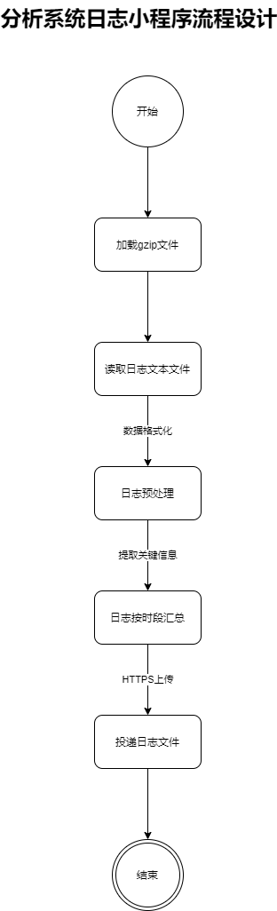

# 分析系统日志脚本设计

### 流程图:


### 需要安装的依赖库

```
pip install gzip requests
```

### 可选依赖库

```
pip install difflib
```

### difflib的目的是用于日志内容相似度匹配的解决方案
> difflib适合匹配一下日志内容的内容,大部分相同,少部分有差异的日志比较

```
Entered:__thr_AMMuxedDeviceDisconnected, mux-device:615
Entered:__thr_AMMuxedDeviceDisconnected, mux-device:616
Entered:__thr_AMMuxedDeviceDisconnected, mux-device:617
```