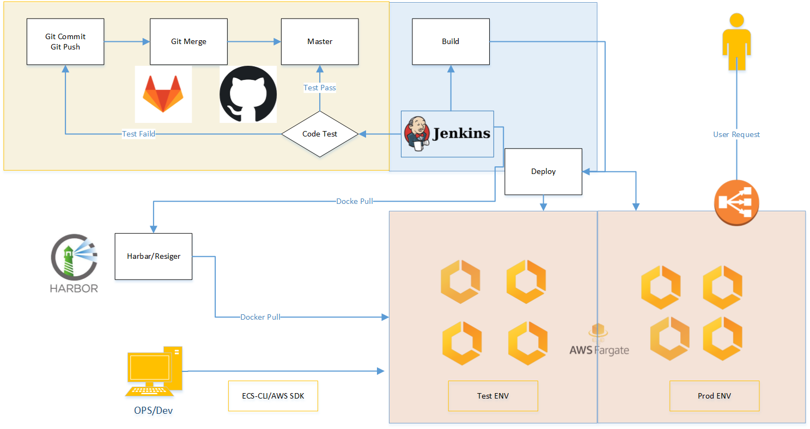

# Q2

### 分析&&方案

----------

1, 代码合并到Master之前，进行编译测试。

> 使用Jenkins-Merge Requests Builder插件，配置webhook或task，触发任务，返回结果，执行操作。

2,代码提交后，进行编译，打包，镜像制作，打标签，上传到register.

> 使用Jenkins进行操作Dockerfile完成。

3，完成AWS FARGATE的自动部署更新和监控

> 使用ECS-CLI进行命令行操作，或者Python SDK进行操作

4，CloudWacth监控日志，并AWS SNS邮件告警

> 使用AWS WatchLogs 关键字触发事件，关联AWS SNS发送告警

### 作业答案

------

* 1，设计文档，包含框架设计图、执行与部署步骤以及说明**

> * 代码提交：开发人员本地测试后，push代码到各自分支，发起merge请求，系统自动测试，如果pass，自动合并,，并通知，如果fail，给与说明并通知。

> * 代码上线：编译打包，镜像制作，打标签，上传到register，使用jenkins pipeline完成

> * 代码上线2：调用ecs-cli或sdk，将含参数的部署请求发布到AWS GARGATE
> 
> * 代码上线3：根据参数，选择（环境，版本，方式）发布

* 2，Dockerfile
  
      FROM ${registry}/library/tomcat:v1 #
      LABEL maitainer anliming
      RUN rm -rf /usr/local/tomcat/webapps/*
      ADD target/*.war /usr/local/tomcat/webapps/ROOT.war

* 3,CI/CD配置
  
      def registry = "reg.anliming.com"
      def project = "javademo"
      def app_name = "java-demo"
      def image_name = "${registry}/${project}/${app_name}:${BUILD_NUMBER}" 
      def git_address = "https://code.anliming.com/Simplest-Spring-Boot-Hello-World.git"
      def git_auth = "x0s8ff8k-je8f-7vd9-ssp9-33lpd9mdpasx"
      
      pipeline {
          agent { any }
          parameters {
              gitParameter branch: '', branchFilter: '.*', defaultValue: 'master', description: '选择发布的分支', name: 'Branch', quickFilterEnabled: false, selectedValue: 'NONE', sortMode: 'NONE', tagFilter: '*', type: 'PT_BRANCH'
          }    
          stages { 
              stage('拉取代码'){
                  steps {
                      checkout([$class: 'GitSCM',
                      branches: [[name: "${params.Branch}"]], 
                      doGenerateSubmoduleConfigurations: false,
                      extensions: [], submoduleCfg: [],
                      userRemoteConfigs: [[credentialsId: "${git_auth}", url:"${git_address}"]]
                      ])
                  } 
              }
              stage('代码编译'){ 
                  steps {
                      sh """
                      mvn clean package -Dmaven.test.skip=true """
                  } 
              }
              stage('构建镜像'){ 
                  steps {
                      withCredentials([usernamePassword(credentialsId: "${docker_registry_auth}", passwordVariable: 'password', usernameVariable: 'username')]) {
                      sh """ 
                          echo '
                              FROM ${registry}/library/tomcat:v1 #
                              LABEL maitainer anliming
                              RUN rm -rf /usr/local/tomcat/webapps/*
                              ADD target/*.war /usr/local/tomcat/webapps/ROOT.war
                              ' > Dockerfile
                          docker build -t ${image_name} .
                          docker login -u ${username} -p '${password}' ${registry} docker push ${image_name}
                      """
                      }
                  }
              }
              stage{"部署到AWS FARGATE"}{
                  stage{
                      "运行ECS-CLI命令，或SDK接口"
                  }
              }
          }
      }

* 4，创建Infrastructure的代码

      #创建集群名称、类型，配置名称，region位置
      ecs-cli configure --cluster java-demo --default-launch-type FARGATE --config-name java-demo --region ap-east-1
    
      #使用访问密钥和私有密钥创建 CLI 配置文件：
      ecs-cli configure profile --access-key AKIA2JXXXXGW --secret-key 6iy83d6qXXXXXXXb8 --profile-name java-demo-profile
    
      #启动集群
      ecs-cli up --cluster-config java-demo --ecs-profile java-demo-profile
    
      #获取安全组id
      aws ec2 describe-security-groups --filters Name=vpc-id,Values=XXXXXXX --region ap-east-1
    
      #安全组添加规则，允许80通过
      aws ec2 authorize-security-group-ingress --group-id XXXXXXX --protocol tcp --port 80 --cidr 0.0.0.0/0 --region ap-east-1
    
      #创建容器配置文件和任务
      docker-compose.yml
      ecs-params.yml
    
      #将文件应用到集群
      ecs-cli compose --project-name java-demo service up --create-log-groups --cluster-config java-demo --ecs-profile java-demo-profile
    
      #查看集群中运行的容器
    
      ecs-cli compose --project-name java-demo service ps --cluster-config java-demo --ecs-profile java-demo-profile
    
      #查看容器日志
      ecs-cli logs --task-id XXXXXXX --follow --cluster-config java-demo --ecs-profile java-demo-profile
    
    
      #扩展容器
      ecs-cli compose --project-name java-demo service scale 2 --cluster-config java-demo --ecs-profile java-demo-profile
      #查看
      ecs-cli compose --project-name java-demo service ps --cluster-config java-demo --ecs-profile java-demo-profile
    
      #清除资源
      ecs-cli compose --project-name  java-demo service down --cluster-config  java-demo --ecs-profile  java-demo-profile
      #关闭集群
      ecs-cli down --force --cluster-config  java-demo --ecs-profile  java-demo-profile
