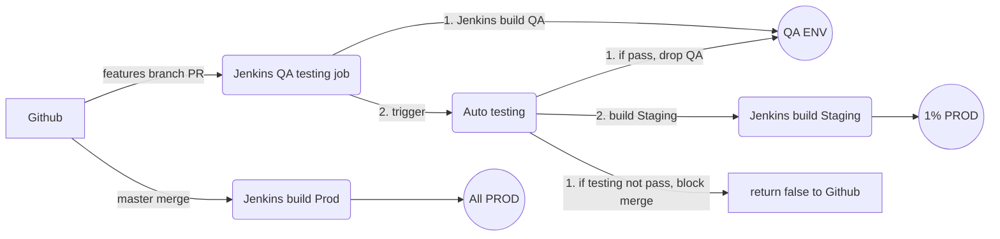

# Diagram code

```mermaid

graph LR

A[Github] -- features branch PR --> H(Jenkins QA testing job)

H -- 1. Jenkins build QA --> D((QA ENV))

H -- 2. trigger --> J(Auto testing) -- 1. if pass, drop QA --> D

J -- 2. build Staging --> C(Jenkins build Staging)

J -- 1. if testing not pass, block merge --> A1[return false to Github]

C --> E((1% PROD))

A -- master merge --> F(Jenkins build Prod) --> G((All PROD))

```