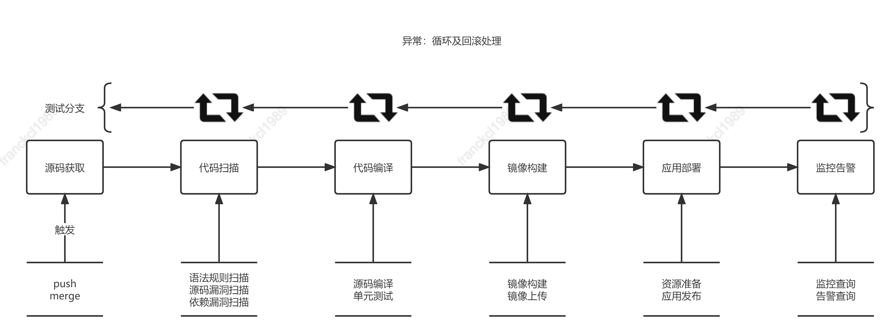

# Simplest-Spring-Boot-Hello-World 部署方案

## 背景说明

依托AWS的 Fargate服务与IAC框架实现自动化的应用交付方案，通过相对完善的流水线与监控集成，使应用发布\更新自动化、持续化达

## 架构设计

整体架构以部署流水线为基准，分为6个部分组成

1. 源码托管 -> 包涵代码托管、控制分支、合并请求等
2. 代码扫描 -> 包涵语法规则扫描、代码漏洞扫描、依赖漏洞扫描等
3. 代码编译 -> 包涵源码编译、单元测试、镜像构建、镜像上传
4. 资源准备 -> 包涵VPC、ECS、Service等底层资源的创建等（通过AWS CDK使用Fargate）
5. 应用部署 -> 包涵通过Fargate运行对应镜像
6. 监控集成 -> 包涵集成CloudWatch监控应用日志等

### 架构设计图

架构精简说明：以部署流水线为主，顺序执行相关功能，如预异常根据实际情况进行重试或者回滚

## 执行步骤

1. 创建Jenkins的Job，命名为Simplest-Spring-Boot-Hello-World，设置源码、分支、web hook
2. Github的project中配置web hook
3. 添加Job的流水线脚本，规则扫描、代码编译、镜像构建、应用发布
4. 查询监控告警配置

## 备注说明

1. 方案属于通用架构的最小化版本，没有插件化和扩展
2. 执行部署尽量简单，实际操作内容见附件相关脚本
3. 过程基本以顺序执行为主，未添加资源销毁释放等模块