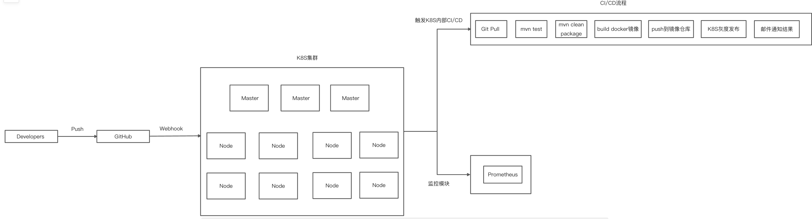
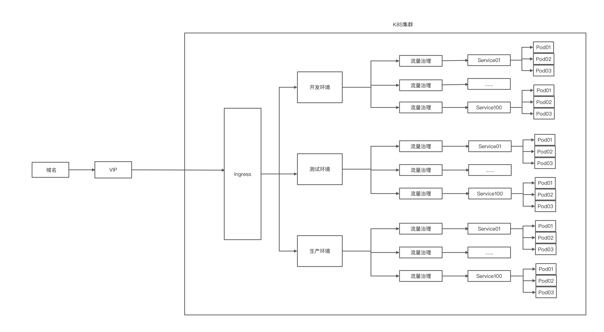

##设计文档
###框架设计图


###执行与部署步骤以及说明
####自动CICD流程
* 开发人员推送代码到github（dev/test/prod分支）
* github通过webhook通知k8s集群代码有变动
* k8s中的流水线触发，从github中拉取最新代码
* maven执行测试
* maven打包为jar包
* maven插件构建docker镜像并推送到docker镜像仓库
* 根据分支自动部署到k8s集群（可选：审核后由授权人员确认后自动部署到k8s集群）

####网络链路
* 客户端发送请求到域名
* 域名解析到VIP地址，VIP指向K8S集群中的多个node节点
* node节点上的ingress根据地址分发请求到各个service
* service间通过istio进行流量治理，链路追踪
* service负载均衡到各个pod上

####监控报警
* K8S中的Prometheus收集各个节点/容器的指标，根据设定的规则进行报警（webhook、email）

##Dockerfile
> 仅展示某个模块进行镜像构建的dockerfile，使用maven的插件进行构建，配置文件见`其他用到的代码和配置文件`

```
FROM java:8
EXPOST 8080
ARG JAR_FILE
ADD /${JAR_FILE} /mall-m3game.jar
ENTRYPOINT ["java", "-jar","-Xms512M","-Xmx512M","-Xmn128M","-Xss256K","-Dspring.profiles.active=dev","-Duser.timezone=GMT+8","/mall-m3game.jar"]
```
##CI/CD的代码或配置
###mall-m3game-deploy.yaml
> k8s中的部署用到的yaml文件

```
kind: PersistentVolumeClaim
apiVersion: v1
metadata:
  name: mall-m3game-dev
  namespace: m3game-server
spec:
  accessModes:
    - ReadWriteOnce
  resources:
    requests:
      storage: 1Gi
  storageClassName: local
  volumeMode: Filesystem
---
apiVersion: apps/v1
kind: Deployment
metadata:
  name: mall-m3game-dev
  namespace: m3game-server
  labels:
    app: mall-m3game-dev
spec:
  replicas: 1
  selector:
    matchLabels:
      app: mall-m3game-dev
  template:
    metadata:
      labels:
        app: mall-m3game-dev
    spec:
      containers:
        - name: mall-m3game-dev
          imagePullPolicy: Always
          image: 'registry.cn-hangzhou.aliyuncs.com/felix_01/mall-m3game-dev:latest'
          resources:
            limits:
              cpu: '0.1'
              memory: 1000Mi
            requests:
              cpu: '0.1'
              memory: 1000Mi
          ports:
            - name: http-9000
              protocol: TCP
              containerPort: 9000
          command:
            - java
          args:
            - '-jar'
            - '-Dspring.profiles.active=dev'
            - '-Duser.timezone=GMT+8'
            - /mall-m3game.jar
          volumeMounts:
            - name: volume-mall-m3game-dev
              readOnly: false
              mountPath: /var/logs
      restartPolicy: Always
      terminationGracePeriodSeconds: 30
      serviceAccount: default
      affinity: {}
      initContainers: []
      volumes:
        - name: volume-mall-m3game-dev
          persistentVolumeClaim:
            claimName: mall-m3game-dev
      imagePullSecrets:
        - name: aliyun-registry
  strategy:
    type: RollingUpdate
    rollingUpdate:
      maxUnavailable: 25%
      maxSurge: 25%
---
apiVersion: v1
kind: Service
metadata:
  name: mall-m3game-dev
  namespace: m3game-server
  labels:
    app: mall-m3game-dev
  annotations:
    kubesphere.io/serviceType: statelessservice
    kubesphere.io/alias-name: mall-m3game-dev
spec:
  sessionAffinity: None
  selector:
    app: mall-m3game-dev
  ports:
    - name: http-9000
      protocol: TCP
      port: 9000
      targetPort: 9000
      nodePort: 31001
  type: NodePort
```
###jenkinsfile
> k8s中的devops流水线配置

```
pipeline {
  agent {
    node {
      label 'maven'
    }

  }
  stages {
    stage('拉取代码') {
      steps {
        git(url: 'https://e.coding.net/yqrz/m3game/m3game-server.git', credentialsId: 'coding-felix', branch: 'develop_spring_cloud', changelog: true, poll: false)
      }
    }

    stage('安装全新依赖') {
      steps {
        container('maven') {
          sh 'mvn -f ${WORKSPACE}/pom.xml clean install -pl mall-common,mall-mbg -am'
        }

      }
    }

    stage('单元测试') {
      agent none
      steps {
        container('maven') {
          sh 'mvn -f ${WORKSPACE}/mall-m3game/pom.xml test'
        }

      }
    }

    stage('构建并推送') {
      steps {
        container('maven') {
          sh 'echo "123456" | docker login registry.cn-hangzhou.aliyuncs.com -u "testuser@126.com" --password-stdin'
          sh 'mvn -Dmaven.test.skip=true -f ${WORKSPACE}/mall-m3game/pom.xml clean package'
        }

      }
    }

    stage('发布测试版本') {
      steps {
        kubernetesDeploy(configs: 'mall-m3game/k8s-deploy/**', enableConfigSubstitution: true, kubeconfigId: 'm3game-deploy-kubeconfig')
      }
    }

    stage('发送邮件') {
      agent none
      steps {
        mail(to: 'sunyajie0829@126.com', subject: '自动部署结果', body: '部署成功')
      }
    }

  }
}
```
##创建Infrastructure的代码
###mysql.yaml的配置文件示例
> 创建mysql相关的pvc、StatefulSet、Service

```
kind: PersistentVolumeClaim
apiVersion: v1
metadata:
  name: m3game-mysql-data
  namespace: m3game-server
spec:
  accessModes:
    - ReadWriteOnce
  resources:
    requests:
      storage: 1Gi
  storageClassName: local
  volumeMode: Filesystem
---
kind: PersistentVolumeClaim
apiVersion: v1
metadata:
  name: m3game-mysql-log
  namespace: m3game-server
spec:
  accessModes:
    - ReadWriteOnce
  resources:
    requests:
      storage: 1Gi
  storageClassName: local
  volumeMode: Filesystem
---
kind: Service
apiVersion: v1
metadata:
  name: m3game-mysql
  namespace: m3game-server
  labels:
    app: m3game-mysql
    version: v1
  annotations:
    kubesphere.io/creator: admin
    kubesphere.io/serviceType: statefulservice
spec:
  ports:
    - name: tcp-3306
      protocol: TCP
      port: 3306
      targetPort: 3306
    - name: tcp-33060
      protocol: TCP
      port: 33060
      targetPort: 33060
  selector:
    app: m3game-mysql
  clusterIP: None
  clusterIPs:
    - None
  type: ClusterIP
  sessionAffinity: None
---
kind: StatefulSet
apiVersion: apps/v1
metadata:
  name: m3game-mysql-v1
  namespace: m3game-server
  labels:
    app: m3game-mysql
    version: v1
  annotations:
    kubesphere.io/creator: admin
spec:
  replicas: 1
  selector:
    matchLabels:
      app: m3game-mysql
      version: v1
  template:
    metadata:
      creationTimestamp: null
      labels:
        app: m3game-mysql
        version: v1
      annotations:
        kubesphere.io/restartedAt: '2021-10-31T13:47:48.580Z'
        logging.kubesphere.io/logsidecar-config: '{}'
    spec:
      volumes:
        - name: host-time
          hostPath:
            path: /etc/localtime
            type: ''
        - name: volume-t0muft
          persistentVolumeClaim:
            claimName: m3game-mysql-data
        - name: volume-rzzqdk
          persistentVolumeClaim:
            claimName: m3game-mysql-log
        - name: volume-wembhq
          configMap:
            name: m3game-mysql
            items:
              - key: my.cnf
                path: my.cnf
            defaultMode: 420
      containers:
        - name: container-7amcys
          image: 'mysql:5.7'
          ports:
            - name: tcp-3306
              containerPort: 3306
              protocol: TCP
            - name: tcp-33060
              containerPort: 33060
              protocol: TCP
          env:
            - name: MYSQL_ROOT_PASSWORD
              value: '123456'
          resources: {}
          volumeMounts:
            - name: host-time
              readOnly: true
              mountPath: /etc/localtime
            - name: volume-t0muft
              mountPath: /var/lib/mysql
            - name: volume-rzzqdk
              mountPath: /var/log/mysql
            - name: volume-wembhq
              readOnly: true
              mountPath: /etc/mysql
          terminationMessagePath: /dev/termination-log
          terminationMessagePolicy: File
          imagePullPolicy: IfNotPresent
      restartPolicy: Always
      terminationGracePeriodSeconds: 30
      dnsPolicy: ClusterFirst
      serviceAccountName: default
      serviceAccount: default
      securityContext: {}
      affinity: {}
      schedulerName: default-scheduler
  serviceName: m3game-mysql
  podManagementPolicy: OrderedReady
  updateStrategy:
    type: RollingUpdate
    rollingUpdate:
      partition: 0
  revisionHistoryLimit: 10

```
##其他用到的代码和配置文件
###mall-m3game/pom.xml
> 用于使用maven插件生成镜像并推送到阿里云docker仓库

```
<?xml version="1.0" encoding="UTF-8"?>
<project xmlns="http://maven.apache.org/POM/4.0.0"
         xmlns:xsi="http://www.w3.org/2001/XMLSchema-instance"
         xsi:schemaLocation="http://maven.apache.org/POM/4.0.0 http://maven.apache.org/xsd/maven-4.0.0.xsd">
    <parent>
        <artifactId>m3game</artifactId>
        <groupId>com.wstk.m3game</groupId>
        <version>1.0-SNAPSHOT</version>
    </parent>
    <modelVersion>4.0.0</modelVersion>

    <artifactId>m3game-m3game</artifactId>

    <dependencies>
        ......
    </dependencies>

    <build>
        <plugins>
            <plugin>
                <groupId>org.springframework.boot</groupId>
                <artifactId>spring-boot-maven-plugin</artifactId>
            </plugin>
            <plugin>
                <groupId>com.spotify</groupId>
                <artifactId>dockerfile-maven-plugin</artifactId>
                <version>${dockerfile.maven.plugin.version}</version>
                <executions>
                    <execution>
                        <phase>package</phase>
                        <goals>
                            <goal>build</goal>
                            <goal>push</goal>
                        </goals>
                    </execution>
                </executions>
                <configuration>
                    <googleContainerRegistryEnabled>false</googleContainerRegistryEnabled>
                    <useMavenSettingsForAuth>true</useMavenSettingsForAuth>
                    <repository>
                        registry.cn-hangzhou.aliyuncs.com/felix_01/${project.artifactId}${deploy-env}
                    </repository>
                    <tag>latest</tag>
                    <force>true</force>
                    <buildArgs>
                        <JAR_FILE>target/${project.build.finalName}.jar</JAR_FILE>
                    </buildArgs>
                </configuration>
            </plugin>
        </plugins>
    </build>
</project>
```