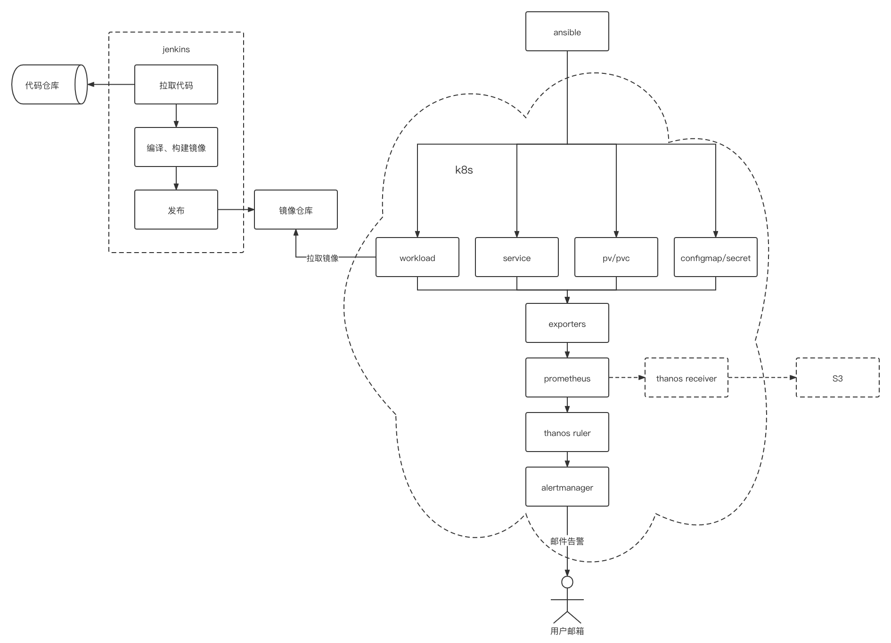

### 自动部署（自动化实现部分详见：./static/jenkinsfile）
#### 执行步骤
环境准备：
1. k8s环境

自动化：
1. 拉取代码
2. 编译代码、构建镜像
3. 上传镜像
3. 更新k8s资源

#### 流程图

### 监控告警
#### 执行步骤
1. 对于k8s本身的资源监控，可以通过cAdvisor、kube-state-metrics等exporter采集指标；
2. 对于springboot服务以及其他自定义指标的监控，可以通过k8s的liveness probe和readiness probe实现，也可以通过JMX exporter、自定义exporter的方式采集指标；
3. 热数据保存在prometheus本地保证查询效率，冷数据可保存到外部存储，按需进行降采样以备后续查询；
3. 在prometheus（单点）或thanos ruler（集群）上配置告警规则，告警触发后通过alertmanager发送邮件通知用户。

#### 流程图
