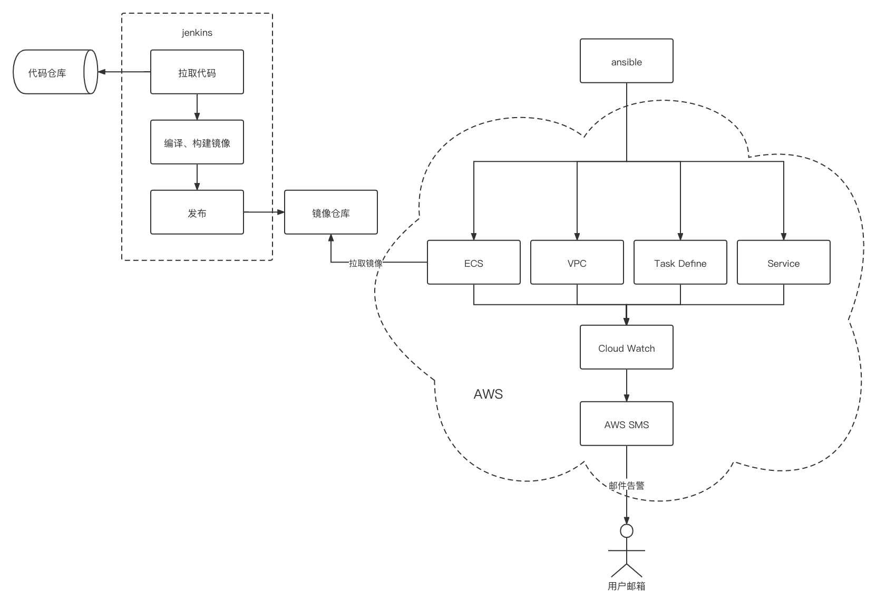

# 设计文档

## 执行与部署步骤
### merge之前自动进行maven测试
#### 执行步骤
1. jenkins安装github插件，复制jenkins github配置中的`hook url`；
2. 创建github webhook，将`Payload URL`设置为步骤1中保存的`hook url`；
3. 编写运行maven test的jenkinsfile，勾选"GitHub Pull Request Builder"下的"Use github hooks for build triggering"；
4. 配置合适的"Trigger phrase"并勾选"Only use trigger phrase for build triggering"可以确保只有符合条件的comment才会触发jenkins流水线（可选）。

### 自动部署（自动化实现部分详见：./static/jenkinsfile）
#### 执行步骤
环境准备：
1. 创建基础设施

自动化([Jenkinsfile](./static/jenkinsfile)、[Dockerfile](./static/Dockerfile))：
1. 拉取代码
2. 编译代码、构建镜像
3. 上传镜像
4. 启动ECS，对外提供服务

#### 流程图

### 监控告警
#### 执行步骤
1. 对于AWS本身的资源监控，可以直接通过AWS CloudWatch监控；
2. 对于springboot服务以及其他自定义指标的监控，可以通过编写代理的方式，将日志发送到AWS CloudWatch Logs；
3. 配置告警规则（日志中是否包含ERROR关键字），符合条件时通过AWS SNS发送邮件告警。

#### 流程图

---

## 可以优化的地方
- 通过缓存或nexus提高maven编译速度，加速镜像构建
- 示例的springboot项目配置文件位置不对，导致声明的server.port=9092未生效，实际启动端口是8080
- 自动化流程中关于错误、重试、超时等逻辑的处理，提升流程健壮性
- 流程中生成的资源（镜像等）可保存到制品库，方便归档、版本控制等操作
- 对AWS不熟悉，基础设施相关代码（[点此查看](./infrastructure/main.yml)）不完善
