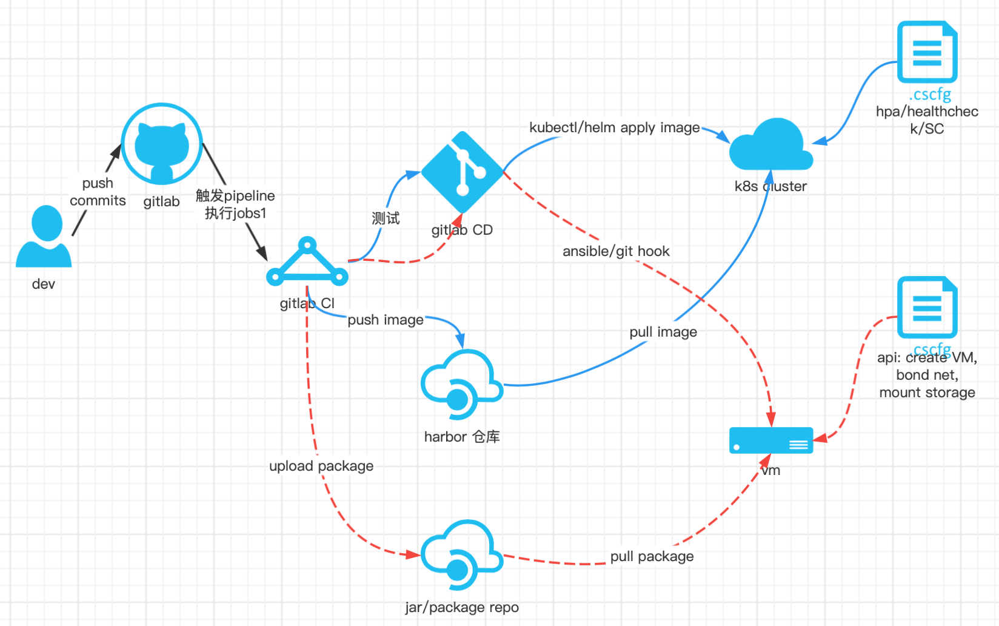

# infra

## steps for k8s
1. dev modify code then commit to gitlab
2. once gitlab knows the changes it will triger the pipeline jobs defines in .gitlab.yaml
3. we defines the jobs like `docker build` (based on Dockerfile and entrypoint.sh), also some steps like deploy and test defined here, gitlab knows how to handle that
4. once images uploaded to harbor we can got the image id, then use helm or kubelt which defined in the base image(repo user name and kube config) to apply images to prod

### how to improve stabilization
1. set health check for service
2. enable hpa base on CPU and MEM
3. set different zone for cluster...

## steps for vm

VM must exists before we push our code when do CD we can use ansible to copy our code to destination server or we can use aws CodeDeploy to do that base on yaml(include VM info, VPC , code)