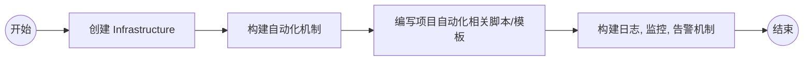

# DevOps 方案

## 说明

- 现有的信息相对较少，某些理解或者细节可能会有所偏差，有需要的话，欢迎交流

- 之前没用过 AWS ，想要更深入的理解 AWS 的云产品，估计还需要 `3-5` 天，当前时间有限，只好类别下国内的云厂商，如阿里云。

- 在 Github 查看流程图，需要安装此插件 [GitHub + Mermaid](https://chrome.google.com/webstore/detail/github-%20-mermaid/goiiopgdnkogdbjmncgedmgpoajilohe)

## 基本流程



## 创建 Infrastructure

- 创建 DevOps 专用的 `子账号`，分配相应权限，创建 `AccessKey / SecretKey` 供 `aws cli` 使用

- `ECS Fargate` 是弹性容器服务，可能需要导出其 `kubeconfig`，用于创建 `Task` 和 `Service`

- 准备服务相关配置，如 VPC、子网、安全组、负载均衡、块存储、对象存储、Kubernetes 等

- 使用 cli 工具结合配置创建基本服务，也可以使用 `api + process` 封装 cli，或者使用 `aws sdk` 来创建

## 构建自动化机制

- 其实用什么工具都可以，只要能调用 `bash` 脚本以及和 `docker` 交互即可， 如 Jenkins，Github Action，Gitlab CI 等

- 这里使用 `Jenkins + Jenkinsfile` 的模式作为示例，所以只需要安装 jenkins + Docker 即可

## 编写项目自动化相关脚本/模板

要求：开发人员的源代码更改合并到 master 分支之前，自动运行单元测试(如果使用本仓库的Java工程，则使用maven执行测试命令)

关于这个要求，我理解是针对 `git flow` 来处理，分为开发分支 dev，测试分支 test，正式分支 master
  
- dev 分支
  ```mermaid
  graph LR;
      Start((开始))-->Step1[编译];
      Step1-->Step2[单元测试];
      Step2-->|通过| Step3[打包并上传镜像];
      Step2-->|不通过| End;
      Step3-->Step4[发布];
      Step4-->End((结束));
  ```
  
- test 分支
  
  ```mermaid
  graph LR;
      Start((开始))-->Step1[编译];
      Step1-->Step2[打包并上传镜像];
      Step2-->Step3[发布];
      Step3-->Step4[接口自动化测试];
      Step4-->|不通过| Step5[回滚];
      Step4-->|通过| End;
      Step5-->End((结束));
  ```
  
- master 分支
  
  ```mermaid
  graph LR;
      Start((开始))-->Step1[编译];
      Step1-->Step2[打包并上传镜像];
      Step2-->Step3[发布];
      Step3-->End((结束));
  ```

- 参考交互图

  

- 脚本及单元测试

  针对各种语言的自动化部署脚本，我自己的仓库有各种语言的示例，java 的示例请参考 [java-ci](https://github.com/ErikXu/java-ci)。
  
  单元测试可能需要在 jdk 基础镜像上安装 maven，然后执行 `mavan test`。
  
  参考 Dockerfile
  
  ```Dockerfile
  FROM openjdk:8-jdk-alpine
  
  ARG MAVEN_VERSION=3.8.1
  
  RUN apk update && apk add wget
  RUN wget https://mirrors.bfsu.edu.cn/apache/maven/maven-3/${MAVEN_VERSION}/binaries/apache-maven-${MAVEN_VERSION}-bin.zip
  RUN unzip apache-maven-${MAVEN_VERSION}-bin.zip -d /usr/local/
  
  ENV MAVEN_HOME=/usr/local/apache-maven-${MAVEN_VERSION}
  ENV PATH=$PATH:$MAVEN_HOME/bin
  
  WORKDIR /root

  CMD ["sh"]
  ```
  
  参考脚本 unit_test.sh
  
  ```bash
  docker run --rm -i \
    -v ${PWD}:/workspace \
    openjdk:8-jdk-alpine-unit-test \
    sh -c 'cd /workspace && mvn -Dtest=Application test'
  ```
  
  
