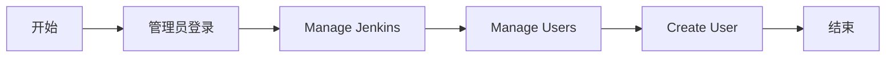

# DevOps 方案

## 说明

- 现有的信息相对概括，某些理解或者细节可能会有所偏差，有需要的话，欢迎交流

- 之前没用过 AWS ，想要更深入的理解 AWS 的云产品，估计还需要 `3-5` 天，当前时间有限，只好类别下国内的云厂商，如阿里云。

- 在 Github 查看流程图，需要安装此插件 [GitHub + Mermaid](https://chrome.google.com/webstore/detail/github-%20-mermaid/goiiopgdnkogdbjmncgedmgpoajilohe)

## 基本流程

