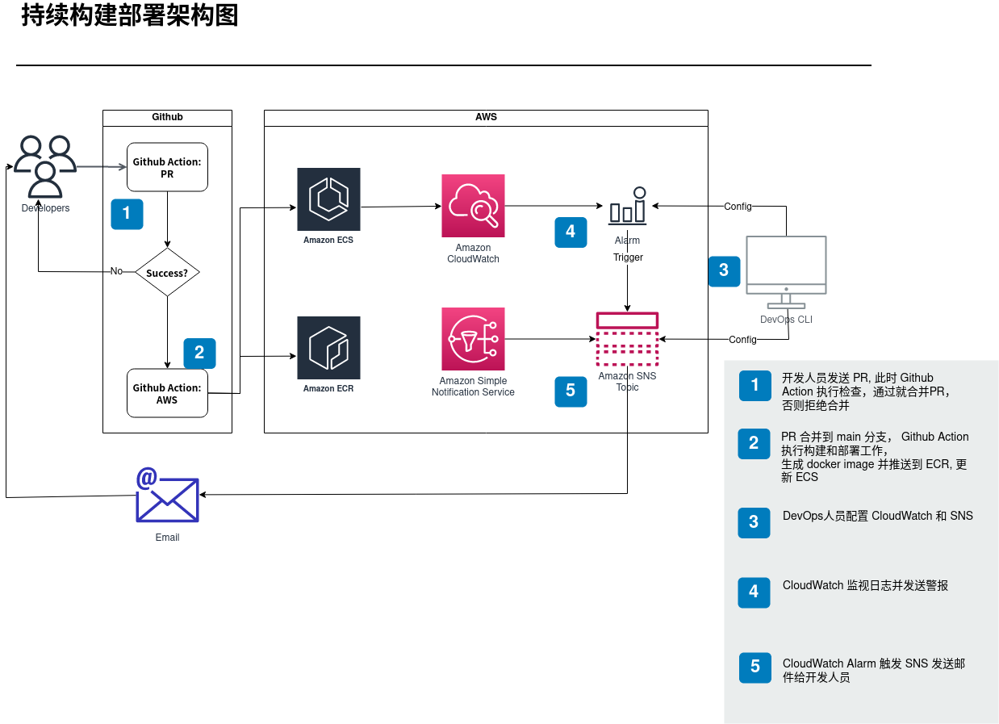

# Assignment Q2

## 开发人员的源代码更改合并到 master 分支之前，自动运行单元测试

使用 `./workflows/pr.yml` 建立 Github Action, 效果是当开发人员创建 PR 时，并且 PR 的目标是 `main` 分支时， 会执行 `mvn verify`

## 源代码更改合并到 master 分支之后，自动部署到 ECS

### 准备工作

创建各种资源, region 为 `ap-northeast-1`
1. repository: `my-simple-springboot-repo`
2. cluster: `my-simple-springboot-cluster`
3. service: `my-simple-springboot-fargate-service`
4. task definition: `task-def.json`

``` sh
aws ecr create-repository --repository-name my-simple-springboot-repo --region ap-northeast-1
aws ecs register-task-definition --region ap-northeast-1 --cli-input-json file://$HOME/dev-ops/q2/task-def.json
aws ecs create-cluster --region ap-northeast-1 --cluster-name my-simple-springboot-cluster
aws ecs create-service --region ap-northeast-1 --service-name \
    my-simple-springboot-fargate-service --task-definition my-sample-fargate:1 \
    --desired-count 2 --launch-type "FARGATE" --network-configuration \
    "awsvpcConfiguration={subnets=[subnet-abcd1234],securityGroups=[sg-abcd1234]}"
```
### 创建 Github Action

使用 `./workflows/workflows_aws.yml` 建立 Github Action, 效果是当 main 分支有 push 操作时， 会自动构建 war 包， 并生成 docker 镜像(参照 `Dockerfile`), 并且此镜像会被发布到 ECR, 同时 task definition 也会被更新

## 与 CloudWatch 和 SNS 整合

### 创建并订阅 SNS Topic

设定 Topic 为 `my-sample`， 接收通知邮件的邮箱为 `someone@somemail.com`

``` sh
aws sns create-topic --name my-sample
aws sns subscribe --topic-arn <value> --protocol email --notification-endpoint someone@somemail.com
```

### 创建 CloudWatch Metric

在 `task-def.json` 我定义了 `log-group` 为 `/ecs/simple-springboot-app-logs`

``` sh
aws logs put-metric-filter \
  --log-group-name /ecs/simple-springboot-app-logs \
  --filter-name MyAppErrorCount \
  --filter-pattern 'Error' \
  --metric-transformations \
      metricName=ErrorCount,metricNamespace=MyNamespace,metricValue=1,defaultValue=0
``` 

### 创建 CloudWatch Alarm

``` sh
aws cloudwatch put-metric-alarm --alarm-name error-alarm --evaluation-periods 1 \
    --comparison-operator GreaterThanOrEqualToThreshold --metric-name ErrorCount \
    --namespace MyNamespace --period 60 --threshold 1 --alarm-actions \
    "arn:aws:sns:ap-northeast-1:${account-id}:my-sample"
```

## 设计图


