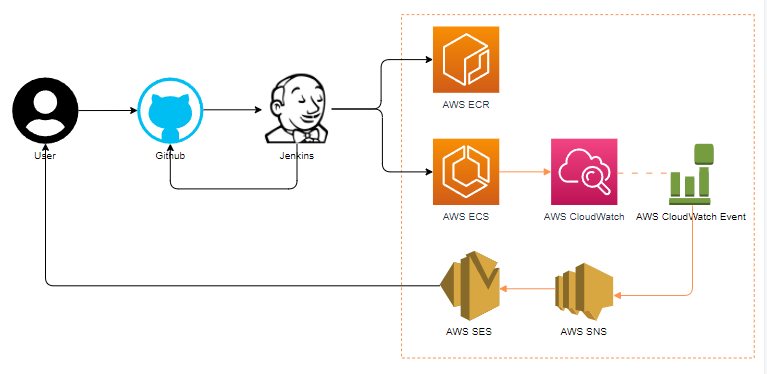
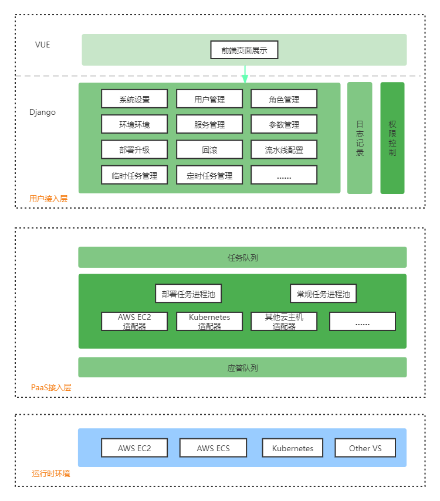

# Assignment Q2
## 0. 思路
### 0.1 架构图

### 0.2 业务逻辑
    1. Github 生成 webhook，并在Jenkins中配置Github 的 webhook
    2. CI/CD 部分主要使用 JenkinsFile 来实现：
        2.1 Stage1: maven test
        2.2 Stage2: merge to master branch
        2.3 Stage3: mavn build
        2.4 Stage4: build docker image
        2.5 Stage5: push docker image to AWS ECR, and reload AWS ECS
    3. 事先使用 AWS CloudFormation 配置 AWS ECS 的日志输出到 AWS CloudWatch log group
    4. 事先使用AWS CloudFormation 配置 AWS CloudWatch 的日志过滤条件，以及 AWS SNS 和 AWS SES 的通知 

## 1. TODO
### 1.1 说明
    1. 由于时间原因，对于没有接触过的 AWS 组件，未进行深入学习，只能来的及提供架构图，以及大致的业务逻辑说明
    2. AWS Code Deploy 和 AWS Code Pipeline 简单了解过，应该可以替代Jenkins进行CI/CD，但没有深入使用
    3. AWS ECS Fargate 没有使用过，故没有进行相关部分的设计
    4. 最近的Devops平台项目的架构图如下仅供参考

