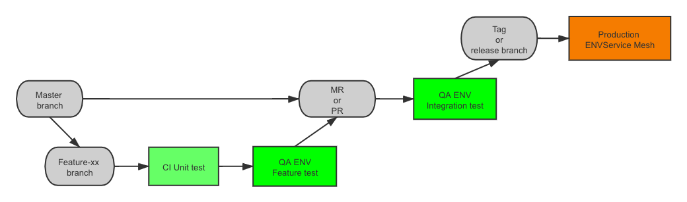

# 设计文档

##  流水线设计

1. 根据需求拉出 feature 或 bugfix 分支
2. 开发完成后 push 到 gitlab ，触发 CI ，单元测试通过后部署到 QA 环境
3. 测试功能是否实现，或 bug 是否修复，通过后提交 MR 或 PR
4. 根据团队分工或公司已有流程，决定在提交 MR 和 PR 时是否在做一轮测试
5. 合并到 master 分支后，进行集成测试
6. 集成测试通过后，打 tag 或创建 release 分支
7. 审核 Dockerfile ，确保再次 build 不会产生不一致
8. 更新 release 说明或其它 metadata
9. 构建生产环境镜像，部署到生产环境
10. 生产环境采用 Service Mesh 或其它灰度发布技术，部署新版本

## 执行步骤

1. 执行 Infrastructure 中的命令，创建 ECS 集群

2. 执行 Kubernetes 中的步骤，搭建构建环境

3. 用 CICD 目录中提供的方式，跑 CI/CD 流水线，完成单元测试和发布到 QA 环境(AWS ECS 集群)

4. 用 monitor 中的脚本，搭建监控和告警
