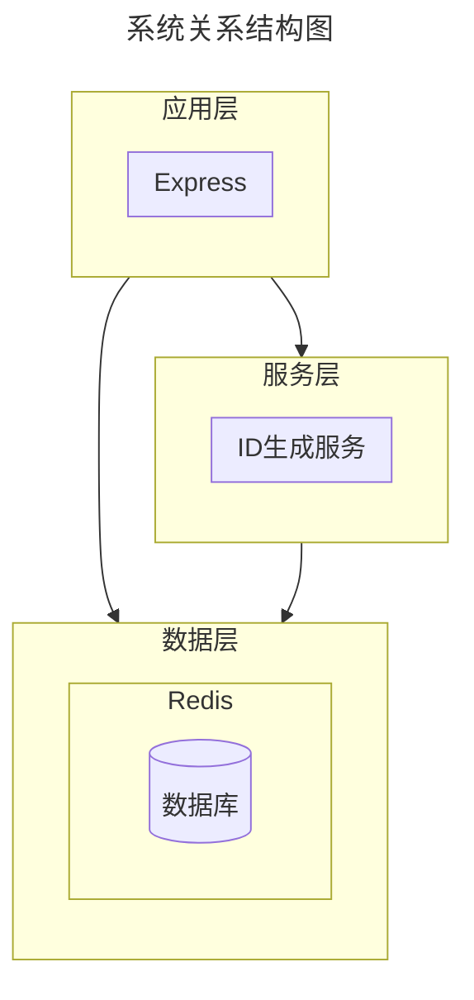
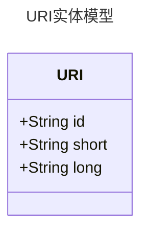
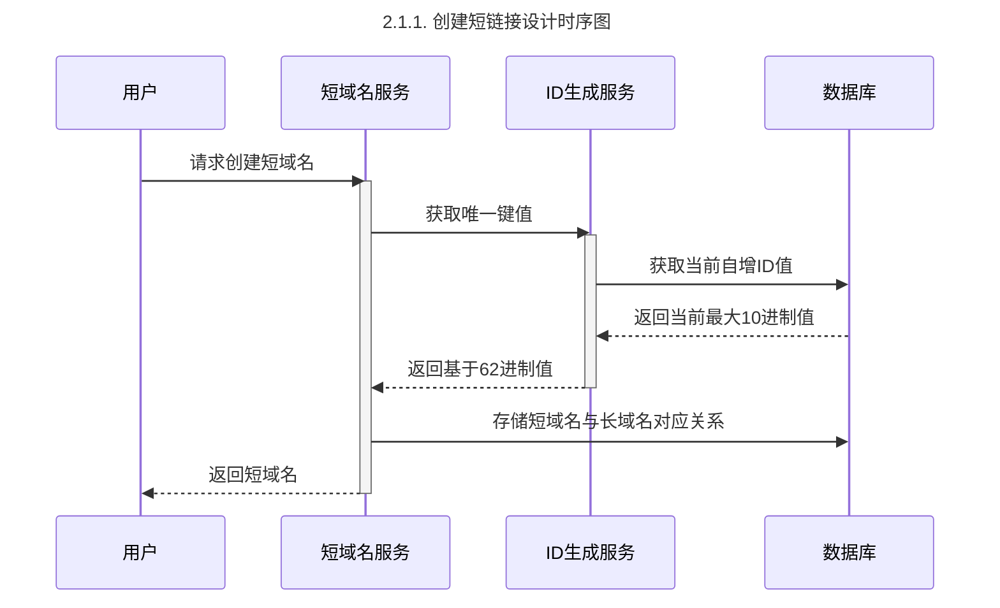
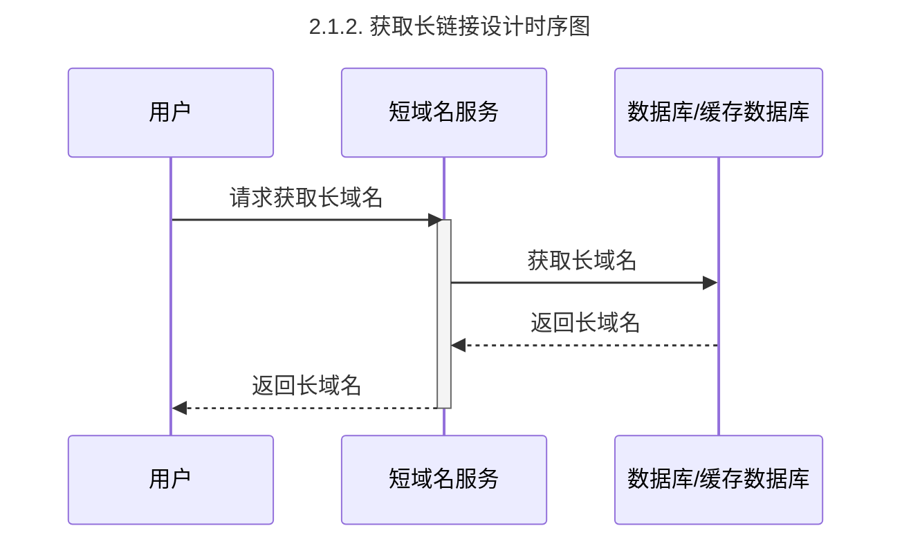

# 2-系统设计

## 2.1. 系统结构设计

```mermaid
---
title: 系统关系结构图
---
flowchart TB
  Redis1[(数据库)]

  subgraph 应用层
    direction TB
    subgraph Express
    end
  end

  subgraph 服务层
    direction TB
    subgraph ID生成服务
    end
  end

  subgraph 数据层
    direction TB
    subgraph Redis
        Redis1
    end
  end
  
  应用层 --> 数据层
  应用层 --> 服务层
  服务层 --> 数据层
```

## 2.2. 存储对象模型

```mermaid
---
title: URI实体模型
---
classDiagram
    class URI
    URI : +String id
    URI : +String short
    URI : +String long
```

## 2.3. 时序关系设计

```mermaid
---
title: 2.1.1. 创建短链接设计时序图
---
sequenceDiagram
    participant User As 用户
    participant Service As 短域名服务
    participant ID As ID生成服务
    participant DB As 数据库

    User ->> Service: 请求创建短域名
    activate Service
    Service ->> ID: 获取唯一键值
    activate ID
    ID ->> DB: 获取当前自增ID值
    DB -->> ID: 返回当前最大10进制值
    ID -->> Service: 返回基于62进制值
    deactivate ID
    Service ->> DB: 存储短域名与长域名对应关系
    Service -->> User: 返回短域名
    deactivate Service
```

```mermaid
---
title: 2.1.2. 获取长链接设计时序图
---
sequenceDiagram
    participant User As 用户
    participant Service As 短域名服务
    participant DB As 数据库/缓存数据库

    User ->> Service: 请求获取长域名
    activate Service
    Service ->> DB: 获取长域名
    DB -->> Service: 返回长域名
    Service -->> User: 返回长域名
    deactivate Service
```
