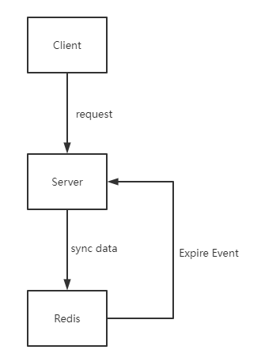

# 设计说明

## 系统框架图

## 开发环境

系统： Manjaro Linux amd64

redis:   v6.2

node:   v16.13.1

## 接口说明

- 基础URL: http://localhost:6789

- 访问数据类型：JSON

- 接口说明：

  | 接口名称      | 访问方式 |               访问示例(这里使用非转义字符描述)               | 返回示例                                                     | 接口说明                                         |
  | ------------- | -------- | :----------------------------------------------------------: | ------------------------------------------------------------ | ------------------------------------------------ |
  | long-to-short | POST     |              { "longDomain": "www.baidu.com" }               | { "longDomain": "www.baidu.com", "shortDomain": "x.xx/AAA" } | 短域名存储接口：接受长域名信息，返回短域名信息   |
  | short-to-long | GET      | http://localhost:6789/short-to-long?query={"shortDomain": "www.baidu.com"} | { "longDomain": "www.baidu.com", "shortDomain": "x.xx/AAA" } | 短域名读取接口：接受短域名信息，返回长域名信息。 |

- 接口异常说明

  

## 系统假设
1. 服务器根域名为x.xx（3个字符），生成的短域名为x.xx/yyy(8个字符)。
2. 假设题目要求的是短域名是定长字符串（而非诸如"x.xx/A","x.xx/AA"这样可变长的形式），且长度为8。
3. 假设所有域名均通过http或https协议访问，且具体访问方式（使用协议，重定向等）由调用者控制，系统仅返回形如"x.xx/AAA"这样的8位域名。
4. 假设传入的所有长域名均为有效的，即系统只提供“发号”和"存储“服务。
5. 假设一个LRU刷新周期（设置为1小时）内不存在超过39^3个短域名生成及存储请求。
    - 为什么是39个字符？选择了URL合法的语义字符，并去掉了圆括号，单引号，点和星号这几个对阅读或上下文可能产生歧义的字符，所选字符集为：[A-Z0-9~-_]+
    - 为什么是39^3（指数部分为3）？因为域名长度限制为8个字符，因此除去基本域名后，可用的短域名长度仅剩下3位字符串。
6. 假设所有长/短域名映射的有效期仅为一个LRU周期，超出该周期后，短域名生成器将刷新并复用，原本的可查的短域名将不再可用。

## Schema设计说明
|       Redis键       |                         存储结构说明                         |                          用途说明                           |
| :-----------------: | :----------------------------------------------------------: | :---------------------------------------------------------: |
| shortname-generator | 采用Redis列表(LIST)的队列，其中每项元素均为一个3位字符串（短域名后缀）。 |            用于给每个新的长域名生成短域名映射。             |
|  形如 x.xx/AAA的键  | 采用Redis简单键值对，其中键为短域名，值为长域名，存在周期为一个LRU周期，每次访问都会更新其周期。 | 保证LRU算法的顺利进行，并且提供通过短域名查找长域名的能力。 |
| generated-longname  | 采用Redis集合，其中每项元素均为一个键为长域名，值为短域名（注意，此处与上表中的键值次序恰好相反）。 |       保证同一个长域名在当前的LRU周期内只会生成一次。       |

1. 生成器采用Redis列表(LIST)，其中每项元素均为一个3位字符串；
2. 长/短映射使用redis的基本k/v存储。短域名为键，长域名为值。
3. redis中同时维护一个键为长域名，值为短域名的集合

## 编码原则

1. URL映射，均使用全小写加减号（-）的命名规则，尽量使用能代表接口用途的全称；
2. 编码及测试过程中应忽略无效的边界检查，认为是无效边界检查的有以下几种情况：
   - 与业务无关的上游组件是否可用的边界检测，如每次查询前，检测redis-client是否可用；
   - 与业务相关，但检测地不属于本模块的边界，如每次查询前检测Redis中是否存在短域名生成器的键。
3. 需要export 的函数或变量使用大写开头的驼峰命名法，其余的使用小写开头的驼峰命名法。

## 单元测试报告

