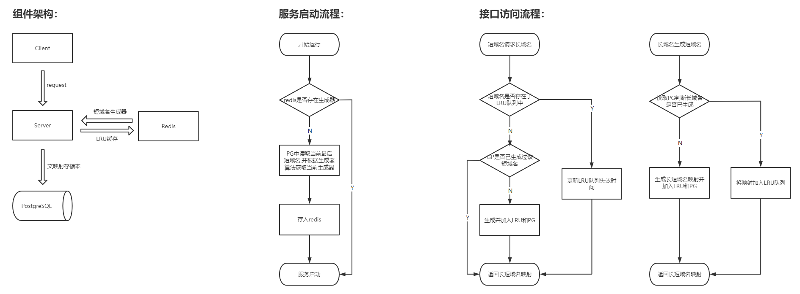
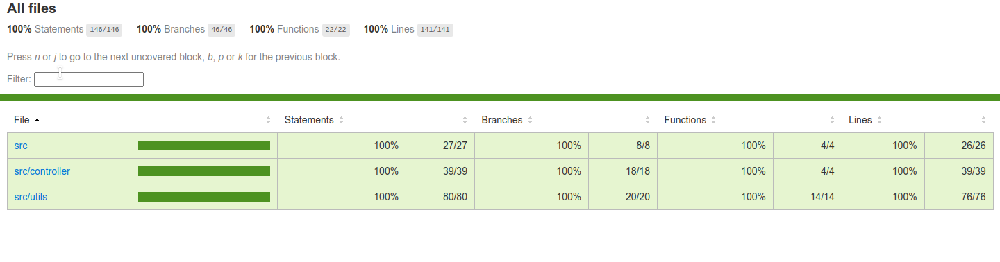
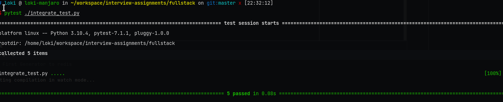

# 设计说明

## 系统框架流程图

## 开发环境

系统： Manjaro Linux amd64

redis:   v6.2

node:   v16.13.1

## 接口说明

- 基础URL: http://localhost:6789

- 访问数据类型：JSON

- 接口说明：

  | 接口名称      | 访问方式 |               访问示例(这里使用非转义字符描述)               | 返回示例                                                     | 接口说明                                         |
  | ------------- | -------- | :----------------------------------------------------------: | ------------------------------------------------------------ | ------------------------------------------------ |
  | long-to-short | POST     |              { "longDomain": "www.baidu.com" }               | { "longDomain": "www.baidu.com", "shortDomain": "x.xx/AAAAAAAA" } | 短域名存储接口：接受长域名信息，返回短域名信息   |
  | short-to-long | GET      | http://localhost:6789/short-to-long?query={"shortDomain": "x.xx/AAAAAAAA"} | { "longDomain": "www.baidu.com", "shortDomain": "x.xx/AAAAAAAA" } | 短域名读取接口：接受短域名信息，返回长域名信息。 |

- 接口异常说明

  | 接口名称      | 异常网络代码 | 异常触发条件说明               | 返回示例                                                     |
  | ------------- | ------------ | ------------------------------ | ------------------------------------------------------------ |
  | long-to-short | 400          | 要转换的长域名未通过格式校验。 | {"error": {"code": -1, "msg": "Wrong long name!"}}           |
  |               | 400          | query请求格式不正确。          | {"error": {"code": -2, "msg": "Bad Request!!"}}              |
  | short-to-long | 400          | 查询的短域名未通过格式校验。   | {"error": {"code": -3, "msg": "Wrong shortDomain!"}}         |
  |               | 400          | 查询的短域名已失效。           | {"error": {"code": -4, "msg": "Request short name is invalid, Please generate again!"}} |
  
  

## 系统假设
1. 服务器根域名为x.xx/（5个字符），生成的短域名为x.xx/YYYYYYYY(短域名部分长为8个字符)。
2. 假设题目要求的是短域名是定长字符串（而非诸如"x.xx/A","x.xx/AA"这样可变长的形式），且短域名部分长度为8。
3. 假设可用主机数量不超过36个，当前仅使用了短域名顶部一个字符作为主机标识。
4. 假设单主机生成的短域名数量不会超过36 ^ 7个（实际也很难超过），但如果发生超过的情况，该节点的服务将通过断言直接退出。
5. 假设所有域名均通过http或https协议访问，且具体访问方式（使用协议，重定向等）由调用者控制，系统仅返回形如"x.xx/AAAAAAAA"这样的短域名。
6. 假设传入的所有长域名均为有效的，并且是唯一且区分大小写的（此处意为http://www.google.com和www.google.com将被存储为两个域名）即系统只提供“发号”和"存储“服务。
7. 系统假设所有传入的长域名总长度不超过8182个字符（chrome浏览器限制）。

## Schema设计说明

### Redis Schema设计说明

|             Redis键             |                         存储结构说明                         |                           用途说明                           |
| :-----------------------------: | :----------------------------------------------------------: | :----------------------------------------------------------: |
| 形如：X-shortname-generator的键 | 采用Redis简单键值对，存储当前服务节点对应的短域名生成器，值为当前生成请求对应的短域名； | “X”对应当前节点的主机号，确保每个不同的主机可以访问不同的生成器。 |
|        形如 AAAAAAAA的键        | 采用Redis简单键值对，其中键为短域名，值为长域名，存在周期为一个LRU周期，每次访问都会更新其周期。 | 保证LRU算法的顺利进行，并且提供通过短域名查找长域名的能力。  |

### PostgreSQL schema设计说明

### 表short_long_map

| 列名         | 类型          | 字段含义         | 索引类型    |
| ------------ | ------------- | ---------------- | ----------- |
| short_domain | CHAR(8)       | 生成的短域名     | Primary key |
| long_domain  | VARCHAR(8182) | 对应的长域名     | Hash index  |
| create_time  | TIMESTAMP     | 记录存入的时间戳 | 无          |

### 设计说明

1. 为什么不使用自增id作为主键？

   使用自增id来作为生成器虽然可以减少一部分工作量，但自增id决定了要存储之后才能获取到短域名，然后再更新，相当于多了一次数据库更新的请求。并且，业务中并无批量查找短域名的需求，故此处设计为不使用自增id。

2. 为什么使用hash索引而非传统的B-Tree索引

   长域名属于一种自由度相当高的字符串，此处如果完全加索引的话，于事无补，因此使用Hash索引，由底层来处理碰撞和。并且再业务中对长域名的搜索也仅限于全等搜索（参见假设6），因此此处使用Hash索引。

## 编码原则

1. URL映射，均使用全小写加减号（-）的命名规则，尽量使用能代表接口用途的全称；
2. 编码及测试过程中应忽略无效的边界检查，认为是无效边界检查的有以下几种情况：
   - 与业务无关的上游组件是否可用的边界检测，如每次查询前，检测redis-client是否可用；
   - 与业务相关，但检测地不属于本模块的边界，如每次查询前检测Redis中是否存在短域名生成器的键。
3. 需要export 的函数或变量使用大写开头的驼峰命名法，其余的使用小写开头的驼峰命名法。
4. 环境变量使用全大写加下划线的方式声明。

## 单元测试报告

## 接口集成测试用例及报告

### 集成测试过程

1.  通过docker构建服务

​		`docker-compose build`

2.  拉取镜像，并初始化数据库

   `docker-compose up redis postgres`

3.  完成数据库初始化后退出，并整体启动服务

   `docker-compose up`

4.  运行pytest

   `pytest ./integrate_test.py`

### 集成测试，测试用例

| 用例名称            | 用例说明                                            | 期望返回                                                     | 测试用例说明                                                 |
| ------------------- | --------------------------------------------------- | ------------------------------------------------------------ | ------------------------------------------------------------ |
| LongStore           | 测试长域名是否生成成功                              | 200, {shortDomain: "AAAAAAAA", longDomain: "www.google.com"} | 发送请求{longDomain: "www.google.com"}                       |
| SameLongStore       | 测试已经生成过的长域名是否会重复生成                | 200, {shortDomain: "AAAAAAAA", longDomain: "www.google.com"} | 发送请求{longDomain: "www.google.com"}                       |
| DiffLongStore       | 测试不同长域名是否生成不同且有序的短域名            | 200, {shortDomain: "AAAAAAAB", longDomain: "http://www.google.com"} | 1. 发送请求{longDomain: "www.google.com"} 2. {longDomain: "www.baidu.com"} 3.  验证两次返回的短域名是不同的 |
| GetByShortFromCache | 测试缓存周期内，已经生成成功的短域名能否返回长域名  | 200, {shortDomain: "AAAAAAAA", longDomain: "www.google.com"} | 1.确保redis中存在相应的短域名键。 2. 发送请求 {shortDomain: "AAAAAAAA"} |
| GetByShortFromDb    | 测试缓存周期外，已经生成成功的短域名能否返回长域名. | 200, {shortDomain: "AAAAAAAA", longDomain: "www.google.com"} | 1.删除redis中存在的短域名键。 2. 发送请求 {shortDomain: "AAAAAAAA"} |

### 集成测试报告

