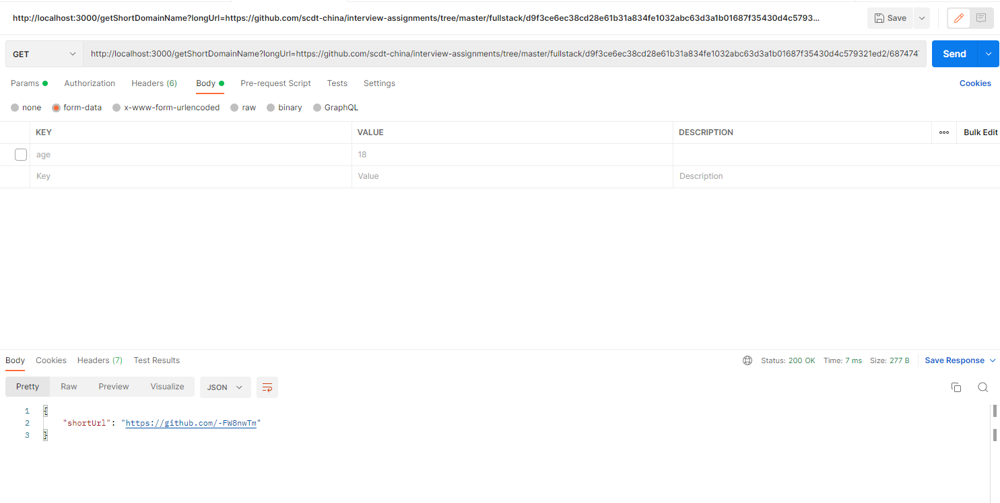

<!-- @format -->

# 设计简要描述

1. 使用 webpack 的 watch 能力和 nodemon 来保证编码过程的热加载。使用时先执行 yarn watch 来监听源码变化，再新开终端
   执行 yarn start 来监听编译后的 bundle.js 的变化来完成热加载，这样可以边写代码，边看效果
2. 使用 nanoid 来生成 8 个字符的随机字符串，当然也可以自实现，但是这个地方没必要重复造轮子

### 单元测试覆盖率

执行 yarn test （测试框架选用 jest）后可自行查看测试报告，代码覆盖率达 100%

### 简单的框架设计图

简要描述执行逻辑

1. 请求获取短域名 -> 长 url 是否有效 -> 数据库是否已存在该 url 所对应 code -> 存在则直接返回段域名，不存在则生成一个新的 code,存储后，返回
2. 请求长域名 -> 短 url 是否有效 -> 有效则从数据库取出记录，返回

### 所作假设

1.可以增加过期时间，超期删除 2. 关于分布式的 ID 冲突问题，亦可用雪花算法来生成 id 短域名

### API 集成测试案例以及测试结果（简要测试）

### 简单的 Schema

{
urlCode: String,
longUrl: String
}
