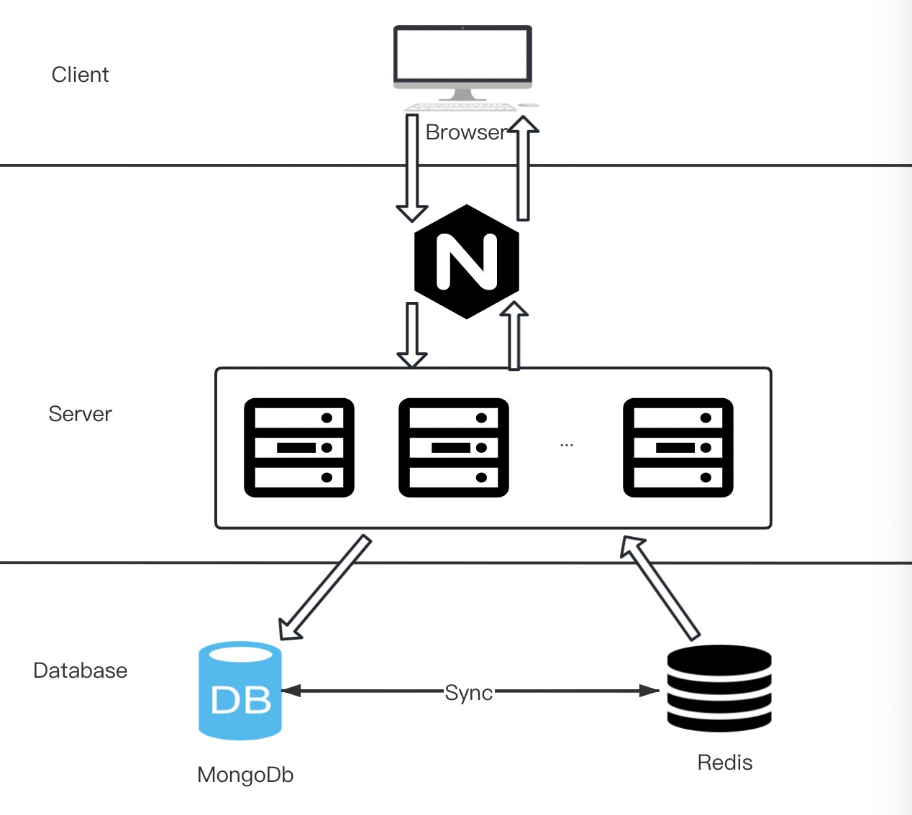
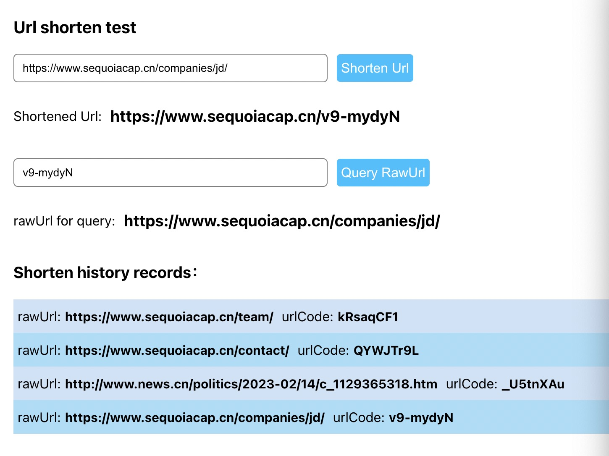

## assginment introduction
this url shorten application is implemented via express + mongoose + typescript + react + jest.

### 环境准备
〉运行环境需要安装 Nodejs > 14 + mongodb

### 运行命令
```
$ cd fullstack

$ npm install or yarn install #安装依赖

$ npm run server or yarn server #启动server服务

$ npm run client or yarn client #启动client

$ npm run dev or yarn dev #同时启动server和client，可监听

$ npm run build or yarn build #构建client

$ npm start or yarn start #一键启动client构建和server服务

$ npm run test:unit or yarn test:unit #运行单元测试

```

### 访问地址
1. 当使用yarn dev or yarn client启动时，访问地址为 http://localhost:3000 
    + 前端调用API地址为 http://localhost:8888
2. 当使用yarn start 启动时，访问地址为： http://localhost:8888
    + 后端服务直接返回html内容


### 结构说明
+ |-fullstack
+ |--public-------------前端访问的html文件夹
+ |--resources ---------intro.md使用的的图片文件夹
+ |--src ---------------所有源码文件夹
+ |----client ----------前端页面代码
+ |----server ----------后端服务代码
+ |------config --------数据库相关配置
+ |------interfaces ----URL接口定义
+ |------middlewares ---中间件
+ |------models --------URL model
+ |------routes --------请求路由
+ |------utils ---------通用工具方法
+ |------app.ts ---------应用逻辑入口
+ |------server.ts ------运行入口文件
+ |--tests --------------单元测试用例

### 技术架构图
 

#### 架构简要说明
1. 用户通过浏览器访问操作页面地址
2. 请求至Nginx，Nginx根据配置规则转发到Server，Server应用程序根据地址配置返回html或json数据
    + 本地环境未搭建nginx，前端直接访问node服务接口地址
3. server层应用使用express开发，数据会直接保存在mongodb中；同时查询数据也是应用直接从mongodb中读取。
    + 对于线上高并发场景，可以进行读写分离，中间加一层redis缓存
    + shorten调用时，写入mongodb，同时同步到redis
    + query查询时，直接从redis中读取，如果redis中不存在，可从mongodb中读取返回，并同步到redis。


### 实现的页面截图

