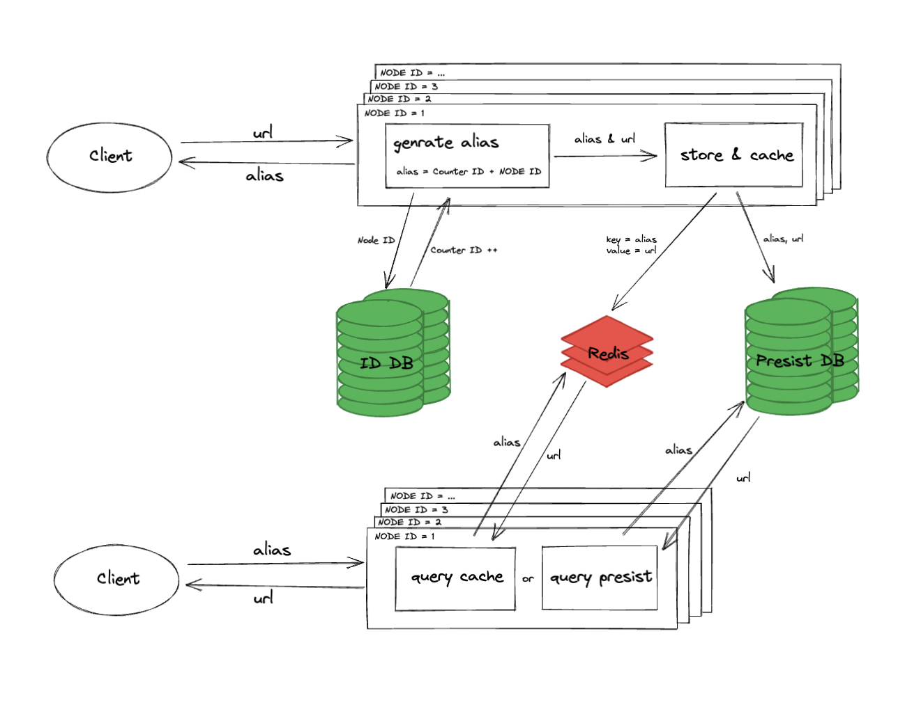

# 容量估计

假设:

1. 假设生成和读取的比例是 `1:50`
2. 假设每月有 `100万` 短地址生成
3. 假设需要稳定运行 24 个月, 每个存储对象为 0.5KB

因此:

1. 生成接口的 QPS `100万 / (30 * 24 * 60 * 60) = 0.38`
2. 读取接口的 QPS `0.38 * 50 = 19.3`
3. 总存储空间 `100万 * 24 * 0.5KB = 12G`

缓存: 按照热门 20% 计算需要内存 `12G * 20% = 2.4G`

结论:

单节点即可满足需求

# 短地址设计

采用 62 进制表示, 既 `0-9 a-z A-Z`

`6 位自增 ID` + `2 位节点标识` 的方式表示

6 位可以 62 进制可以表示 `62^6 = 56800235584` 500 亿, 因此 ID 是绝对够用的

# 横向扩展

如果实际运行超出假设, 需要可以通过水平扩容来满足需求

| 整体思路, 将水平扩容压力转移到 数据库集群 和 Redis 分片上

节点设计成可横向扩展, 外层通过 LB 负载到多个节点

每个节点通过唯一节点 ID 加 数据库自增 ID 生成为一个 短地址 alias



# 单节点压测

10 秒, 并发 10 个请求

```
MacBook Pro (13-inch, M1, 2020)
16G Memo
```

/encode

```
┌─────────┬──────┬──────┬───────┬──────┬─────────┬─────────┬───────┐
│ Stat    │ 2.5% │ 50%  │ 97.5% │ 99%  │ Avg     │ Stdev   │ Max   │
├─────────┼──────┼──────┼───────┼──────┼─────────┼─────────┼───────┤
│ Latency │ 2 ms │ 2 ms │ 4 ms  │ 5 ms │ 2.34 ms │ 0.89 ms │ 15 ms │
└─────────┴──────┴──────┴───────┴──────┴─────────┴─────────┴───────┘
┌───────────┬─────────┬─────────┬─────────┬─────────┬─────────┬────────┬─────────┐
│ Stat      │ 1%      │ 2.5%    │ 50%     │ 97.5%   │ Avg     │ Stdev  │ Min     │
├───────────┼─────────┼─────────┼─────────┼─────────┼─────────┼────────┼─────────┤
│ Req/Sec   │ 2785    │ 2785    │ 3557    │ 3653    │ 3465.8  │ 244.84 │ 2784    │
├───────────┼─────────┼─────────┼─────────┼─────────┼─────────┼────────┼─────────┤
│ Bytes/Sec │ 2.62 MB │ 2.62 MB │ 3.34 MB │ 3.43 MB │ 3.25 MB │ 230 kB │ 2.61 MB │
└───────────┴─────────┴─────────┴─────────┴─────────┴─────────┴────────┴─────────┘

Req/Bytes counts sampled once per second.
# of samples: 10

35k requests in 10.01s, 32.5 MB read
```

/decode

```
┌─────────┬──────┬──────┬───────┬──────┬─────────┬─────────┬──────┐
│ Stat    │ 2.5% │ 50%  │ 97.5% │ 99%  │ Avg     │ Stdev   │ Max  │
├─────────┼──────┼──────┼───────┼──────┼─────────┼─────────┼──────┤
│ Latency │ 0 ms │ 0 ms │ 2 ms  │ 2 ms │ 0.11 ms │ 0.43 ms │ 6 ms │
└─────────┴──────┴──────┴───────┴──────┴─────────┴─────────┴──────┘
┌───────────┬─────────┬─────────┬─────────┬─────────┬─────────┬────────┬─────────┐
│ Stat      │ 1%      │ 2.5%    │ 50%     │ 97.5%   │ Avg     │ Stdev  │ Min     │
├───────────┼─────────┼─────────┼─────────┼─────────┼─────────┼────────┼─────────┤
│ Req/Sec   │ 10663   │ 10663   │ 12303   │ 12431   │ 12117.6 │ 511.66 │ 10660   │
├───────────┼─────────┼─────────┼─────────┼─────────┼─────────┼────────┼─────────┤
│ Bytes/Sec │ 10.1 MB │ 10.1 MB │ 11.7 MB │ 11.8 MB │ 11.5 MB │ 487 kB │ 10.1 MB │
└───────────┴─────────┴─────────┴─────────┴─────────┴─────────┴────────┴─────────┘

Req/Bytes counts sampled once per second.
# of samples: 10

121k requests in 10s, 115 MB read
```
