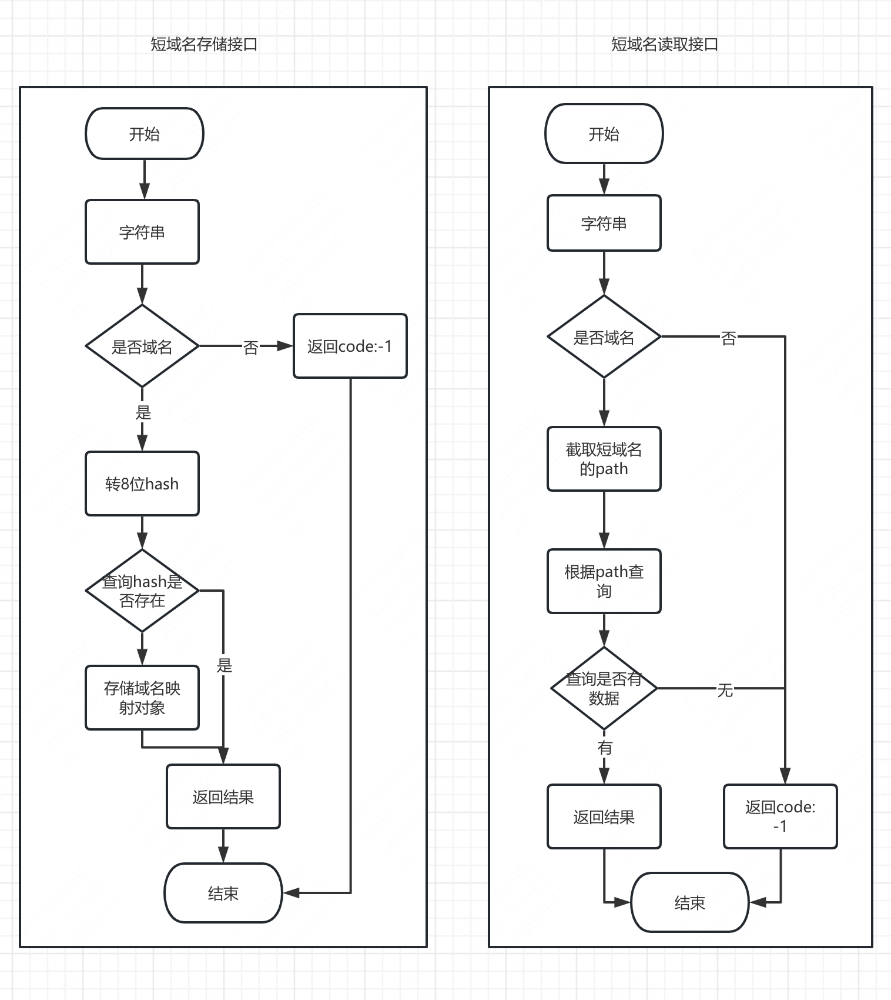

# 短链接
- 短域名存储接口：接受长域名信息，返回短域名信息
- 短域名读取接口：接受短域名信息，返回长域名信息。

## 短链接设想关键词

- 用户唯一判断（cookie实现）
- redis缓存（加速访问）
- 分步骤匹配短链接（优化逻辑）
- 记录访问记录（ua、ip、用户等）

## 访问短链接接口行为步骤

1. 通过cookie分配uuid（用户唯一标识）
2. 读取短链接（通过redis或者数据库）
3. 记录访问记录

## 如何运行
```bash
docker-compose up -d
npm install
npm run start:dev
```
浏览器打开http://localhost:3000/api/

##流程图


# TypeScript Fullstack Engineer Assignment

### Typescript 实现短域名服务（细节可以百度/谷歌）

撰写两个 API 接口

- 短域名存储接口：接受长域名信息，返回短域名信息
- 短域名读取接口：接受短域名信息，返回长域名信息。

限制：

- 短域名长度最大为 8 个字符

递交作业内容

1. 源代码
2. 单元测试代码以及单元测试覆盖率
3. API 集成测试案例以及测试结果
4. 简单的框架设计图，以及所有做的假设
5. 涉及的 SQL 或者 NoSQL 的 Schema，注意标注出 Primary key 和 Index 如果有。

## 岗位职责

- 根据产品交互稿构建高质量企业级 Web 应用
- 技术栈：Express + React
- 在产品迭代中逐步积累技术框架与组件库
- 根据业务需求适时地重构
- 为 Pull Request 提供有效的代码审查建议
- 设计并撰写固实的单元测试与集成测试

## 要求

- 三年以上技术相关工作经验
- 能高效并高质量交付产品
- 对业务逻辑有较为深刻的理解
- 加分项
  - 持续更新的技术博客
  - 长期维护的开源项目
  - 流畅阅读英文技术文档
  - 对审美有一定追求
  - 能力突出者可适当放宽年限
