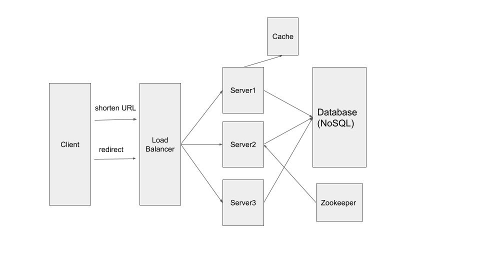

### Typescript 实现短域名服务（细节可以百度/谷歌）

撰写两个API接口

- 短域名存储接口：接受长域名信息，返回短域名信息
- 短域名读取接口：接受短域名信息，返回长域名信息。

限制：

- 短域名长度最大为8个字符

递交作业内容

1. 源代码
2. 单元测试代码以及单元测试覆盖率
3. API集成测试案例以及测试结果
4. 简单的框架设计图，以及所有做的假设
5. 涉及的SQL或者NoSQL的Schema，注意标注出Primary key 和Index 如果有。

### Solution

#### Tech Stack
- Node.js (backend) + React (frontend) + MongoDB (database)
- Misc NPM packages: mongoose, mocha, express, body-parser, nanoid
- routes/api/redirect.js: 接受短域名信息，查询数据库，返回长域名信息
- routes/api/shorten.js: 接受短域名信息，存储数据库，返回长域名信息
- models/URLs.js: MongoDB schema
- test/server_test.js: unit tests

#### Traffic Estimate
- 最大支持URL个数: 64^8 (8个字符)
- 假设1 URL平均有N个访问 (e.g. N = 100 calls)
- 假设平均每月生成M个URL (e.g. M = 5000,000)
- URL shortening traffic T = M/(30 days * 24 hours * 3600 secs) ~= 2 URLs/s
- redirect访问traffic = N × T = 200 redirects/s

#### Storage Estimate
- 每个entry: id (8 Bytes) + hash (8 Bytes) + url(～2KB) = 2.02KB
- 假设URL保存期3年, 则总数据量约为: 3 * M * 12 * 2.02KB= 1800万个entry * 2.02 = 363.6G

#### Bandwidth Estimate
- T * 2.02KB = 4.02KB/s

#### System Design

