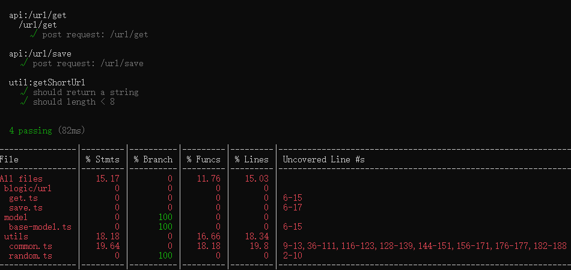
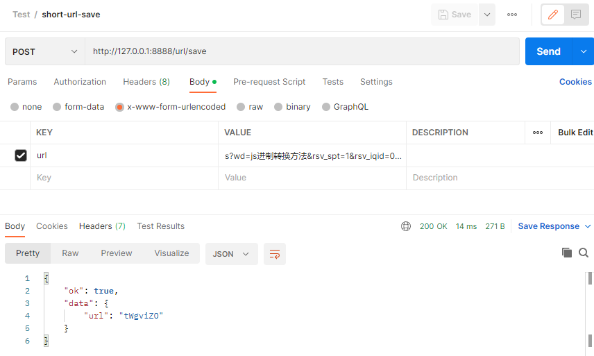
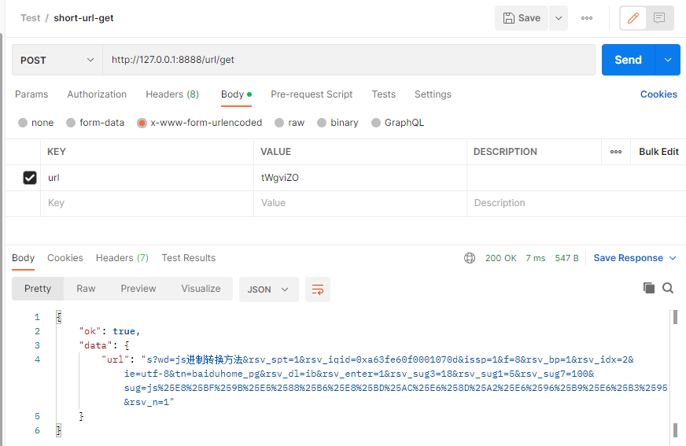
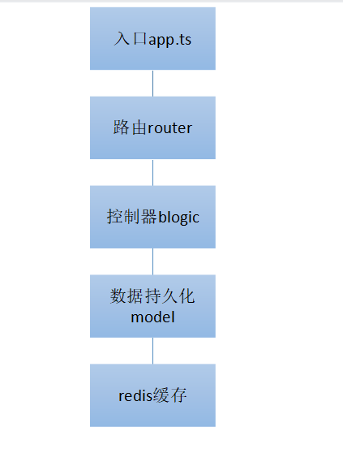

# 项目说明

- 本框架原本使用 node+typescript+express+mysql 搭建，修改后使用 redis 实现数据存储。
  因此删掉了大多数不必要的文件，只保留了实现 api 的基础框架。
- 此项目代码只考虑了长域名和短域名的转换，长域名唯一性校验和 mysql 持久化存储没有实现。
- 短域名存储接口 url/save
- 短域名读取接口 url/get

# 递交作业说明

1. 源代码
   见代码。
2. 单元测试代码以及单元测试覆盖率(覆盖率请勿提交整个目录，一张图片或一个 text table 即可)
   
3. API 集成测试案例以及测试结果
   
   
4. 简单的框架设计图，以及所有做的假设
   
   假设：
   - 怎么保证所有的短 url 唯一？
     使用时间戳+10 位随机数生成一个数字，不能说完全唯一，但是重复率极小极小。
   - 怎么保证短 url 长度小于 8 位？
     时间戳长度为 13 位，经过 62 进制编码后长度绝对小于等于 8 位。
   - 怎么保证长域名存储的唯一性？
     本项目只考虑了长短域名的对应，长域名如果想做唯一性校验，可以在持久化到 mysql 数据库时做唯一索引，redis 这里只考虑短域名的唯一，且不考虑获取长域名对应的短域名情况
5. 涉及的 SQL 或者 NoSQL 的 Schema，注意标注出 Primary key 和 Index 如果有。
   本项目数据只涉及 redis 存储，schema 为 db0，key（短域名）- value（长域名）

## 使用说明

安装:

> yarn

启动：

> yarn start

# TypeScript Fullstack Engineer Assignment

### Typescript 实现短域名服务（细节可以百度/谷歌）

撰写两个 API 接口

- 短域名存储接口：接受长域名信息，返回短域名信息
- 短域名读取接口：接受短域名信息，返回长域名信息。

限制

- 短域名长度最大为 8 个字符（不含域名）

递交作业内容

1. 源代码
2. 单元测试代码以及单元测试覆盖率(覆盖率请勿提交整个目录，一张图片或一个 text table 即可)
3. API 集成测试案例以及测试结果
4. 简单的框架设计图，以及所有做的假设
5. 涉及的 SQL 或者 NoSQL 的 Schema，注意标注出 Primary key 和 Index 如果有。

其他

- 我们期望不要过度设计，每一个依赖以及每一行代码都有足够充分的理由。

## 岗位职责

- 根据产品交互稿构建高质量企业级 Web 应用
- 技术栈：Express + React
- 在产品迭代中逐步积累技术框架与组件库
- 根据业务需求适时地重构
- 为 Pull Request 提供有效的代码审查建议
- 设计并撰写固实的单元测试与集成测试

## 要求

- 三年以上技术相关工作经验
- 能高效并高质量交付产品
- 对业务逻辑有较为深刻的理解
- 加分项
  - 持续更新的技术博客
  - 长期维护的开源项目
  - 流畅阅读英文技术文档
  - 对审美有一定追求
  - 能力突出者可适当放宽年限
