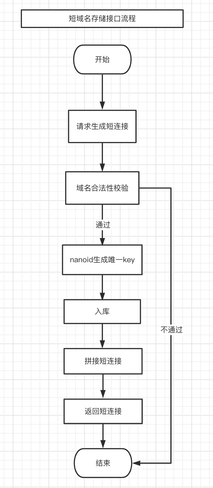
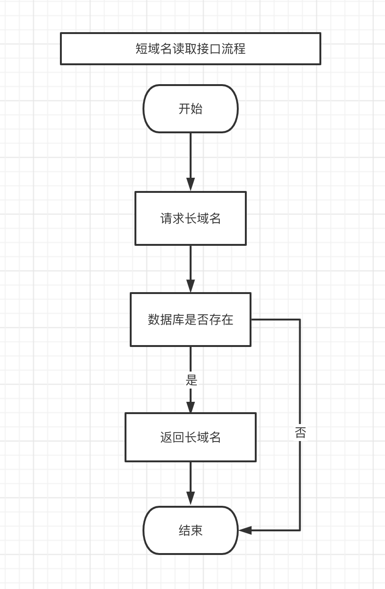
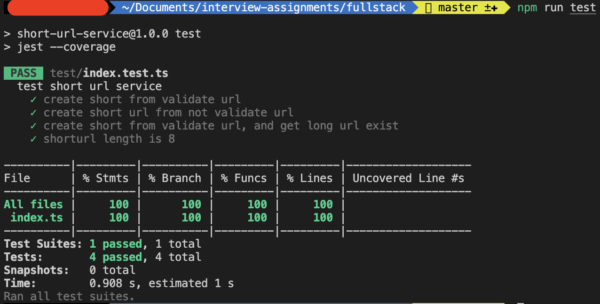

# TypeScript Fullstack Engineer Assignment

### Typescript 实现短域名服务（细节可以百度/谷歌）

撰写两个 API 接口

- 短域名存储接口：接受长域名信息，返回短域名信息
- 短域名读取接口：接受短域名信息，返回长域名信息。

限制

- 短域名长度最大为 8 个字符（不含域名）

### 需求分析与注意事项

1. 撰写两个 API 接口: 短域名存储与读取；
2. 岗位JD描述技术栈为 express + react;
3. 短域名长度最大为 8 个字符（不含域名）；
4. 期望不要过度设计，每一个依赖以及每一行代码都有足够充分的理由；
5. 与HR沟通岗位职责得知，主要业务场景为内部人员使用，高并发场景暂不考虑；

### 技术选型要点

1. 数据库选用当前 nosql 数据库中功能最丰富，最像关系数据库的MongoDB;
2. 生成唯一id方案，最初考虑了 uuid v4，后来改用 nanoid 代替，nanoid 使用更大的字母表，不使用不安全的 Math.random(), 而是使用 Node.js 的 crypto 模块和浏览器的 Web Crypto API，这些模块使用不可预测的硬件随机生成器；
使用 8 位字符，1000 并发下，99 天会产出一次碰撞，该概率可以忽略不计（如需考虑，可以采用布隆过滤器解决碰撞问题）：[https://zelark.github.io/nano-id-cc/](碰撞计算器)；
3. 检测url合法性选用valid-url；
4. 单元测试工具选用jest；

### 后续优化
由于时间关系和避免过度设计，仅最小成本实现了两个 API 接口服务，该服务还有很多技术优化空间：
1. 缓存机制，适当的使用缓存以提升系统的吞吐量，可以考虑接入redis；
2. 布隆过滤器，短连接创建后，将 key 放入过滤器中，在查询到无效的短连接后可以避免缓存穿透；也可以解决 nanoid 碰撞问题，当检查到 key 在过滤器中存在，会生成新的 key；

### 流程图

### 单元测试
抱歉做了一些脱敏处理；

