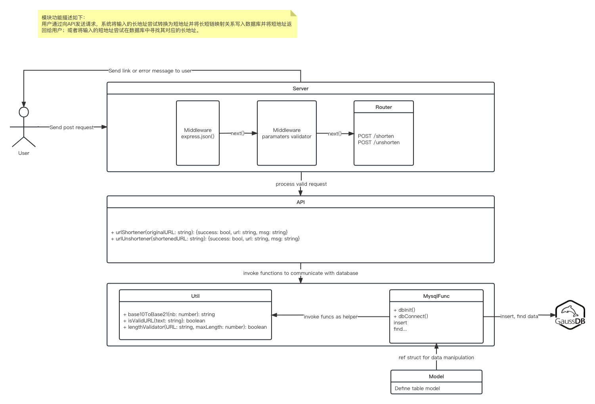

# url-shortener

## Get started

- npm install
- npm run build
- node dist/server.js

## API /shorten

Method: POST

Path: /shorten

Content-Type:application/json

Request body：

| Param | Type   | Required |
| ----- | ------ | -------- |
| url   | string | yes      |

Response body：

| Param   | Type   |
| ------- | ------ |
| success | number |
| msg     | string |
| url     | string |

## API /unshorten

Method: POST

Path : /unshorten

Content-Type:application/json

Request body：

| Param | Type   | Required |
| ----- | ------ | -------- |
| url   | string | yes      |

Response body：

| Param   | Type   |
| ------- | ------ |
| success | number |
| msg     | string |
| url     | string |

## Architecture diagram



## Assumption

- Internal use, so we do not need to design the API authentication (ex: api-token) and flow control
- Shortened URLs generated : 10/s, shortened URLs generated in 100 years : about 3.16 \* 10^10
- Shortened link should be as small as possible, 8 letter maximum (not include the host name and protocol)
- Database and api running on the same server
- Singleton instance

## Test env

- MySQL 5.7, image from docker hub

## SQL schema

Database: MySQL

```
TABLE TinyURL (
  ID BIGINT NOT NULL AUTO_INCREMENT,
  ShortenedURL VARCHAR(40) NOT NULL,
  OriginalURL VARCHAR(400) NOT NULL,
  INDEX(ShortenedUrl, OriginalUrl)
);
```

## Unit test coverage


## Integration test coverage


