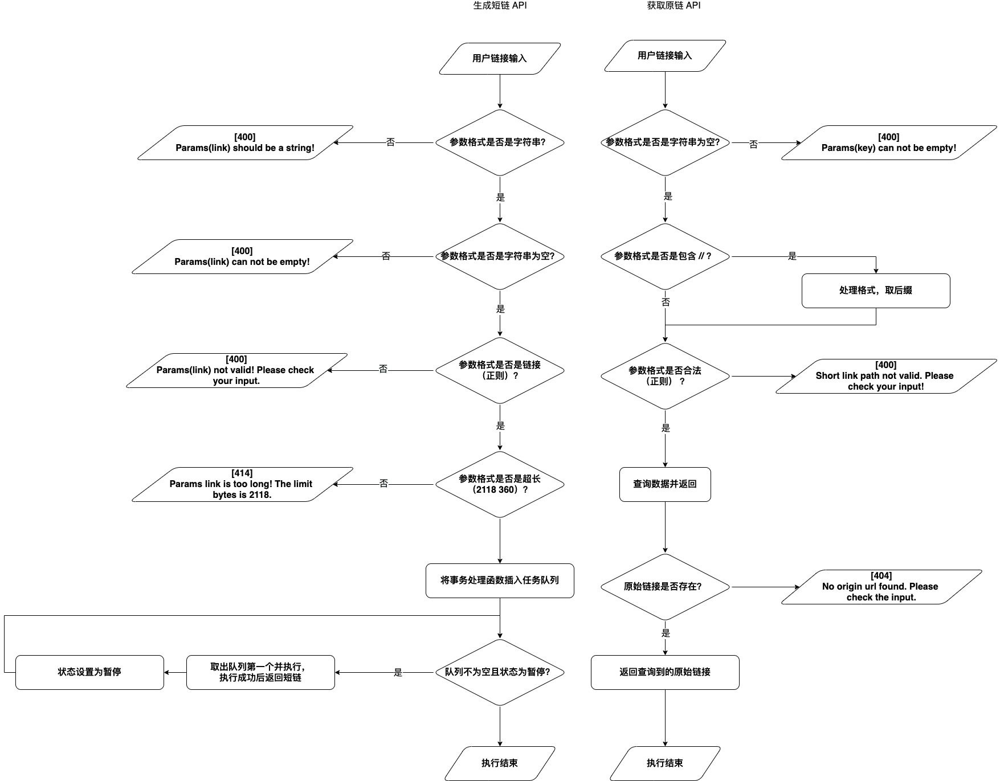

# Short link service

## command
```shell
# dev
bash bin/init.sh

# test
bash bin/test.sh

# build
# 需要指定 ng 的静态资源目录
bash bin/build.sh
```
## Env
- `node v12.9.1, npm 6.14.8`
- `mysql  Ver 8.0.15 for macos10.14 on x86_64`
## 注意事项
- 前端资源在 `resources` 下，如果部署 `server` 的 `path` 有变化，需要调整 `resources/package.json` 中的 `homepage` 字段
- 初始化 `mysql` 情况下，需要手动创建 `database` `link`

## 框架图及及假设


- 假设一
  - 使用 nginx 部署前端服务，前后端同域名部署（见 bin/build.sh）
    - 可能需要使用 cdn 服务，建议在前端资源构建时使用 commitId 作为 key，构建后上传所有的资源包含 html，下次构建先判断 hash 是否存在，如果存在可直接拉云端对应 html 文件从而跳过构建（html 不缓存，发布期服务照常）
    - 前后端仅配置了 3001 本地端口的跨域，方便 dev 调试

- 假设二
  - 可能分布式部署，因此
    - hashid 算法需要添加 hostname 来作为参数辅助
    - 假设可以提前拿到每一个机器的详细信息，并假设流量按照机器性能来分发，则可以优化存储分区，加快查询速度
  - 仅用单机来实现 master 写，因此简化了队列，没有使用 async 等库，更没有使用 redis 来辅助
  - 使用其他的机器来实现 slave 读，并且如果 master 机器出问题，slave 机器会竞争出 master。短暂期间会服务不可用（包含队列中未处理的请求）

- 假设三
  - 使用 pm2 等工具来完成 node 服务保活
- 假设四
  - ts 工具可以完成的接口字段检测，无需写到测试用例中
- 假设五
```
# 用户可能会使用到的浏览器及对应支持的 get 请求长度，这里由于域名不确定，暂时没有减去前面固定的长度部分来判断
 * 1、IE 2048
 * 2、360 2118
 * 3、Firefox 65536
 * 4、Safari 80000
 * 5、Opera 190000
 * 6、Chrome 8182
```

- 假设六
  - 需要多套部署配置和 db 配置，来区分开发、测试、生产环境
- 假设七
  - 不需要登录，但是可以用 cookie 和 localStorage 的方案来标记当前用户，同时提示他一段时间内已生成的长链和短链对应表（类似 https://www.shortlink.net/）
- 假设八
  - 可能需要登录或有后台等，可以用中间件来实现鉴权等功能
- 假设九
  - 日志需要特殊处理添加全链路 traceid 来完成上下游日志排查，因此单独写了一个简单的日志文件，但还没有实现写本地和异步空闲上报等操作，为了简单也没有使用 express-pino-logger 等类库
- 假设十
  - 当前的 [hashid 算法](https://github.com/niieani/hashids.js)足够友好，且能存的数据足够
    - 自增 id 能保证不碰撞，但是可能会打满（对比 hash 的优点）
  - 不存在隐私数据、黑客攻击、流量攻击等
- 假设十一
  - 暂未实现 301 短链重定向长链
## SQL
- 见 server/models
  - short 字段 uniuqe 索引即可


-------------------
# TypeScript Fullstack Engineer Assignment

### Typescript 实现短域名服务（细节可以百度/谷歌）

撰写两个 API 接口

- 短域名存储接口：接受长域名信息，返回短域名信息
- 短域名读取接口：接受短域名信息，返回长域名信息。

限制：

- 短域名长度最大为 8 个字符

递交作业内容

1. 源代码
2. 单元测试代码以及单元测试覆盖率
3. API 集成测试案例以及测试结果
4. 简单的框架设计图，以及所有做的假设
5. 涉及的 SQL 或者 NoSQL 的 Schema，注意标注出 Primary key 和 Index 如果有。

## 岗位职责

- 根据产品交互稿构建高质量企业级 Web 应用
- 技术栈：Express + React
- 在产品迭代中逐步积累技术框架与组件库
- 根据业务需求适时地重构
- 为 Pull Request 提供有效的代码审查建议
- 设计并撰写固实的单元测试与集成测试

## 要求

- 三年以上技术相关工作经验
- 能高效并高质量交付产品
- 对业务逻辑有较为深刻的理解
- 加分项
  - 持续更新的技术博客
  - 长期维护的开源项目
  - 流畅阅读英文技术文档
  - 对审美有一定追求
  - 能力突出者可适当放宽年限
