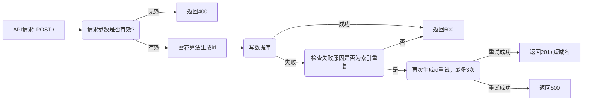
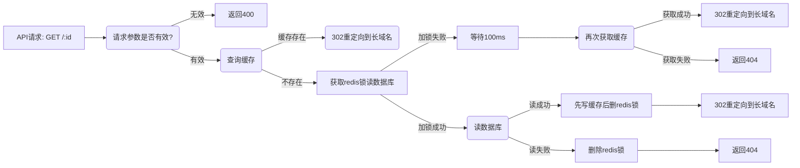

# 短域名服务

## API 说明

### 1.生成短域名

- Method: **POST**
- URL:  `/`
- Request Headers：
    - Content-type: `application/x-www-form-urlencoded` ｜ `application/json`
- Request Body:
```
link=http://gooogle.com
```
```
{"link":"https://www.baidu.com/dsgdftr"}
```
- 长域名校验规则，校验不过返回400
```nodejs

const url = 'https://www.google.com';
const urlReg = new RegExp(
  /^(https?:\/\/(([a-zA-Z0-9]+-?)+[a-zA-Z0-9]+\.)+[a-zA-Z]+)(:\d+)?(\/.*)?(\?.*)?(#.*)?$/,
);
console.log(urlReg.test(url));

```
- Curl Ex:
```
curl -i -X POST -d "link=https://www.baidu.com/dsgdftr" "http://localhost:3000"
curl -X POST "http://localhost:3000" -H 'Content-Type: application/json'  -d '{"link":"https://www.baidu.com/dsgdftr"}'
```

- Response
    - statusCode: 201 创建成功
    - statusCode: 400 参数错误
    - statusCode: 500 服务内部错误
```
{"statusCode":201,"message":"Success","link":"http://localhost:3000/ha32ehu4"}
{"statusCode":400,"message":"Bad Request"}
{"statusCode":500,"message":"Internal server error"}
```  

### 2.根据短域名获取长域名

- Method: **GET**
- URL:  `/:id`
- Curl Ex:
```
curl -i "http://localhost:3000/55cdssg1"
```

- Response
    - statusCode: 302 资源存在，重定向到长域名
    - statusCode: 400 参数错误
    - statusCode: 404 资源不存在


## 单元测试
- 启动单测
```
npm run test
npm run test:cov
```
- 单测结果
```
Test Suites: 6 passed, 6 total
Tests:       23 passed, 23 total
Snapshots:   0 total
Time:        14.167 s
```

- 单测覆盖情况
```
---------------------------|---------|----------|---------|---------|-------------------
File                       | % Stmts | % Branch | % Funcs | % Lines | Uncovered Line #s 
---------------------------|---------|----------|---------|---------|-------------------
All files                  |   93.82 |    93.61 |   96.42 |   93.08 |                   
 src                       |   35.71 |      100 |       0 |      25 |                   
  app.module.ts            |     100 |      100 |     100 |     100 |                   
  main.ts                  |       0 |      100 |       0 |       0 | 1-12              
 src/config                |     100 |      100 |     100 |     100 |                   
  index.ts                 |     100 |      100 |     100 |     100 |                   
 src/entities              |     100 |      100 |     100 |     100 |                   
  base.entity.ts           |     100 |      100 |     100 |     100 |                   
  link.entity.ts           |     100 |      100 |     100 |     100 |                   
 src/id                    |     100 |      100 |     100 |     100 |                   
  id.module.ts             |     100 |      100 |     100 |     100 |                   
  id.service.ts            |     100 |      100 |     100 |     100 |                   
  id.snowflake.bit48.ts    |     100 |      100 |     100 |     100 |                   
 src/short-link            |   97.89 |     92.1 |     100 |   97.72 |                   
  short-link.controller.ts |      96 |    92.85 |     100 |   95.65 | 54                
  short-link.module.ts     |     100 |      100 |     100 |     100 |                   
  short-link.service.ts    |    98.3 |    91.66 |     100 |   98.21 | 60                
 src/utils                 |     100 |      100 |     100 |     100 |                   
  reg.ts                   |     100 |      100 |     100 |     100 |                   
---------------------------|---------|----------|---------|---------|-------------------

Test Suites: 7 passed, 7 total
Tests:       27 passed, 27 total
Snapshots:   0 total
Time:        17.171 s
```

## 集成测试
- 集成测试
```
npm run test:e2e
```

- 集成测试情况
```
 PASS  test/app.e2e-spec.ts
  ShortLinkController (e2e)
    ✓ / (POST) (232 ms)
    ✓ / (POST) 400 (24 ms)
    ✓ /:id (GET) 404 (28 ms)
    ✓ /:id (GET) 400 (25 ms)
    ✓ /:id (GET) 302 (31 ms)

Test Suites: 1 passed, 1 total
Tests:       5 passed, 5 total
Snapshots:   0 total
Time:        3.172 s, estimated 4 s
```

## 流程设计

### 1.生成长链接


```flow
  start=>start: API请求: POST /
  valid=>condition: 请求参数是否合法？
  generateId=>operation: 雪花算法生成id
  checkDbIndexError=>condition: 检查是否索引重复
  retryGenerateId=>condition: 再次生成id重试,最多重复3次
  writeDb=>condition: 写数据库,是否成功？
  end201=>end: 创建成功，返回201
  end400=>end: 返回400,参数错误
  end500=>end: 返回500，服务内部错误
  end201-1=>end: 创建成功，返回201
  end500-1=>end: 返回500，服务内部错误
  start->valid
  valid(no)->end400
  valid(yes)->generateId->writeDb
  writeDb(yes)->end201
  writeDb(no)->checkDbIndexError
  checkDbIndexError(yes)->retryGenerateId->writeDb
  checkDbIndexError(no)->end500
  retryGenerateId(yes)->end201-1
  retryGenerateId(no)->end500-1
```


### 2.获取长链接




```flow
  start=>start: API请求: GET /:id
  valid=>condition: 请求参数是否合法？
  cached=>condition: 读取Redis缓存,是否有缓存？
  setCache=>operation: 保存缓存
  getRedisLock=>condition: 尝试获取redis锁
  wait100=>condition: 等待100ms后，再从redis缓存中获取1次
  readDb=>condition: 尝试从db读取域名记录
  delRedisLock=>operation: 删除redis锁
  end302=>end: 302重定向到长域名
  end302-1=>end: 302重定向到长域名
  end302-2=>end: 302重定向到长域名
  end400=>end: 返回400,参数错误
  end404=>end: 返回404,资源不存在
  end404-1=>end: 返回404,资源不存在
  start->valid
  valid(no)->end400
  valid(yes)->cached
  cached(yes)->end302
  cached(no)->getRedisLock
  getRedisLock(yes)->readDb
  readDb(yes)->setCache->delRedisLock->end302-1
  readDb(no)->end404
  getRedisLock(no)->wait100
  wait100(yes)->end302-2
  wait100(no)->end404-1
```


### 

## 一些考虑和假设

1. 域名id唯一的考虑
  提交代码中域名id采用64进制表示法:`abcdefghijklmnopqrstuvwxyz-ABCDEFGHIJKLMNOPQRSTUVWXYZ@0123456789`；
  8长度的64进制域名刚好可以表示48位: `64^8=2^48`，所以采用自改进的雪花算法生成共48位的域名id，具体规则位从高位到地位：`4字节服务id+41字节毫秒时间戳+3字节序列号`；
  服务id采用随机生成，随机分配服务id会加大id碰撞的可能性，在代码中针对id重复问题做了再生成处理；
  上生产环境可考虑通过预估qps、压测结果、成本等因素，考虑是否有必要使用其它等中间件解决服务id重复问题；

2. 域名长度的假设
  使用64进制表示域名短链，8长度短链使用雪花算法48位，每减少一个长度，雪花算法减少6位；每增加一个长度，雪花算法需增加6位
  假设需求提出短链长度要支持`6-8位`，可以使用35位秒级时间戳；
  假设需求提出短链`低于6位`，根据需要计算减少时间戳占位数，id碰撞概率会明显提升；
  假设数据库链接已经达到极限`281474976710656n(1n << 48n)`,可以考虑新增`9长度64进制`的id服务接受新的创建申请，对于查询申请，可由nginx判断短链长度转发到不同服务；

3. db性能的考虑
  参考阿里云对postgresql数据的测试报告`https://antchain.antgroup.com/docs/2/101470`,`2c8g`配置下可支撑`19880QPS`的情况下，在没有并发量评估的情况下可暂不考虑分库分表

4. 接口限频、监控告警的考虑
  为防止服务器受到`DDOS攻击`，最好是统一建设服务网关，如没有，上生产环境还是需要补上限频功能；
  目前比较好的方案是`prometheus`+`grafana`, 上生产环境可以考虑增加对`http状态码`、`SQL/NoSQL慢查询`、`机器CPU使用率/内存/负载/IO`等指标的监控告警;

5. 存储空间
  如果这个服务只为少数域名提供短链服务，每条长链接里面存放域名，有些浪费空间，可考虑采用ak/sk授权应用的方式去设计，数据库中链接只存appid和长链接的path，数据量巨大的情况下可以明显节约存储空间;

6. 是否有需求通过长链接查找/更新/删除短链接
  可以考虑对长链接添加索引，会降低写入性能；


## SQL 

### postgresql

- 创建postgresql用户
```/bin/bash
创建远程访问用户：
createuser vizoss
创建db并设置Owner为vizoss：
createdb fs_hw_vizoss -O vizoss -E utf-8
本地连接：
psql fs_hw_vizoss -U vizoss
设置密码：
\password vizoss 
vizoss
```

- 修改postgresql限制
```
pg_hba.conf: 新增一行
# TYPE  DATABASE        USER            ADDRESS                 METHOD
host    fs_hw_vizoss    vizoss          0.0.0.0/0               password
```

```
postgresql.conf: listen_addresses设置
listen_addresses = '0.0.0.0'		# what IP address(es) to listen on;
```

- 测试连接
```/bin/bash
psql fs_hw_vizoss -h 192.168.0.103 -U vizoss
Password for user vizoss: vizoss
```

- 创建表
```
CREATE TABLE IF NOT EXISTS sl_link(
   id      VARCHAR(8) PRIMARY KEY     NOT NULL,
   link    TEXT                       NOT NULL,
   ctime   TIMESTAMP  DEFAULT now()
);
```

### redis的key

- 长域名的key
使用``id-${id}`` 作为长域名的key存放，ex： id为12345678，redis中key为 `id-12345678`, 过期时间为1小时

- 分布式锁的key
使用``idl-${id}``作为分布式锁的key，ex：在需要读某个id为12345678的db内容时，redis分布式锁的key为`idl-12345678`, 过期时间1s


## 部署运行

### 本地运行
- 环境准备
  安装node、postgresql、redis
- 安装依赖npm install
- 环境变量配置
```/bin/zsh
cat >> ~/.bash_profile <<EOF
export POSTGRES_HOST=127.0.0.1
export POSTGRES_PORT=5432
export POSTGRES_USER=vizoss
export POSTGRES_PASSWORD=vizoss
export POSTGRES_DB=fs_hw_vizoss
export REDIS_HOST=127.0.0.1
export REDIS_PORT=6379
export REDIS_PASSWORD=vizoss
EOF
source ~/.bash_profile
```
- 本地开发
```
npm run start:dev
```

- 本地构建
```
npm run build
```

### 打包Docker镜像
```
docker pull node:18.4-alpine
docker build -t scdt-china/fs-hw-vizoss:latest .
```

### Docker 运行
```
docker run -p 13000:3000 --name fs-hw-vizoss \
  -e POSTGRES_HOST="192.168.0.103" \
  -e POSTGRES_PORT=5432 \
  -e POSTGRES_USER="vizoss" \
  -e POSTGRES_PASSWORD="vizoss" \
  -e POSTGRES_DB="fs_hw_vizoss" \
  -e REDIS_HOST="192.168.0.103" \
  -e REDIS_PORT=6379 \
  -e REDIS_PASSWORD="vizoss" \
  -itd scdt-china/fs-hw-vizoss:latest
  
```

### Docker-compose
```
docker pull redis:latest
docker pull postgres:14
docker pull 
chmod 777 ./docker-compose/postgres/db/init.sh
docker-compose up -d
```


