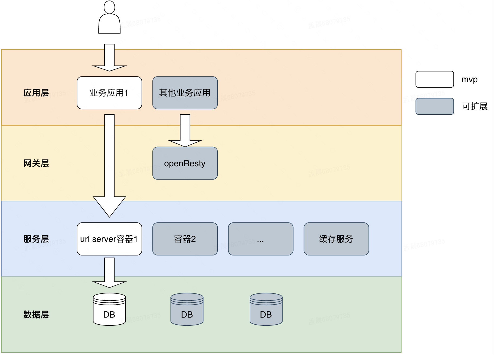
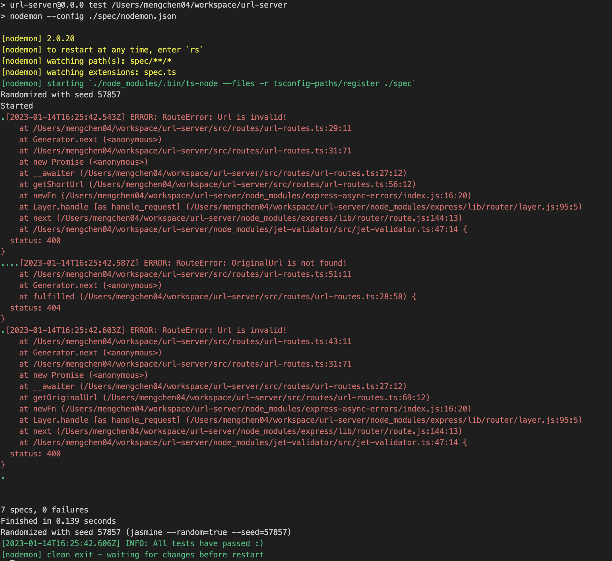

#### 关于工程

由于拿到作业到上交的时间非常紧迫，本工程采用了脚手架[express-generator-typescript](https://github.com/seanpmaxwell/express-generator-typescript).
进行搭建，并且使用的是mockDB，实际工程下会调整成数据库以及合适的ORM框架，并且添加日志监控埋点，增加缓存机制等,工程依赖中目前可能存在一些脚手架自带依赖未删除干净。

#### 关于作业的理解
本作业要求的是短链接服务，虽然只有两个接口，但是我理解真实工作是在一定的业务场景和需求下去做的决策，由于题目中业务背景相关信息较少，我这边代码层面只是出了一个mvp版本的接口服务，相关技术设计和未来扩展的考虑，会在下文详细描述。我猜想这个作业考察的是我们候选人三个方面的能力。
+ 代码规范，通过工程可以看到我们的代码习惯
+ 系统设计能力，通过技术分析设计，看我们思考问题的全面性
+ 解决问题的思维方式，考察我们最终选择方案的方式方法

#### 前言
由于本人之前没设计过短链接系统，此次需求按照正常工作流程，进行了需求分析，技术调研，方案设计，代码落地这四个阶段。
#### 需求分析
如上文所述，没有业务场景，目前只能按照mvp版去实现，后续工程扩展需要根据具体业务场景和情况去分析，例如，题目中正常理解长短链接为1对1关系，然而实际业务场景可能需要进行数据统计，根据不同用户，不同时间，同一个链接产生不同的短链接。题目希望接口是200返回，而实际业务场景中似乎301或302的重定向情况更加普遍等等，正常情况是需要和业务方进行需求确认的。
#### 技术调研
根据几篇技术博客的方案对比，以及交了作业的其他同学的代码实现的参考，我理解这个作业核心逻辑就是长短链接映射关系生成的算法选择。
[参考文献1](https://soulmachine.gitbooks.io/system-design/content/cn/tinyurl.html)
[参考文献2](https://www.zhihu.com/question/29270034)
[参考文献3](https://blog.csdn.net/majianfei1023/article/details/125862568)
通过网上技术方案设计对比，这种服务的主要算法方案中，我选择了雪花算法，也就是分布式自增ID生成反转后转62进制的策略，基于以下几点原因：
+ 实现成本较低
+ 性能过硬
+ 重复的可能性只会发生在时间回调

我认为采用redis分布式发号器的设计，还是过重了，而其他方案例如哈希还需要解决冲突问题等，且重复可能性都较之更高。

#### 方案设计
##### 系统简单架构图

#### 扩展性解释
上面架构图中，白色部分为最基础服务搭建使用需要的内容。灰色部分为可根据具体业务可扩展的情况。
##### 应用层
可以有多个web服务，url服务可支持多个业务的调用。
##### 网关层
通常使用nginx做负载均衡，当遇到高并发场景，可采用openresty直连缓存层以及数据层。
##### 服务层
通常采用多容器部署，根据使用技术，微服务架构等情况来拆分服务。除了我们的url服务，可能还会有用户服务，鉴权服务，日志服务等。在我们的服务场景中，根据安全性考虑，可能需要根据用户调用情况做限流，可能需要使用缓存层防止攻击，也需要考虑sql注入等问题。
##### 数据存储层
不同服务可采用自己的数据库，数据量过大时则需要考虑分库分表等分布式技术来处理运维，成本将上升

#### 集成测试

#### 单元测试及覆盖率
由于时间关系，未引入。

#### 工程脚本使用

### `npm run dev`

Run the server in development mode.

### `npm test`

Run all unit-tests with hot-reloading.

### `npm test -- --testFile="name of test file" (i.e. --testFile=Users).`

Run a single unit-test.

### `npm run test:no-reloading`

Run all unit-tests without hot-reloading.

### `npm run lint`

Check for linting errors.

### `npm run build`

Build the project for production.

### `npm start`

Run the production build (Must be built first).

### `npm start -- --env="name of env file" (default is production).`

Run production build with a different env file.

