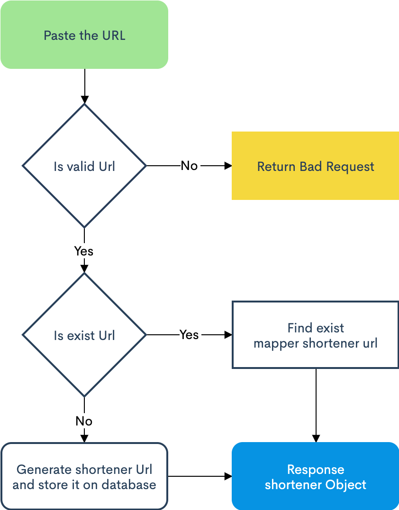
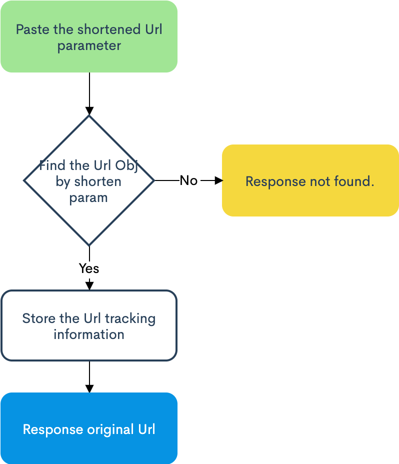

## Description

This application is for sequoia capital's code challenge, it is provided to shorten a URL and get original link back. 

The URL Shortener application is built by TypeScript([Nest.js](https://nestjs.com/)) and [MongoDB](https://www.mongodb.com/).

## Architecture Design

### How does this URL Shortener application work?
The URL shortener works by taking an entered URL and creating a relatively shortened version simplified into an easy to share format. 

The shortened hash will be generated by base-encoding an Nano ID library, and creates a minimum eight-character hash that stored URLs go up.

When the shortened version of the URL is visited, the service will fetch the original URL stored in MongoDB and then get back and store the track information.

### List of the technologies 

* Nest.js (Is built with and fully supports TypeScript) <br />
It is a progressive Node.js framework for building efficient, reliable and scalable server-side applications. I use it to build an API for shortening URLs.

* MongoDB (storing URLs) <br />
It is a NoSQL database perfect for this application. It provides a flexible schema design and is easy to get started with. 

* TypeORM <br />
It is an ORM that can run in NodeJS, Browser, Cordova, PhoneGap, Ionic, React Native, NativeScript, Expo, and Electron platforms and can be used with TypeScript and JavaScript (ES5, ES6, ES7, ES8). Its goal is to always support the latest JavaScript features and provide additional features that help you to develop any kind of application that uses databases - from small applications with a few tables to large scale enterprise applications with multiple databases.

* Nano ID <br />
It is a library for generating random IDs. Likewise UUID, there is a probability of duplicate IDs. However, this probability is extremely small.

* Swagger (Debug the API within UI mode)<br />
Simplify API development for users, teams, and enterprises with the Swagger open source and professional toolset. Find out how Swagger can help you design and document your APIs at scale.


### Flowchart
* Shoten URLs



<br />
<br />

* Retrieve URLs



<br />
<br />


### Nano ID Collision Calculator

This calculator aims to help you realize the extent to which the ID length can be reduced.

Dictionary:
```js
const alphabet = '0123456789ABCDEFGHIJKLMNOPQRSTUVWXYZ_abcdefghijklmnopqrstuvwxyz-';
```

* ID length: **8 characters**, Speed:1000 IDs per hour. **~99 days** needed, in order to have a 1% probability of at least one collision.
```js
const nanoid = require('nanoid');
nanoid(8); //=> "Fj7sB39c"
```

* ID length: **9 characters**, Speed:1000 IDs per hour. **~2 years** needed, in order to have a 1% probability of at least one collision.
```js
const nanoid = require('nanoid');
nanoid(9); //=> "Iu13EwGaG"
```

* ID length: **10 characters**, Speed:1000 IDs per hour. **~17 years** needed, in order to have a 1% probability of at least one collision.
```js
const nanoid = require('nanoid');
nanoid(10); //=> "LThFuTb_ui"
```

## Running the app

### 1. Docker Mode

#### Dependencies

In order to ensure that we have same development environment, I containerize the app and db with Docker.

```bash
$ brew cask install docker
```

#### Launch

```bash
# Pull code
$ git pull

# Go to the workspace
$ cd [application folder]

# Launch production mode
$ bash docker_run.sh
```
```bash
# Open the Swagger-UI
http://localhost:3010/api/
```

### 2. Local Mode

#### Dependencies

You need to install the node.js and mongodb by yourself.

```bash
# Install Nodejs
$ brew install node

# Install Database
$ brew tap mongodb/brew
$ brew install mongodb-community@4.4
```

```bash
# Pull code
$ git pull

# Go to the workspace
$ cd [application folder]

# Installation
$ npm install

# Launch dev mode
$ npm run start
```
```bash
# Open the Swagger-UI
http://localhost:3000/api/
```

## Test
This app uses the [Jest](https://jestjs.io/)(A delightful JavaScript Testing Framework).

### Unit testing

```bash
# unit tests
$ npm run test
```

```bash
PASS  src/app.controller.spec.ts (8.463 s)
  AppController
    Get shortened link
      ✓ should return "Shorten" object (19 ms)
    Get original link
      ✓ should return original link (5 ms)

Test Suites: 1 passed, 1 total
Tests:       2 passed, 2 total
Snapshots:   0 total
Time:        8.615 s
Ran all test suites.
```

### Test coverage
```bash
# test coverage
$ npm run test:cov
```

```bash
--------------------|---------|----------|---------|---------|-------------------
File                | % Stmts | % Branch | % Funcs | % Lines | Uncovered Line #s
--------------------|---------|----------|---------|---------|-------------------
All files           |   50.55 |        0 |   44.44 |   46.91 |
 src                |   34.78 |        0 |   44.44 |   31.75 |
  app.controller.ts |   94.12 |      100 |     100 |   93.33 | 36
  app.module.ts     |       0 |        0 |       0 |       0 | 1-31
  app.service.ts    |   25.81 |        0 |      25 |   20.69 | 13-58
  main.ts           |       0 |      100 |       0 |       0 | 1-18
 src/dto            |     100 |      100 |     100 |     100 |
  ShortenDto.ts     |     100 |      100 |     100 |     100 |
 src/entity         |     100 |      100 |     100 |     100 |
  shorten.ts        |     100 |      100 |     100 |     100 |
  tracklink.ts      |     100 |      100 |     100 |     100 |
--------------------|---------|----------|---------|---------|-------------------
```

### API End-to-end testing
This app uses the SuperTest for API e2e testing
**Plase make sure your database be started**
```bash
# test e2e
$ npm run test:e2e
```
```bash
PASS  test/app.e2e-spec.ts (7.142 s)
  AppController (e2e) POST
    ✓ /POST /api/link (662 ms)
  AppController (e2e) GET
    ✓ /GET /api/link (33 ms)

Test Suites: 1 passed, 1 total
Tests:       2 passed, 2 total
Snapshots:   0 total
Time:        7.244 s
Ran all test suites.
```

## Code Quality
```bash
# Run eslint check
$ npm run lint
```

## Stay in touch

- Author - [Lidong LI](https://www.lsmedm.com/)
- Contact - [LinkedIn](https://cn.linkedin.com/in/tedli)
