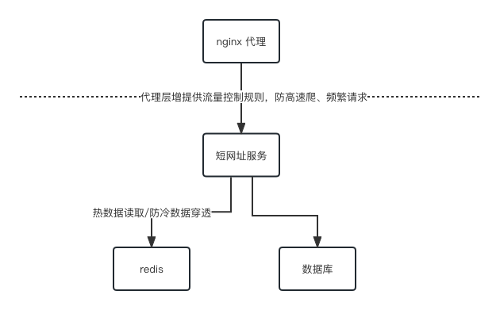

# TypeScript Fullstack Engineer Assignment

### 框架设计及目的

- 根据考察全栈场景，所以结合SSR + API 两方面功能，设计单体应用。
- 根据偏后段场景，所以结合数据库存储和缓存存储，设计高可用服务。

### library

- Typescript 类型检查
- react系列 渲染框架
- vite 构建工具
- jest 单元测试
- express 提供HTTP server
- dotenv 环境变量管理（可用于环境变量隔离）
- nanoid 字符串ID 生成器
- ioredis 连接redis 
- mongoose 连接mongodb
- pm2 生产级启动方案
- axios 网络请求库

### 多级存储逻辑

- 为防止恶意提交，根据长域名地址为KEY作缓存
- 提高相应速度，根据短域名地址作为KEY作缓存

### 关于302

- 302是临时重定向，满足SEO 搜索曝光及点击转化场景。

### 部分说明

- 由于提到避免过度设计，完整的短网址服务所需要的client sdk（用户端流量采集及监控）忽略
- 由于提到避免过度设计，短域名生成过程用户信息采集忽略
- 由于提到避免过度设计，跳转信息采集忽略

### 关于nginx

- 基础服务提供云网关，可使用云网关，增加缓存、流量控制
- 基础服务提供风控能力，可忽略DDOS攻击

### 备注

- 系统设计不能脱离具体业务场景，该应用是DEMO示例，不作为最终方案
- 涉及分布式系统方案，需要重新确定方案。

------

### Typescript 实现短域名服务（细节可以百度/谷歌）

撰写两个 API 接口

- 短域名存储接口：接受长域名信息，返回短域名信息
- 短域名读取接口：接受短域名信息，返回长域名信息。

限制

- 短域名长度最大为 8 个字符（不含域名）

递交作业内容

1. 源代码
2. 单元测试代码以及单元测试覆盖率(覆盖率请勿提交整个目录，一张图片或一个 text table 即可)
3. API 集成测试案例以及测试结果
4. 简单的框架设计图，以及所有做的假设
5. 涉及的 SQL 或者 NoSQL 的 Schema，注意标注出 Primary key 和 Index 如果有。

其他

- 我们期望不要过度设计，每一个依赖以及每一行代码都有足够充分的理由。

## 岗位职责

- 根据产品交互稿构建高质量企业级 Web 应用
- 技术栈：Express + React
- 在产品迭代中逐步积累技术框架与组件库
- 根据业务需求适时地重构
- 为 Pull Request 提供有效的代码审查建议
- 设计并撰写固实的单元测试与集成测试

## 要求

- 三年以上技术相关工作经验
- 能高效并高质量交付产品
- 对业务逻辑有较为深刻的理解
- 加分项
  - 持续更新的技术博客
  - 长期维护的开源项目
  - 流畅阅读英文技术文档
  - 对审美有一定追求
  - 能力突出者可适当放宽年限
