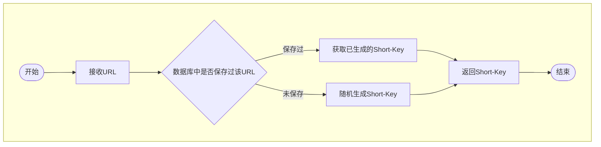
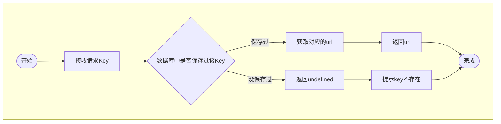

# 需求分析

## 核心任务目标

1.  提供两个 API
    1.  短域名存储接口：接受长域名信息，返回短域名信息
    2.  短域名读取接口：接受短域名信息，返回长域名信息。(注意, 只是提供转换 API, 不涉及实际跳转)
2.  额外注意事项
    1.  要求使用 TypeScript 实现
    2.  **不要过度设计**
    3.  **每一个依赖以及每一行代码都有足够充分的理由**

## 任务拆解

1.  业务量预估:
    1.  业务场景: 红杉中国, 不属于秒杀类系统, 日常应用中一般不涉及高并发场景
    2.  预期 url 记录的数量级为千万级: 10000(条/天) \* 365(天) \* 10(年) => 10 年总量 3000 万条. 假设单条记录 1kb, 总容量 34T. 考虑到假设本身已是极端情况, 因此实际场景中可以认为总数据量不超 300G, 全部数据可以直接放在内存中处理.
2.  基于数据预估, 因此 demo 项目中不使用数据库(可以减去 mysql/knex 依赖, 或 ioredis 依赖)
3.  使用 Object 对数据进行存储(而非相对更专业的 Map), 方便未来定期 JSON 化, 方便数据恢复
4.  使用随机数作为 key. Number.MAX_SAFE_INTEGER => 9007199254740991, 可存千万亿条数据, 远大于 3000 万的最高需求
5.  对于 id 生成, 可以利用 JS 自带的进制转换函数`Number.prototype.toString`和`parseInt`进行 id 和字符转换. 内置的 36 进制(0-9, a-z)配合 8 位空间最大支持 2821109907455 条记录, 是预期总储存值的 1 万倍. 即使逼近数量上限, 也可以通过简单新增 2 位冗余位的方式, 将支持规模再扩张 1000 倍
6.  id 值可通过随机数生成, 在总容量为 2 万亿的前提下, 这意味着即使数据容量达到 1000 亿, 新增一个 key, 连续生成 5 次仍没有可用 id 的概率只有不到 (1/10)^5, 万分之一, 可以接受
7.  业务流程
    1.  get
        1.  检查内存中是否有对应 key
        2.  若无
            1.  返回 key 对应的 url 不存在
        3.  若有
            1.  返回 url
    2.  storage
        1.  检查是否传入 url
            1.  若无, 返回: 请传入 url
        2.  检查 url 是否已在内存中缓存
            1.  若有, 找到对应 key, 直接返回
        3.  若无, 生成一个随机 key
            1.  在 key => url 对象, 和 url => key 对象中记录对应关系
            2.  返回对应 key

# 业务流程

## /api/v1/storage 流程

## /api/v1/get 流程

