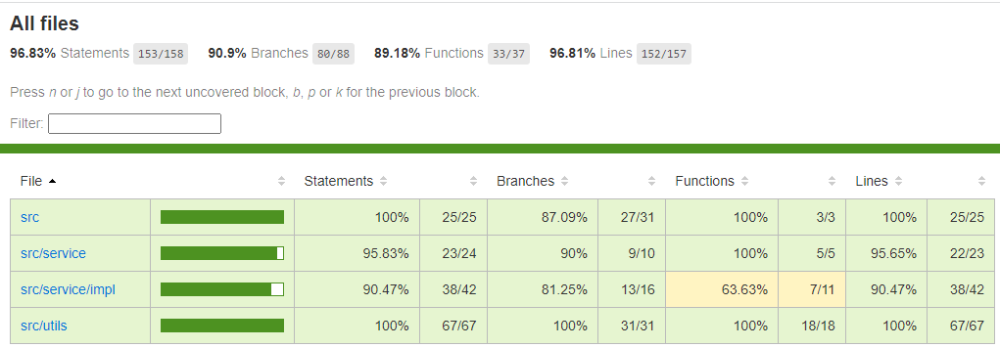

### Typescript 实现短域名服务


## 运行

1. 依赖环境

需要一个pg数据库  

```shell
# docker 运行  $pwd 换成对应环境的当前路径
docker run --restart=always --name=postgres -e POSTGRES_USER=sl -e POSTGRES_PASSWORD=password -p 5432:5432 -v $pwd/pg:/var/lib/postgresql/data -v $pwd/initdb.d:/docker-entrypoint-initdb.d -d postgres
```

[数据结构](./initdb.d/init.sql)  

2. 运行测试、 构建、 运行

```shell
npm i

# 测试
npm run test

# 构建
npm run build

# 运行。 后续可换成pm2等
node ./
```

3. 接口访问

```shell
curl -H "Content-Type: application/json" -X POST -d '{"link":"http://www.baidu.com"}' http://localhost/saveLink > saveLink

_ID=`cat saveLink | grep "sl.cn\/\([0-9A-Za-z]\{8\}\)" -o | grep "[0-9A-Za-z]\{8\}" -o` && curl "http://localhost/getLink?id="$_ID
```

## 设计

提供factory提供多种不同形式的短链接服务。项目中实现了自增ID模式的短链接，使用pg库的单表进行存储。  

可以根据具体场景，实现不同的短链接服务。  

- 可以用分表、分库（根据业务情况，做一些分库属性，放到ID中， 如 大客户的域名，或者是按表、库平均分配）

- 也可以用 nosql 库，进行存储，根据nosql库的特性生成ID


## 单元测试覆盖率

